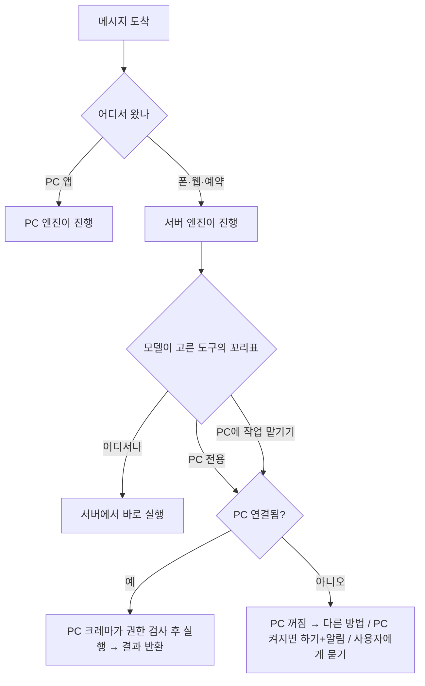

# crema 하이브리드 실행 기술 검토

2026-09-25 · 상태: 검토 초안 · 관련: [crema-제품기획-2026-09-25.md](crema-제품기획-2026-09-25.md)

## 0. 쉬운 설명: 누가 어디서 무엇을 하나

- 사용자는 **크레마 앱 하나만** 설치한다. Hermes를 따로 설치하지 않는다. 앱 안에 Hermes를 줄인 **크레마 엔진**이 들어 있다.
- 같은 크레마 엔진이 **사용자 PC(앱 안)**와 **우리 서버** 두 곳에서 돈다.
- "두뇌"는 판단을 이어 가는 **진행자**(모델에 묻고 → 도구 실행 → 다시 묻기를 반복하는 쪽)다. 생각(모델 추론) 자체는 어느 경우든 모델사(OpenAI·Anthropic 등)가 한다.

| 위치 | 설치되는 것 | 하는 일 |
|---|---|---|
| 사용자 PC | 크레마 앱(엔진 포함) | 내 PC에서만 할 수 있는 일: 파일, 프로그램·화면 조작 |
| 우리 서버 | 크레마 엔진(우리가 운영) | PC가 꺼져도 해야 하는 일: 예약, 알림, 웹 조사, 폰에서 온 대화 |
| 모델사 | — | 모델 추론 |

| 상황 | 처리 |
|---|---|
| PC 앞에서 "이 엑셀 표 정리해" | PC 크레마가 끝까지 처리(지금과 같음), 대화 기록만 서버와 맞춤 |
| 외출 중 폰 "내 PC 보고서 찾아 요약해"(PC 켜짐) | 폰→서버, 서버가 PC 크레마에 파일 요청, 서버가 요약해 폰으로 |
| 외출 중 폰 "PC에서 엑셀 열어 표 정리해"(PC 켜짐) | 단계가 많은 화면 작업 → 서버가 일을 통째로 PC 크레마에 넘김, 결과만 폰으로 |
| PC 꺼짐, 매일 9시 뉴스 | 서버가 처리해 폰으로 알림 |
| PC 꺼짐, "다운로드 폴더 정리해" | 서버가 "PC 켜지면 할 일"로 접수·알림 → PC 켜지면 PC 크레마가 처리 |

- "무거운 일은 PC로"의 뜻: 화면을 보며 여러 번 조작하는 **단계 많은 PC 작업은 서버가 한 단계씩 지시하지 않고 PC 크레마에 통째로 맡긴다.** 빠르고, 그 반복의 자원은 사용자 PC가 쓴다. 모델을 PC에서 돌린다는 뜻이 아니다.

## 0-1. 어디서 할지는 누가 어떻게 정하나

따로 "판단 담당"을 두지 않는다. **무엇을 할지는 모델이(평소처럼 도구 선택), 어디서 실행할지는 엔진이 규칙으로** 정한다.

1. **턴의 주인 = 메시지를 받은 곳**: PC 앱 → PC 엔진, 폰·웹·예약 → 서버 엔진. 한 턴은 한 곳에서만 진행(충돌 없음), 대화 기록은 서버에서 하나로.
2. **도구마다 실행 위치 꼬리표**: `PC 전용`(PC 파일·명령) → 서버 엔진이 부르면 PC로 전달, PC가 꺼져 있으면 "PC 꺼짐" 결과 / `서버 전용`(예약 등록·폰 알림) → PC 엔진이 부르면 서버로 / `어디서나`(웹 검색·읽기, 이미지) → 진행 중인 곳에서. 모델은 도구만 고르고, 전달은 엔진이 꼬리표로 기계적으로.
3. **서버 엔진에는 화면 조작 도구가 없다**: 대신 "PC에 작업 맡기기" 도구 하나. 단계 많은 데스크톱 작업은 구조적으로 PC에 통째로 넘어간다(4-1).
4. **PC가 꺼져 있을 때**: 모델이 정해진 선택지 중 고름 — 다른 방법(클라우드 드라이브 등) / "PC 켜지면 하기" 대기열 + 알림 / 사용자에게 묻기. 말없이 오래 기다리지 않는다.
5. **빠른 모델(Jev·싼 모델)**: 처음엔 불필요. 나중에 "PC 필요한 일인가" 미리 분류해 연결 확인, 도구 후보 좁히기 등 속도용 보조.
6. **최종 결정권은 PC**: 서버가 무엇을 보내든 PC 크레마가 허용 폴더·명령·승인 규칙을 스스로 검사(6절).



## 1. 풀려는 문제

- 로컬 에이전트의 가장 큰 장점: 내 PC의 파일·프로그램·브라우저를 쓰고, PC에서 하는 일을 대신 한다.
- 가장 큰 단점: PC가 꺼지면 에이전트도 멈춘다. 예약 작업(매일 9시 뉴스, 10분마다 메일 분류)도 멈추고, 밖에서 연결도 안 된다.
- 지금의 에이전트는 본질적으로 한 방향이다. 사용자가 물어야 답한다. 예약 작업은 여기서 조금 벗어난 유일한 예외인데, 그마저 PC가 켜져 있어야 한다.

## 2. 핵심 결정: 두뇌는 서버, PC는 손발

| | 지금 (PC 중심) | 제안 (서버 중심) |
|---|---|---|
| 에이전트 두뇌(대화·기억·판단·예약) | PC | **서버** (24시간) |
| PC의 역할 | 전부 | **도구 제공자**: 켜져 있을 때 파일·명령·앱·브라우저를 서버 에이전트에게 빌려줌 |
| PC가 꺼지면 | 전부 멈춤 | 대화·예약·알림·웹 작업은 계속. PC가 필요한 일만 기다림 |
| 사용자가 접속하는 곳 | PC 앱 | 데스크톱·모바일·웹 어디서나 같은 서버에 접속 |

```
[데스크톱 앱] [모바일 앱] [웹]  ─┐
                                 ├─▶ [서버: crema 에이전트]
[알림: 앱 푸시 · (선택) 텔레그램] ◀┘     ├ 대화·기억·예약·알림
                                        ├ 클라우드 도구: 웹 검색·읽기, 메일·캘린더 API, 서버 작업 공간
                                        └ PC 도구 (연결되어 있을 때만) ◀── [PC: crema 기기 에이전트]
                                                                         PC가 먼저 서버로 연결을 엶
```

## 3. 구성 요소

### 3-1. 서버 에이전트
- 대화 처리, 기억, 예약 작업(크론), 이벤트 반응(새 메일 등), 알림 발송.
- Hermes 기존 부품: 게이트웨이, `/v1/runs`(승인 이벤트 포함), 예약 작업 + 결과 전달 대기열(`cron/delivery_queue.py`), 세션 DB.

### 3-2. PC 기기 에이전트 (새로 만듦, 가볍게)
- PC에서 백그라운드로 도는 작은 프로그램(트레이). crema 데스크톱 앱에 포함하거나 별도 서비스로 둔다. 부팅 시 자동 시작.
- 하는 일은 하나: **PC 도구를 서버 에이전트에게 제공**한다(파일 찾기·읽기·쓰기, 명령 실행, 앱·브라우저 제어, 화면 확인).
- 방식: PC 도구를 **MCP 서버**로 내놓는다. 서버 에이전트는 MCP 클라이언트로 이를 쓴다.
  - Hermes는 MCP 클라이언트를 이미 지원한다(stdio·Streamable HTTP·SSE, `tools/mcp_tool.py`), 연결 생존 확인도 있다(`tools/mcp_liveness.py`).
  - 표준 방식이라 도구를 추가·교체하기 쉽고, 다른 MCP 도구와 섞어 쓸 수 있다.

### 3-3. 연결: PC가 먼저 연다
- PC가 서버로 바깥 방향 연결(WebSocket 또는 역방향 터널)을 열어 두고, 서버의 도구 호출은 이 연결을 거꾸로 타고 PC에 도착한다.
- 공유기 포트 열기·고정 IP가 필요 없다. 회사·카페 네트워크에서도 대부분 동작한다.
- 끊기면 자동 재연결. 서버는 "PC 연결됨/끊김"을 늘 안다.

## 4. PC가 꺼져 있을 때의 전략

PC가 없으면 할 수 없는 일은 줄이고, 해야 할 때는 기다렸다가 한다.

| 전략 | 내용 | 비고 |
|---|---|---|
| ① 대신할 수 있는 건 서버에서 | 웹 조사, 메일·캘린더(API 연결), 문서 작성, 코드 실행은 서버 작업 공간에서 | PC가 꼭 필요하지 않은 "컴퓨터 일"의 대부분 |
| ② PC 파일 색인을 서버에 | 사용자가 고른 폴더의 파일 목록·요약(원하면 내용)을 PC가 켜져 있을 때 서버로 동기화 | PC가 꺼져도 "그 파일 어디 있지?", "지난주 보고서 내용은?"에 답함. 고른 폴더만, 저장 시 암호화 |
| ③ 클라우드 드라이브 연결 | OneDrive·Google Drive를 서버 도구로 연결 | 이미 클라우드에 있는 파일은 PC 없이 처리 |
| ④ PC 작업 대기열 | PC가 필요한 일은 "PC가 켜지면 실행" 대기열에 넣고 알림. PC가 연결되면 자동 실행 후 결과 보고 | 예: "집에 가면 이 폴더 정리해 둬" |
| ⑤ (선택) PC 깨우기 | Wake-on-LAN으로 PC를 켬 | 같은 집 안에 늘 켜진 작은 기기(공유기·NAS 등)가 필요해 고급 옵션으로만 |

- 도구 호출 규칙: PC 도구가 연결되어 있지 않으면 "PC 꺼짐"이라는 정해진 결과를 돌려준다. 에이전트는 이를 보고 ①~④ 중에서 고른다(대신하기, 대기열, 사용자에게 묻기).

## 4-1. 데스크톱 제어(컴퓨터 유즈)는 어떻게 되나

질문(주인님): 두뇌를 서버에 두면 로컬 윈도우 데스크톱 제어가 안 되는 것 아닌가?

- **된다.** 판단과 실행은 원래 따로 있다. 지금 PC의 Hermes도 화면을 찍어 클라우드 모델(Claude·GPT)에 보내고, 모델이 정한 클릭·입력을 PC가 실행한다. 두뇌(모델)는 처음부터 PC 밖에 있고, PC에 있는 것은 손(화면 캡처·마우스·키보드·UI 자동화)과 반복 루프다.
- 서버 중심에서도 손은 PC 기기 에이전트에 그대로 둔다. 서버가 정하고 PC가 실행한다.
- **문제는 속도.** 컴퓨터 유즈는 한 작업에 "찍기→판단→클릭"을 수십 번 반복한다. 서버 루프로 돌리면 반복마다 PC→서버→모델→서버→PC로 경유가 늘고 화면 이미지 전송이 늘어난다.
- **해결: 두뇌를 둘로 나눈다(총괄은 서버, 현장은 PC).**
  - 서버 두뇌: 대화·기억·예약·알림, 어떤 일을 어디서 할지 결정.
  - PC 두뇌: 화면을 보며 여러 번 조작하는 데스크톱 작업은 서버가 **작업 단위로 통째로 PC에 맡기고**, PC가 모델과 직접 반복한 뒤 결과만 보고한다(지금과 같은 속도).
  - 둘 다 같은 crema 코어. 서버·인터넷이 끊겨도 PC가 혼자 동작하는 오프라인 모드가 함께 생긴다(9절 4번 질문의 답).
  - 한두 번의 간단한 PC 도구 호출(파일 찾기·읽기, 명령 한 줄)은 서버 두뇌가 MCP로 직접 호출한다.
- **윈도우 조건**
  - UI 제어는 로그인된 사용자 화면 세션에서만 된다 → 기기 에이전트는 백그라운드 서비스가 아니라 **트레이 앱**으로 돈다(9절 2번 질문의 답: 앱을 닫아도 도는 트레이 상주).
  - 화면이 잠기면 파일·명령은 되지만 화면 제어는 안 된다 → PC 작업 대기열로 넘기고 잠금이 풀리면 이어서 한다.

## 4-2. 속도: Jev 활용 (2026-09-25 주인님 제안 검토)

**Jev**: TypeSafe AI가 2026-09-15 공개한 "빠른 판단(System One)" 모델. 응답 70~500ms(대부분 약 100ms), 입력 100만 토큰당 $0.042·출력 무료, TypeSafe 직접 또는 Vercel AI Gateway로 제공.

### 할 수 있는 것과 없는 것

| | 내용 |
|---|---|
| 입력 | **텍스트만**(문자열·JSON). 이미지·음성 불가 |
| 출력 | 글을 쓰지 않는다. 정해진 형식의 판단만: 예/아니오 확률, 선택지 중 하나(+확률 분포·확신도), 점수 |
| 한도 | 상태+질문 합계 약 64,000토큰(상태+가장 긴 질문 약 32,000토큰) |
| 약점 | 개수 세기·계산·날짜 추출·부정문 처리 불안정. 입력 글에 섞인 조종 문구에 판단이 흔들림(예: 가짜 "사전 승인" 문구로 위험 명령 차단 확률 0.76→0.48) |

→ **화면 찍기→클릭 반복을 통째로 대신하지는 못한다.** 대신 반복 속의 "빠른 판단" 자리를 맡긴다.

### crema에서 쓸 자리

| 자리 | 지금 | Jev로 |
|---|---|---|
| **데스크톱 조작의 다음 한 수** | 매 단계 화면 이미지를 큰 모델에 보내 판단(수 초) | 윈도우 UI 자동화가 주는 **화면 요소 목록(텍스트)**을 Jev에 주고 "이 목표에서 다음에 누를 요소"를 선택지로 고르게 함(약 0.1초). 확신도가 낮거나 목록에 없으면 큰 모델(이미지)로 넘김 |
| 일 배분 | 큰 모델이 판단 | "서버에서 할 일 / PC에 맡길 일 / PC 대기열" 선택을 Jev로 |
| 도구·파일 고르기 | 큰 모델이 모든 도구·파일 설명을 읽음 | Jev가 후보를 먼저 좁혀 큰 모델 입력을 줄임(속도·토큰 절약) |
| 예약 작업 분류 | 10분마다 메일 분류를 큰 모델로 | 메일 분류·중요도 판단을 Jev로(빠르고 쌈) |
| 알림 판단 | — | "지금 알릴 일 / 묶어 보낼 일 / 버릴 일"을 Jev로 |

- 구조: **큰 모델이 계획하고, Jev가 빠르게 실행 판단, 막히면 다시 큰 모델.** 데스크톱 작업은 이 반복을 PC 두뇌 안에서 돌려(4-1) 서버 경유 지연도 없앤다.

### 안전 조건 (필수)

- 위험 작업 승인 판단은 Jev 단독으로 하지 않는다. 정해진 규칙 검사 + 사용자 승인이 기본, Jev는 보조.
- 화면 글·웹 글·도구 결과처럼 **바깥에서 온 글**은 승인·권한 판단 입력에 넣지 않는다(조종 문구 차단).
- 확신도 기준을 두고 그 아래는 큰 모델이나 사용자에게 넘긴다.
- 모델 판을 고정해 쓰고(`jev-latest` 금지), 매 판단의 입력·선택지·확신도·모델 판을 기록한다.

### 확인할 것

- Jev의 약관(재판매·상용 조건), 한국어 판단 품질, UI 요소 목록 크기(큰 화면은 요소가 많아 한도에 걸릴 수 있음 → 보이는 영역·역할별로 줄여 보냄).
- 시험: 7절 본인 시험에 "UI 요소 목록 + Jev로 다음 클릭 고르기"를 추가해 큰 모델 이미지 방식과 속도·성공률 비교.

출처: flaviocopes.com「A deep dive into Jev」, VentureBeat「Companies are putting Jev in charge of AI agent decisions — and prompt injection can influence the verdict」, Analytics India Magazine(저지연 사례), Funda AI「Jev Users Report 10× Faster」.

## 4-3. 속도: 싼 모델 + 스키마 강제 + 병렬 호출 (2026-09-25 주인님 제안 검토)

Jev는 텍스트만 읽고 검증이 덜 되었으므로, 일반 LLM도 같은 방식으로 불러 빠른 판단을 만든다.

### 왜 빨라지나

한 번 판단하는 시간 = 추론 토큰 + 출력 길이 + 입력 크기(첫 토큰까지의 시간).

| 요인 | 큰 추론 모델 통째 호출 | 제안 방식 |
|---|---|---|
| 추론 | 매 단계 수백~수천 토큰 생각 | 추론 없는 작은 모델 |
| 출력 | 설명·계획까지 길게 | 스키마 강제 한 줄(`{"action":"click","id":12}`) |
| 입력 | 전체 화면 이미지 + 긴 지시문·대화 | 필요한 부분만 작게 + 짧은 지시문(캐시) |

- **관측**: 다음 입력 예상을 가벼운 모델(gpt-6-luna)로 부르는데도 2~3초 걸렸다. Hermes 기록상 호출당 입력이 약 17,000토큰(에이전트 한 턴이라 도구 설명·기본 지시문이 통째로 붙음). → 빠른 판단은 에이전트 루프 밖에서 **모델 API를 짧은 지시문으로 직접** 호출한다.

### 병렬 호출: 속도보다 확신도

| 방식 | 효과 | 주의 |
|---|---|---|
| 같은 질문을 싼 모델 3개에 동시에 → 다수결 | 정확도↑, 일치 개수 = 확신도(Jev 확률 대체) | 가장 느린 응답까지 기다리지 않게: 2개 일치하면 확정 |
| 서로 다른 질문을 동시에(다음 클릭? 끝났나? 오류 창?) | 한 단계의 판단들을 한 번의 대기 시간에 | 질문끼리 독립이어야 함 |
| 같은 질문을 두 회사 모델에 → 먼저 온 답 | 한쪽 서버 지연 회피 | 비용 2배 |
| 선택지 토큰 확률(logprobs) | 한 번 호출로 확신도 | 지원 모델만 |

- 데스크톱 조작은 단계끼리 앞 결과에 기대므로 단계 간 병렬은 불가. 대신 예측 가능한 구간(폼 칸 여러 개 등)은 여러 동작을 한 번에 정하고 끝에 한 번 확인해 단계 수를 줄인다.

### 판단 사다리

| 단계 | 판단 주체 | 쓰는 때 |
|---|---|---|
| 0 | 규칙(UI 자동화로 이름 찾아 클릭) | 대상이 확실할 때, 모델 없이 즉시 |
| 1 | 싼 모델 + 스키마 강제 + 병렬 다수결(필요 시 작은 비전 모델) | 대부분의 단계 |
| 1' | Jev(텍스트 판단) | 화면 요소 목록만으로 고를 수 있을 때 |
| 2 | 큰 추론 모델 | 확신도 낮음, 같은 단계 2회 실패, 계획을 새로 세울 때 |

- 이미지 입력은 화면에 요소 번호를 겹쳐 그린 작은 캡처로 보내고, 답은 그 번호 중 하나(스키마 선택지)로만 받는다. 좌표 추측보다 빠르고 정확하다.
- 스키마 강제는 주요 모델사가 모두 지원(OpenAI 구조화 출력, Anthropic 도구 호출, Gemini 응답 스키마) — 모델사를 바꿔도 같은 틀.

### 검증

- 실제 작업 단계를 기록해 시험 묶음을 만들고, 설정별(큰 모델 단독 / 싼 모델 1회 / 싼 모델 3개 다수결 / Jev) 단계당 시간·성공률·비용을 측정해 정한다. 숫자는 측정 전에는 단정하지 않는다.

## 4-4. Hermes의 현재 컴퓨터 유즈 구현 (0.21.4 소스 확인)

| 항목 | Hermes 구현 | crema에 주는 뜻 |
|---|---|---|
| 손(실행 엔진) | 외부 프로그램 **cua-driver**(Cua 프로젝트)를 **MCP(stdio)**로 호출. 이 PC에 설치됨(`AppData\Local\Programs\Cua\cua-driver`). Windows·macOS·Linux 공통 | 3-2절 "PC 도구를 MCP로 내놓는다"와 같은 구조. 서버 두뇌에서도 cua-driver를 PC 쪽 손으로 그대로 쓸 수 있다 |
| 조작 방식 | 기본은 **백그라운드**: 대상 앱 프로세스에만 입력을 보내 사용자의 마우스·키보드·포커스를 빼앗지 않음. 필요하면 앞으로 가져와 조작(foreground) | 사용자가 PC를 쓰는 중에도 에이전트가 옆에서 일할 수 있다 |
| 화면 인식 3가지 | `som`: 요소마다 번호를 겹친 캡처 + 접근성 트리 → **번호로 클릭** / `vision`: 일반 캡처 / `ax`: 접근성 트리(텍스트)만 — 이미지를 못 보는 모델용 | 4-3의 "번호 겹친 캡처 + 번호로 고르기"가 이미 구현됨. `ax` 텍스트는 Jev 같은 텍스트 판단 모델에 바로 줄 수 있다 |
| 비전 우회 | 주 모델이 이미지를 못 읽으면 보조 비전 모델이 캡처를 글로 설명해 넘김 | 판단 사다리에서 모델을 섞어 쓰는 기반 |
| 동작 | capture, click(더블·오른쪽·가운데), drag, scroll, type, key, set_value, wait, list_apps, list_windows, focus_app 등 | 데스크톱 조작에 필요한 기본기는 갖춤 |
| 안전 | 승인 게이트 공유, **항상 차단**: 잠금·로그아웃 단축키(Win+L 등), Ctrl+Alt+Del, 위험한 셸 문구 입력(curl\|bash, rm -rf / 등) | 6절 보안 원칙의 PC 쪽 검사와 같은 방향 |
| 켜져 있는 곳 | 이 PC 설정에서 cli·telegram 등 여러 플랫폼 도구 목록에 `computer_use` 포함 | 이미 쓸 수 있는 상태 |

### Hermes에 없는 것 = crema가 더할 것

- **매 단계를 주 모델(큰 모델)이 판단한다.** 캡처 → 에이전트 한 턴(도구 설명·기본 지시문이 붙은 큰 입력) → 동작을 반복한다. 빠른 판단 층(규칙·싼 모델 스키마·병렬 다수결·Jev)이 없다. → 4-3 판단 사다리를 이 반복 안에 넣는 것이 crema의 개선점.
- 반복이 에이전트가 도는 곳(지금은 PC)에서만 돈다. → 4-1처럼 서버 두뇌는 데스크톱 작업을 통째로 PC 두뇌에 맡긴다.

### 확인할 것

- cua-driver는 익명 사용 통계를 기본으로 보낸다(`CUA_DRIVER_RS_TELEMETRY_ENABLED`, 없으면 켜짐). 제품에서는 끄고 고지한다.
- cua-driver의 라이선스와 배포 조건(제품에 함께 넣어도 되는지)을 확인한다.
- macOS 경로는 비공개 시스템 기능을 써서 OS 업데이트 때 깨질 수 있다고 소스에 적혀 있다(Windows 우선이라 당장은 영향 적음).

## 5. 먼저 말을 거는 에이전트

예약 작업을 넘어, 에이전트가 먼저 알려 주고 제안한다. 두뇌가 서버에 있기 때문에 가능하다.

| 방식 | 예 |
|---|---|
| 예약 작업 | 매일 9시 뉴스 요약, 10분마다 메일 분류 |
| 사건 반응 | 중요한 메일이 오면 요약해 알림, 일정 30분 전 준비물 알림 |
| 브리핑 | 아침: 오늘 일정·밤사이 온 중요한 일·어제 남긴 일 |
| 제안 | "어제 부탁하신 보고서, PC가 켜지면 마무리할까요?" |

- 알림 채널: crema 모바일·데스크톱 앱 푸시(기본), 텔레그램 등은 선택 연결.
- 피로 관리: 방해 금지 시간, 묶어서 보내기(요약 알림), 알림 중요도, 사용자가 "이런 알림 그만"이라고 하면 규칙으로 저장.

## 6. 보안 (PC를 원격으로 다루므로 가장 중요)

- **기기 등록**: PC마다 처음 한 번 짝짓기(앱에서 코드 확인). 등록되지 않은 기기는 도구를 내놓지 못한다.
- **권한은 PC가 최종 결정**: 서버가 무엇을 시키든, PC 기기 에이전트가 허용 폴더·허용 명령·승인 규칙을 스스로 검사한다. 서버가 뚫려도 PC 쪽 규칙을 넘을 수 없게.
- **위험 작업 승인**: 삭제·설치·결제·외부 발송 등은 사용자의 폰이나 PC에서 승인해야 실행(지금 만든 승인 카드를 모바일로 확장).
- **기록과 긴급 차단**: 원격 실행은 모두 기록하고 앱에서 볼 수 있게. "모든 원격 실행 멈춤" 버튼.
- **저장 데이터**: 동기화한 파일 색인·대화는 암호화해 저장. 서버의 에이전트가 읽어야 판단할 수 있으므로 완전한 종단 간 암호화는 불가. 대신 무엇을 올릴지 사용자가 고르게 한다.

## 6-1. 서버 자원: 사용자가 늘면 무엇이 느나

- **측정(2026-09-25, 이 PC)**: 쉬고 있는 Hermes 게이트웨이 1개 = 전용 메모리 약 285MB(작업 집합 60MB). 사용자마다 Hermes 하나씩이면 1,000명에 약 285GB → **사용자별 프로세스는 피한다.**

| 자원 | 크기 | 부담 |
|---|---|---|
| 모델 추론 | 가장 큼 | 모델사. 비용은 사용자 API 키·포함 크레딧 |
| 에이전트 반복 | 계산은 가벼움, 대부분 모델 응답 대기 | 서버. 프로세스 방식이 비용을 좌우 |
| 상시 연결(PC·모바일) | 연결당 매우 가벼움 | 서버 |
| 예약 작업 | 정한 시각에만 | 서버 |
| 기억·파일 색인 | 작음 | 서버 |
| 클라우드 브라우저·작업 공간 | 큼(사용자별) | 서버 → 프로 등급에만 |
| 화면 캡처 | 큼 | 데스크톱 반복을 PC에서 돌리면 서버를 거치지 않음(4-1) |

### 줄이는 설계

1. 공용 작업자 + 작업 대기열 + DB 상태: 사용자별 상주 프로세스 없음. 쉬는 사용자는 거의 0.
2. 무료 등급은 서버 두뇌 없음(로컬 전용) → 서버 비용은 유료 사용자에게서만.
3. PC가 켜져 있으면 무거운 반복은 PC 두뇌로(사용자 자원).
4. 일 배분·분류·알림 판단은 Jev·싼 모델(4-2, 4-3).
5. 사건이 있을 때만 작업자 사용(예약 시각, 새 메일 등).
6. 등급별 한도(클라우드 실행 시간·예약 수·저장 용량).
7. 경량 코어: 안 쓰는 도구·플러그인을 올리지 않아 작업자당 메모리 감소.

- 원가 확정: 경량 코어 이후 "사용자 N명, 하루 작업 M건" 가정으로 부하 시험.

## 7. 지금 바로 해 볼 수 있는 시험 (본인용)

주인님은 이미 PC Hermes와 main 서버 Hermes를 함께 쓰고 있다. 기존 부품만으로 핵심을 검증할 수 있다.

1. PC에서 파일·명령 도구를 MCP 서버로 띄운다(Streamable HTTP, 이 PC 안에서만 열림).
2. PC → main 서버로 SSH 역방향 터널을 연다(이미 쓰는 SSH 사용).
3. main 서버 Hermes 설정의 MCP 서버 목록에 이 터널 주소를 추가한다.
4. 텔레그램이나 앱에서 main 서버 Hermes에게 "내 PC의 ○○ 폴더에서 △△ 찾아줘"를 시킨다.
5. PC를 끈 상태에서 같은 요청 → "PC 꺼짐"을 받고 대기열·알림으로 처리되는지 본다.

- 확인할 것: 도구 호출 지연, 끊김·재연결 시 동작, Hermes가 끊긴 MCP 서버를 어떻게 다루는지(`mcp_liveness`), 권한 검사 위치.
- 이 시험이 성공하면 3-2의 기기 에이전트와 3-3의 연결을 제품 품질로 다시 만든다.

## 8. 단계

| 단계 | 내용 | 완료 기준 |
|---|---|---|
| 0. 본인 시험 | 7절 | main 서버 에이전트가 PC 켜짐/꺼짐 둘 다에서 올바르게 동작 |
| 1. 기기 에이전트 | PC 트레이 프로그램, 기기 등록, 자동 재연결, PC 쪽 권한 검사, 데스크톱 작업을 통째로 받는 PC 두뇌 | 설치 후 설정 없이 서버와 연결, 데스크톱 작업 속도가 지금과 같음 |
| 2. 서버 쪽 | PC 작업 대기열, "PC 꺼짐" 처리, 파일 색인 동기화, 알림 발송 | PC 꺼진 동안의 요청이 켜진 뒤 자동 처리·보고 |
| 3. 먼저 말 걸기 | 사건 반응, 브리핑, 제안, 알림 피로 관리 | 하루 동안 쓸모 있는 알림만 받음 |
| 4. 여러 사용자 | 사용자별 격리, 서버 에이전트 비용 관리 | 사용자 수가 늘어도 원가가 요금 안에 들어옴 |

## 9. 열린 질문

1. 서버 에이전트는 사용자마다 따로 띄울까(격리 쉬움, 비쌈), 여러 사용자가 나눠 쓸까(쌈, 격리 설계 필요)?
2. PC 기기 에이전트를 crema 데스크톱 앱에 넣을까, 앱을 닫아도 도는 별도 서비스로 둘까? (예약 작업이 PC를 쓰려면 별도 서비스가 유리)
3. 파일 색인에 내용까지 올릴지, 목록·요약만 올릴지 기본값은?
4. 인터넷이 끊겼을 때 PC가 혼자 에이전트로 동작하는 "오프라인 모드"가 필요한가?
