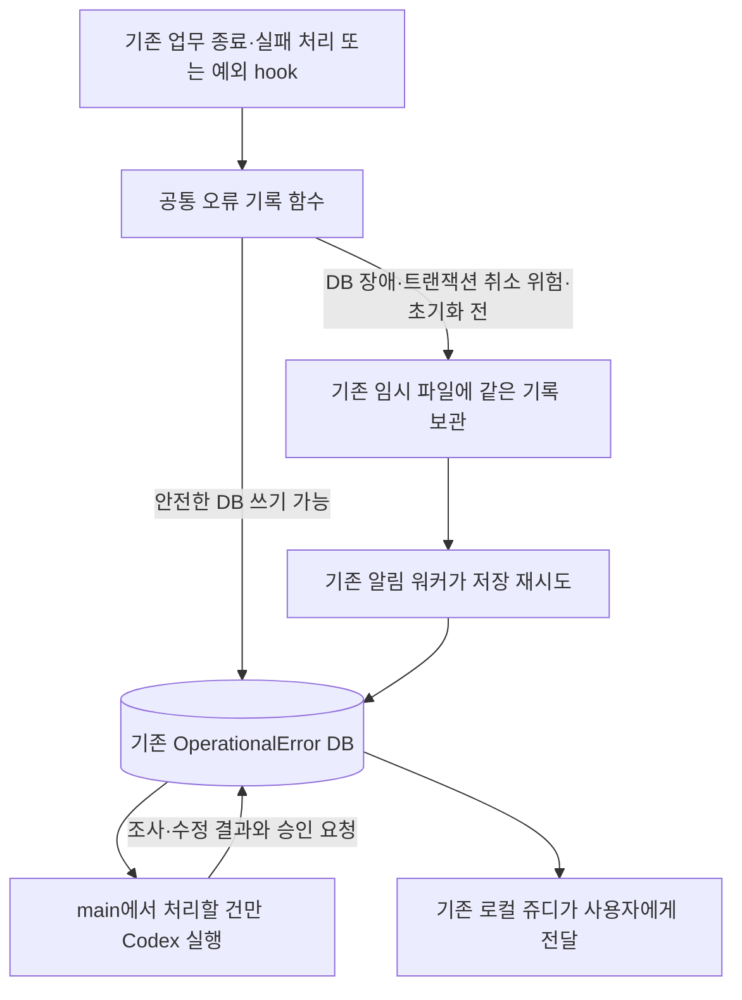

# Exdigm 운영 실패 분류·승인·자동 수정 기획

작성일: 2026-09-18 KST. 개정: 2026-09-19 KST. 상태: **v2 단순화 설계안. 기존 오류 수집·쥬디 알림과 main 조정실 기반은 확인했으며, 아래 직접 기록 전환·새 분류·자동 수정 실행은 구현 전이다.**

## 1. 목표와 확정된 경계

오류 한 건을 보면 **무슨 업무가 어디에서 왜 멈췄고, 지금 누가 무엇을 해야 하며, 무엇을 확인해야 끝나는지** 알 수 있게 한다. 동시에 **발생한 곳에서 한 번 판단하고 공통 함수로 한 번 기록한다.** 이미 결정한 실패를 다른 프로그램이 업무 테이블에서 다시 찾아 같은 판단을 만드는 구조를 공식 경로로 남기지 않는다.

주인님이 결정한 자동 범위는 **수정·검증·리뷰·커밋까지 자동, 배포는 승인**이다. 큰 구조·업무 규칙·권한·데이터 의미 변경은 적용 전에 구체적 변경안을 승인받는다. 사용자에게 알리는 주체는 **로컬 PC의 Hermes 쥬디(default)**다. main의 다른 Hermes나 Exdigm 직원별 Hermes로 바꾸지 않는다.

기획을 자세히 쓰기 위해 실행 프로그램을 늘리지 않는다. 이번 정본은 **Exdigm의 공통 기록, main Codex의 조사·수정, 기존 쥬디의 전달**이라는 실제 목적을 중심으로 정리한다. 기록 서비스 서버, 분류 전용 워커, 승인 전용 웹 화면, 전달 장부용 새 테이블을 먼저 만드는 이전 초안은 채택하지 않는다. 승인 뒤에는 기존 조정실 에이전트와 공식 배포 경로를 사용한다.

### 현재 코드와의 차이 — 직접 확인

| 현재 구현 | 확인 근거 | 설계에서 바꿀 점 |
|---|---|---|
| 오류 순간 공통 로그 처리기가 임시 JSONL 파일에 저장 | `common/operational_errors.py:OperationalErrorHandler.emit`, `install_exception_hooks` | DB에 안전하게 기록할 수 있으면 같은 호출 안에서 즉시 저장. 임시 보관은 기록 불가 상황에 사용 |
| 기존 알림 워커가 약 5초마다 파일을 DB로 옮김 | `deliver_notification_dispatches` → `collect_notification_dispatches` → `collect_operational_errors` → `_collect_logs` → `_record` | 기존 워커는 DB에 못 쓴 임시 기록의 재전달만 담당. 실패 의미를 다시 판단하지 않음 |
| 같은 워커가 업무 상태도 조회해 오류 기록 생성 | `_job_sources`의 13개 모델·14개 조회 조건, `_collect_jobs` | 실패를 확정한 기존 업무 종료 지점에서 공통 기록 함수를 호출하고, 검증한 대상의 재탐색 코드를 제거 |
| 공통 업무 종료 지점이 일부 이미 존재 | `data_extraction/services/execution.py:pipeline_execution`, `_finish_run`; 업로드는 `services/resume_uploader.py` | 각 `except`마다 별도 구현을 복제하지 않고 기존 종료·실패 처리 지점을 먼저 재사용 |
| 원문과 처리 이력 저장 구현이 존재 | `OperationalError`, `_record`, `record_processing_result`, 기존 관리 명령 | 같은 모듈과 모델을 확장. 새 기록 서버·별도 오류 DB를 만들지 않음 |
| 쥬디가 새 오류를 10분마다 읽음 | 로컬 `Gmail and Exdigm 10-minute monitor`, ID `41796002f11e` | 같은 작업에서 기존 오류의 후속 분류·승인 요청·수정 결과도 읽게 함 |

여기서 **알림 워커는 이미 운영 중인 별도 프로세스**이고, **오류 기록 함수는 업무 프로그램 안에서 호출되는 코드**다. 함수마다 워커가 있는 것이 아니다. 실제 서비스는 `Exdigm_exdigm_notification_dispatcher`, 실행 명령은 `python manage.py deliver_notification_dispatches --limit 100 --sleep 5`다. 일반 알림·직원 lifecycle도 함께 처리하므로 이 프로세스 전체를 제거하지 않는다.

현재 파일 보관에는 확인된 이유가 있다. `tests/test_operational_alerts.py`에는 업무 트랜잭션이 취소돼도 오류 기록을 보존하는 사례, DB 저장 실패 뒤 같은 파일을 재처리하는 사례, `QuerySet.update`와 일부 실패를 수집하는 사례가 있다. **현재 코드를 읽은 근거이며 이번 문서 작업에서 이 검사를 재실행한 것은 아니다.** 직접 기록 전환은 이 보호 결과를 유지해야 한다.

## 2. 하나의 공식 기록 경로

**정상 기록은 발생 시 호출에서 DB 저장까지 마친다. 5초 뒤 다시 찾아야 기록되는 구조를 기본으로 삼지 않는다.** DB에 쓸 수 없는 동안 DB 저장까지 즉시 완료한다고 주장할 수는 없다. 그때만 기존 파일에 즉시 보존하고 같은 오류 번호로 재전달한다.

호출자가 이용하는 오류 기록 진입점은 하나다. 기존 `_record`의 DB 저장·중복 방지, `safe_error_text`의 비밀값 제거, `OperationalErrorHandler`의 위치·호출 경로 추출과 파일 보관을 통합해 재사용한다. 함수 이름 변경 자체가 목표는 아니다. 새 진입점 아래에 같은 저장 책임을 가진 두 구현을 남기지 않는다.

| 기록 시점 | 공통 함수가 할 일 | 보존할 결과 |
|---|---|---|
| DB 사용 가능, 업무 저장 취소에 영향을 받지 않는 위치 | 기존 Django 저장 기능으로 즉시 오류 기록 | 발생 시각·기록 시각·원천 번호·관측 내용 |
| 확정된 업무 실패 상태를 저장하는 정상 종료 처리 | 실패 상태와 오류 행을 같은 기존 DB 트랜잭션에서 확정 | 업무 상태만 commit되고 오류 행이 빠지는 중단 구간 제거 |
| 취소될 수 있는 업무 도중의 예외 관측 또는 이미 실패한 연결 | 그 트랜잭션에 진단 기록을 얹지 않고 기존 파일에 즉시 보관 | 업무 rollback과 관계없이 오류 원문 보존 |
| Django/모델 초기화 전 또는 DB 장애 | DB 초기화를 억지로 반복하지 않고 같은 파일 보관 사용 | 원래 예외 동작과 진단 자료 보존 |
| 임시 기록 재전달 | 기존 워커가 이미 완성된 기록을 같은 DB 저장 구현에 전달 | 의미 재판정·새 오류 번호 생성 없이 한 번 반영 |
| DB 반영 후 응답만 소실 | 같은 번호의 저장 여부를 확인 | 중복 행·중복 Codex 실행 방지 |

업무상 실패는 **기존 공통 종료 처리에서 실패 상태와 오류 행을 함께 확정**한다. 상태를 먼저 commit하고 뒤에서 오류 함수를 부르는 틈을 남기지 않는다. 이 정상적인 실패 결과 저장과, 취소될 수 있는 업무 도중 관측한 예외를 구별한다. 후자는 공통 함수의 기존 파일 보관으로 보호한다. 같은 저장 책임을 재사용하되 `on_commit`에만 맡겨 rollback 때 관측 오류가 사라지게 하거나 업무 트랜잭션을 강제로 commit하지 않는다. 확정 실패 저장 자체가 실패하면 그 저장 실패의 관측을 보존하며, commit되지 않은 업무 결과를 확정 상태로 보고하지 않는다. 재귀적인 오류 기록도 막는다.

### 책임 중복을 실제로 없애는 전환

1. 기존 `_job_sources`가 다루는 모든 업무의 실패·일부 실패·재시도 소진·잠금 회수 시점을 찾는다. 현재 대상은 업로드 장부, 추출 실행/배치, 후보자 임베딩/배치, 이력서 생성, 미팅 처리, 후보자 검수, 자동 게시 run/site, 뉴스 수집, FileData, 외부 SearchSession이다.
2. 각 업무의 기존 확정 처리 지점에서 공통 함수를 호출한다. 이미 확정된 업무 판정·번호·단계·원인 자료를 전달하며 수집기용 별도 실패 조건표를 복제하지 않는다. 공통 종료 함수가 없는 경우에도 같은 책임의 분산 지점부터 정리한다.
3. 해당 업무의 공식 실행 경로에서 정상·실패·일부 실패·bulk update·늦은 commit·commit 직전/직후 종료·중단 복구를 확인한 다음 그 업무의 `_collect_jobs` 조회 조건을 제거한다. 기존 정상 취소·진행 중 재시도를 오류로 바꾸지 않는다.
4. 모든 대상이 전환되면 `_job_sources`·`_collect_jobs`와 그 전용 조회·식별 계산을 제거한다. 전환 중에도 같은 사건 번호를 사용해 새/구 수집이 중복 기록하지 않게 한다. 전환용 조회를 영구 병행하지 않는다.
5. `_collect_logs`의 임시 파일 재전달, 정상 업무 알림과 lifecycle 처리는 유지한다. 기록 장애 복구와 업무 실패 재탐색은 다른 기능이다.

예외 hook과 업무 종료가 **같은 실패**를 관측하면 원천 작업·시도·단계 식별자를 전달해 같은 기록에 연결한다. 관련 번호가 없는 두 로그를 문구가 비슷하다는 이유로 합치지 않는다. 업무 장부의 상태는 화면·재시도·산출물 관리에 필요하므로 보존하고, 진단 자료와 후속 조치의 정본만 `OperationalError`에 둔다.

프로세스 강제 종료나 서버 전원 차단은 사라진 프로세스가 스스로 함수를 호출할 수 없다. 이미 있는 업무 재개/잠금 회수 코드가 중단을 확인한 시점에 같은 함수로 남긴다. 그 경로가 없는 유형까지 “즉시 감지”한다고 보고하거나 새 전원 감시 시스템을 이번 범위에 추가하지 않는다.

## 3. 누가 언제 무엇을 맡는가

| 실제 주체 | 실행 시점 | 책임과 완료 결과 |
|---|---|---|
| Exdigm 업무 코드와 공통 기록 함수 | 오류/업무 중단을 확정한 즉시 | 원인 조사에 필요한 사실과 이미 확인한 업무 판정을 한 번 기록. 원천 상태를 재탐색하는 별도 정상 수집 단계 없음 |
| 기존 Exdigm 알림 워커 | 기존 약 5초 반복 | DB에 못 쓴 임시 기록 재전달. 새 의미 판단·수정·승인 없음 |
| main Codex와 최소 실행 연결 코드 | DB에 조사/수정할 건이 있을 때 | 같은 실행에서 자료 확인→분류/원인 조사→허용된 작은 수정→검증·리뷰·커밋 또는 구체적 승인 요청. 결과를 같은 DB에 기록 |
| 기존 로컬 쥬디(default) | 기존 10분 반복 | 사용자에게 필요한 새 행동·승인·결과 전달. 분류·수리 재실행 없음 |
| 주인님과 명시적 지시를 받은 기존 조정실 에이전트 | 큰 변경/배포 요청을 검토한 뒤 | 정확한 대상·변경안/커밋을 승인·거절. 승인된 범위만 기존 수정/배포 절차로 진행 |
| 업무 담당자·계정 소유자 | 보완·인증 요청을 받았을 때 | 기존 접수/인증 경로로 조치. 실제 업무 결과를 확인한 뒤 같은 기록을 갱신 |

main에서 Codex를 시작하는 연결 자체는 필요하지만 **새 상시 관리자 서버를 만들지는 않는다.** 단건 실행 코드 하나를 기본 진입점으로 하고 main의 기존 systemd 기능으로 주기 실행한다. 대기 건 읽기·중복 시작 방지·Codex 호출·결과 저장이 그 코드의 범위다. 업무 실패 발견·내용 분류·알림 발송을 다시 구현하지 않는다. 별도 webhook·큐·분류 워커·복구 워커를 덧붙이지 않는다.

신규 실행 제안값은 **60초마다 처리 대기 확인, 동시 Codex 1개, 호출당 60분 상한, 같은 사건·같은 근거로 자동 호출 1회**다. 이 값은 설계안이며 현재 설치된 예약이나 사용자 확정 운영값은 아니다. 단건 검증 뒤 활성화한다. 기존 Codex 실행 제한과 OS의 프로세스 관리·잠금을 우선 사용한다. 상한에 걸리면 미완료 자료와 재개 조건을 기록하고 같은 입력을 무한 재실행하지 않는다.

오류 기록 즉시성과 Codex 실행 주기는 다르다. 업무 처리 요청에서 장시간 Codex 수리를 기다리지 않는다. main의 60초 조회는 **이미 DB에 남은 사건의 다음 행동**만 찾는다. 빈 조회·자료 보완 대기·승인 대기에 Codex를 호출하지 않는다.

## 4. 분류는 5가지이고 판단은 한 번만 한다

| 분류 | 확정할 근거와 예 | 다음 행동·담당 | 종료 조건 |
|---|---|---|---|
| C1 `user_action` 자료·사용자 조치 대기 | 원본의 필수 정보 부족, 소유자의 인증 필요. 연락처 보완·메일 링크 로그인 | 기존 컨설턴트 안내/쥬디 전달에 필요한 담당자·원본 링크·구체적 행동 기록. Codex 수리 없음 | 실제 보완·인증과 원래 업무 결과 확인 |
| C2 `expected_stop` 정상적인 업무상 종료 | 명시적 취소·업무 규칙상 제외·확인된 중복 완료 | 기존 업무 사유 보존. 원래 추가 행동이 없으면 알림·Codex 호출 없음 | 정상 종료 근거가 확인됨. 모든 정상 취소를 새 오류로 수집하지 않음 |
| C3 `external_wait` 외부 조건 대기 | 확인된 외부 장애·한도·정비와 재개 조건 | 기존 업무 재시도 기능이 담당. 다음 확인 조건/시각만 기록 | 조건 회복과 실제 업무 결과 확인. 재시도 소진은 남은 행동 기록 |
| C4 `defect` 프로그램 결함 | 정상 계약을 깨뜨린 원인을 원본·코드·재현/실행 증거로 확인 | main Codex가 작은 수정 또는 큰 변경 승인 요청 | 수정·운영 반영·원래 필수 결과 확인. 커밋만으로 복구 완료 아님 |
| C5 `unclassified` 미확인 | 위 판단에 필요한 근거가 없거나 모순됨 | main Codex가 조사. 부족한 증거와 재개 조건 기록 | C1~C4로 확인 후 해당 완료 조건 적용. 미확인 자동 종료 없음 |

C1~C4는 실패의 성격이고 C5는 근거 부족 동안의 임시 분류다. 긴급도·작은/큰 변경·진행 상태를 분류 종류에 섞지 않는다.

업무 코드가 이미 확정한 구조화된 판정은 공통 기록 함수가 그대로 연결한다. 최초 편입은 검증된 `EXPECTED_MISSING_DATA_STATES`, 기존 `notify_resume_missing_fields`와 담당자/원본 연결이다. 로그인 링크·인증 대기도 실제 공식 판정과 재개 경로를 확인해 연결한다. 오류 문구 키워드로 새 분류표를 만들지 않는다.

의미 해석·근본 원인 확인이 필요한 경우에는 C5로 남기고 **수리를 맡을 같은 Codex 실행에서** 판단한다. 분류 전용 LLM을 먼저 호출하고 수리용 LLM이 같은 내용을 다시 조사하는 방식을 필수 단계로 만들지 않는다. 주인님이 요청한 문제해결·SSP 검토와 필수 코드 리뷰는 같은 책임의 중복 감지가 아니라 수정 검증 절차로 유지한다.

- 원본에 연락처가 없으면 C1이지만 원본에 있는데 추출기가 잃었다면 C4 후보를 조사한다.
- `timeout`만 보고 C3로 확정하지 않는다. 외부 장애·우리 요청 결함을 구별할 근거가 필요하다.
- 담당자가 아직 연결되지 않았다고 확인된 C1을 C5로 바꾸지 않는다. 분류는 유지하고 담당 연결이라는 남은 행동을 적는다.
- C1 안내 기능이 별도로 고장났다면 보완 건과 안내 결함 건을 연결한다. 자료 부족이라는 이유로 안내 결함을 숨기지 않는다.
- 기존 컨설턴트 보완 안내를 다시 만들지 않는다. 쥬디에는 주인님이 해야 할 일·담당 미정·관리자 판단이 필요한 사항을 전달한다.

## 5. DB 기록과 후속 처리도 기존 한 경로를 확장한다

**기존 `OperationalError`와 `processing_history`를 정본으로 쓴다.** 새 DB, 요청 전용 테이블, 별도 기록 API 서버를 먼저 추가하지 않는다. 현재 `projects/services/operational_errors.py`와 `record_operational_error_result` 관리 명령에 필요한 제한 동작을 확장한다. 문서의 “기록 기능”은 이 기존 코드의 책임이며 별도 실행 서비스 이름이 아니다.

| 남길 정보 | 작성 책임과 뜻 |
|---|---|
| 원래 오류 | 공통 함수: 기존 id·발생/기록 시각·위치·실제 오류·traceback·원천 작업/시도/단계. 조사 뒤 덮어쓰지 않음 |
| 분류와 근거 | 확정 업무 판정 또는 Codex: C1~C5, 판단자·시각·근거·확인 정도. 반증 뒤 수정은 이력으로 남김 |
| 원인 | Codex: 관측 현상·가설·확인 원인을 구별. 최초 이탈 단계·증거 참조. 모르면 미확인 |
| 현재 다음 행동 | 해당 처리 주체: 무엇을 누가 해야 하는지, 대상 자료/커밋, 재개 조건과 개정 번호 |
| 조사·수정 결과 | Codex/실행 연결: 실행 번호, 기준·결과 커밋, 실제 수정·검증·리뷰, 성공/실패·남은 일 |
| 변경/배포 요청 | 같은 오류의 현재 행동과 이력: 요청 번호·개정, 구체적 변경 범위·영향·증거·복구안. 별도 승인 장부를 중복 구현하지 않음 |
| 사용자 결정 | 명시적 지시를 받은 기존 조정실: 누가 언제 어떤 요청/개정/커밋에 승인·거절했는지와 지시 근거 |
| 최종 결과 | 실제 업무 확인 주체: 산출물·전달·사용 증거, 복구 성공/정상 종료/사용자 취소의 구별 |

새 조회에 필요한 분류·현재 행동·개정과 실행/요청 자료만 기존 모델에 확장한다. 현재 행동은 `investigate` 조사, `user_action` 보완, `external_wait` 외부 대기, `repair` 수정, `approve_change` 변경 승인, `approve_deploy` 배포 승인, `verify_result` 업무 결과 확인, `none` 추가 행동 없음으로 구분한다. 실행 여부는 기존 처리 상태와 실행 기록으로 나타내고 별도의 12단계 사건 엔진을 만들지 않는다.

기존 `processing_status`는 마지막 처리 결과이고 `pending`은 처리 기록 없음이다. 새로운 전체 사건 종료값으로 재해석하지 않는다. `processing_history`의 과거 항목은 보존하고 새 항목에 실행/이력/개정 식별과 필요한 구조화된 자료를 추가한다. 대기·승인 요청이나 배포 성공을 기존 업무의 복구 성공으로 대신 쓰지 않는다.

현재 행동 변경·그 이유·요청 자료는 기존 행 잠금과 트랜잭션에서 함께 저장한다. 같은 사건/개정/단계 결과의 재전송은 같은 이력으로 식별해 중복 추가하지 않는다. 요청 내용이 달라지면 개정을 올리고 예전 승인을 새 행동에 재사용하지 않는다. 한 사건에 동시에 다른 원인의 조치가 필요하면 원천을 연결한 별도 사건으로 관리하며 기존 원문을 억지로 새 의미로 바꾸지 않는다.

메일·이력서 본문 전체와 인증값은 DB 이력에 복제하지 않는다. 보호된 원본 참조와 필요한 최소 근거를 남기고 기존 관리자 읽기·일반 직원 차단·비밀값 제거를 유지한다.

## 6. 자동 수리 한 건의 진행과 완료

| 순서 | 누가 무엇을 하는가 | 반드시 남길 결과 |
|---|---|---|
| 1. 기록 | Exdigm이 발생 즉시 공통 함수 호출 | 원래 오류와 확인된 분류 또는 C5, 다음 행동 |
| 2. 시작 | main 단건 연결 코드가 처리할 건 한 개와 작업 공간 소유를 확인 | 사건/개정/실행 번호·기준 코드. 이미 처리 중/대기인 건 재호출 없음 |
| 3. 조사 | main Codex가 원본·현재 코드·실행 판본을 대조 | 원인·확인 정도, C1~C5와 다음 행동. 사람이 할 일이면 그 내용을 기록하고 종료 |
| 4. 판단과 수정 | 같은 Codex가 자동 범위인지 판단 | 작은 결함이면 이어서 수정·검증·리뷰. 큰 변경이면 구체적 변경안을 남기고 적용 전 종료 |
| 5. 커밋과 요청 | 같은 Codex가 검증된 변경을 커밋하고 연결 코드가 실제 결과 대조·저장 | 수정 내용·검사·커밋·배포 승인 요청. 운영은 아직 고치기 전 상태 |
| 6. 전달·결정 | 기존 쥬디가 새 행동/결과를 알리고 주인님이 결정 | 정확한 요청·개정·변경안/커밋의 승인·거절. 메시지 전달과 승인은 다른 사실 |
| 7. 승인된 실행 | 지시받은 기존 조정실 에이전트가 같은 공식 수정/배포 경로 사용 | 승인 범위 실행 결과와 운영 판본·서비스 확인 |
| 8. 업무 확인 | 업무 담당 기능/조정실이 원래 업무 결과 확인 | 실제 필수 산출물·전달·사용 결과, 최종 종료 또는 남은 재처리 요청 |

호출 지시는 현재 조정실의 지침과 관련 스킬을 읽도록 하고 **문제해결 게이트를 명시적으로 요청**한다. 순서는 현상 잠금 → 연속 질문 → 버드뷰 → 결과 대조 → 근본 원인 판정 → 해결책 → 적용·검증 → 재발 판정이다. 이후 SSP·최소 구현·변경 무결성·공식 검증·필수 리뷰를 따른다. 지침·스킬 내용을 실행 스크립트에 다시 복사해 별도 판본을 만들지 않는다.

작은 수정은 확인된 원인을 고치면서 업무 규칙·입출력·권한·데이터 의미를 보존하고 영향과 되돌릴 범위를 특정할 수 있어야 한다. 원래 실패·같은 원인의 변형·기존 성공을 확인한다. 줄 수나 파일 수만으로 정하지 않는다. DB 의미·후보자 병합·필수조건·공용 구조·권한·새 서비스·외부 효과·대량 자료 수정·지침/승인 기준 변경은 큰 변경 검토 대상이다.

Codex 종료 코드 0이나 JSON 형식 통과를 실제 수리 성공으로 취급하지 않는다. 연결 코드는 같은 실행의 실제 커밋·검증 증거·허용 범위를 대조한다. 확인할 수 없으면 미완료로 남긴다. 원인 미확인을 승인 요청으로 떠넘기지 않고 부족한 증거를 구체적으로 적는다.

main은 `/home/chaconne/controlroom/exdigm`에서 실행하고 제품 코드·Git·검증은 SSH로 `/home/chaconne/exdigm-debug`를 사용한다. `scripts/debug_workspace.sh`와 기존 리뷰 절차를 재사용하며 운영 checkout을 직접 수정하지 않는다. 한 실행 중 controlroom 지침 판본을 교체하지 않고 동기화는 실행·미전송 작업을 정리한 뒤 수행한다.

## 7. 승인과 쥬디는 기존 사용 경로를 쓴다

새 승인 화면을 만들지 않는다. 쥬디가 요청 번호, 왜 필요한지, 구체적 변경안/커밋·검증·영향·복구안을 알려 주고, **주인님의 명시적 지시를 받은 기존 조정실 에이전트가 그 요청에 대한 결정을 기록하고 실행**한다. 이 첫 구현에서 쥬디는 전달 담당이며 자동 승인 대행자가 아니다. 향후 대화 채널에서 직접 승인 저장까지 요구되면 그 연결을 별도 검증한다.

변경 승인은 특정 변경안 적용, 배포 승인은 특정 검증된 커밋의 운영 반영 권한이다. 실패했던 과거 업무를 재실행·발송·게시하거나 데이터를 정정하는 범위는 승인에 포함된 대상과 부작용을 따른다. 같은 구체적 계획에 이미 포함된 허용은 다시 묻지 않는다.

승인 전후 기준 커밋·변경안 개정이 달라졌으면 차이와 재검증 필요를 기록한다. 승인 범위가 유지되는지 대조한 뒤 진행하고 강제 push·운영 파일 복사로 우회하지 않는다. 배포는 기존 `scripts/deploy/deploy.sh prod`다. 승인된 복구 범위도 같이 기록한다.

쥬디의 실제 프로필은 `C:\Users\chaconne\AppData\Local\hermes`다. 기존 10분 작업은 `gmail_exdigm_context.py` → `exdigm_error_context.py` → Exdigm 공식 `shell-readonly` 조회 → 기존 Telegram origin 전달이다. **이 경로의 Exdigm 조회와 처리 위치 기록만 확장하며 Gmail 동작과 다른 Hermes를 보존한다.**

- 현재 `created_at,id` 이후의 새 행만 읽으므로 기존 오류에 뒤늦게 붙은 승인·수정 결과를 놓칠 수 있다. 다음 행동이 남은 행과 새 개정을 읽고 기존 로컬 확인 위치에 오류 번호·개정을 기록한다. 단순 시각 cursor만으로 전달하지 않은 행동을 영구 건너뛰지 않는다.
- 쥬디는 저장된 분류·근거·다음 행동을 설명한다. 주인님 행동이 필요하거나 수정 결과·중단 이유가 새로 생긴 경우 전달하고 같은 대기 상태를 매번 새 장애로 알리지 않는다.
- 현재 체크포인트는 보고 준비 뒤 전진하므로 실제 전달과 일치하는지 확인이 필요하다. 기존 Hermes의 전달 결과를 확인한 뒤 해당 개정을 전달 완료로 취급한다. 연결 증거가 없으면 미확인으로 남기며 메시지 작성만으로 전달 완료라고 기록하지 않는다.
- 조회 실패와 새 항목 없음은 구분한다. 전달 실패/불명은 기존 로그·재시도·확인 위치로 복구한다. 쥬디의 일반 DB 쓰기 권한이나 새 전달 확인 서버를 추가하지 않는다.
- 로컬 PC가 꺼져 있으면 쥬디 전달은 멈춘다. DB 기록과 main의 승인 범위 내 작업은 계속되고 승인 요청은 남는다. PC가 켜진 뒤 읽으며, 그동안 배포 승인을 추측하지 않는다.

## 8. 중단·충돌 때도 같은 실행을 이어 간다

| 상황 | 같은 경로에서 처리할 일 |
|---|---|
| 업무 DB 장애/rollback | 공통 기록 함수가 기존 파일 보관, 기존 워커가 같은 번호 재전달. 원래 업무 성공·실패를 바꾸지 않음 |
| main이 DB/SSH에 연결하지 못함 | 새 수리를 시작하지 않고 연결 실패 증거 보존. 상태 대조 전 실행 여부 불명의 작업을 재호출하지 않음 |
| 로컬과 main이 같은 debug를 사용 | 같은 작업 공간 소유/OS 잠금 사용. 기존 변경·미배포 커밋을 확인하고 하나의 writer만 허용 |
| Codex 종료/상한 초과 | 실제 원격 프로세스·파일·커밋·기록 대조 후 중단 단계 저장. 잠금 시간 경과만으로 새 writer를 시작하지 않음 |
| 커밋 후 DB 결과 저장 실패 | 남은 실행 증거와 Git으로 같은 실행의 결과만 다시 저장. 수정·커밋 재생성 없음 |
| 배포 승인 대기 | CLI는 종료하되 미배포 커밋과 작업 공간 예약을 보존. 다른 사건의 변경을 그 위에 쌓지 않음 |
| 배포 중 응답 소실 | 운영 판본·서비스·공식 결과부터 확인. 배포·업무 효과를 무작정 반복하지 않음 |
| 같은 원인 재발 | 기존 결과를 보존하고 새 발생/시도를 연결. 근거 변화 없이 같은 패치 자동 반복 없음 |
| 기록/실행 연결 자체 오류 | 제한된 로컬 진단 자료와 한 번의 운영 조치 요청. 자기 오류가 Codex를 무한 호출하는 고리 차단 |

main Codex에는 debug 수정·검증에 필요한 권한만 연결하며 사용자 승인·운영 쓰기를 스스로 수행할 권한을 자동 범위로 주지 않는다. 현재 넓은 `chaconne` SSH 접속 성공은 이 제한을 검증한 것이 아니다. 기존 운영/개발 권한과 공식 명령을 활용해 실제 경계를 확인한 뒤 무인 실행한다. 새 서버로 책임을 나누는 것으로 권한 검증을 대신하지 않는다.

## 9. 구현 순서와 최소 구현 기준

문서의 수정은 완료해도 아래 기능이 구현됐다는 뜻은 아니다. 이번 범위는 기획이며 실제 구현은 승인된 기획과 당시 기준선에서 시작한다.

| 단계 | 기존 구현의 변경 | 인수 조건 |
|---|---|---|
| 1. 기록 경로 통합 | 공통 기록 함수의 즉시 DB 저장·기존 파일 보관을 연결하고 기존 업무 종료 지점에서 호출. 검증한 `_collect_jobs` 분기 제거 | 원래 수집 범위 보존, 정상 시 즉시 기록, rollback/DB 장애 보존·복구, 최종 재탐색 코드 제거 |
| 2. 분류·조치·전달 | 같은 `OperationalError`/이력/관리 명령에 분류·다음 행동·승인 요청·결과 추가. 기존 보완 안내와 쥬디 조회 연결 | 5종별 담당/재개/종료 조건, 기존 행의 후속 결과 전달, 원문·Gmail·일반 알림 보존 |
| 3. main 단건 자동 수정 | 단건 실행 코드로 기존 Codex CLI·SSH·debug·스킬·검증·커밋 연결 | 같은 실행에서 조사와 작은 수정, 큰 변경/배포 승인 대기, 중복·권한·작업 공간 경계 확인 |
| 4. 승인 뒤 결과와 반복 실행 | 명시적 승인에 따른 기존 배포·업무 검증, 검증된 단건 코드를 systemd로 주기 실행 | 실제 원래 업무 결과·DB 이력·쥬디 전달 확인. PC 종료·프로세스 중단에서 보존/재개 |

**최소 구현 게이트의 설계 판단:** 기록·보관·재전달·업무 종료·DB 이력·알림·검증·배포는 저장소의 기존 구현 재사용인 **2단계**를 우선한다. main의 반복 실행과 잠금은 설치된 systemd/OS 기능을 활용한다. 코드 작성 직전에 실제 검색과 필요한 추가 부분을 잠그며 아직 미확인인 구현을 재사용 완료로 보고하지 않는다.

필수 추가는 기존 기록 경로를 연결하는 변경, 분류/다음 행동의 최소 저장 확장, main에서 기존 Codex를 시작·결과 기록하는 단건 연결이다. 별도 기록 서비스·분류 워커·요청 테이블·승인 웹 화면·두 번째 쥬디 예약은 이 목표의 필수 전제가 아니므로 만들지 않는다. 같은 함수 이름을 여러 곳에 붙이거나 기존 수집기를 그대로 둔 채 직접 기록 경로만 추가한 상태는 통합 완료가 아니다.

### 공식 경로에서 확인할 사례

| 사례 | 확인 결과 |
|---|---|
| 정상 환경의 예외 | 실제 업무/로그 진입점에서 DB 기록. 5초 수집기 호출 없이 조회 가능 |
| 업무 실패·일부 실패 | 기존 공식 종료 지점에서 원래 수집 대상과 같은 범위 기록. `QuerySet.update`도 누락 없음 |
| 업무 상태 저장 직후 종료 | 실패 상태와 오류 행이 함께 commit돼 재탐색 없이 기록 존재. commit 전 종료면 확정 실패로 오인하지 않고 원래 중단 복구 계약 유지 |
| rollback·초기화 전·DB 중단 | 오류 원문 보존, 원래 업무 동작 유지, 복구 후 같은 DB 번호 한 건 |
| 신규 직접 기록/구 수집 중첩 | 같은 사건이 두 행·두 Codex 실행이 되지 않음. 전환 완료 뒤 구 조회 분기 없음 |
| 같은 예외와 업무 실패 | 원천 식별자가 연결된 같은 사건을 중복 처리하지 않음. 별개 사건은 임의 병합하지 않음 |
| 취소·정상 완료·재시도 중 | 기존 정상 제외 유지. 새 오류·알림·수리 없음 |
| 자료 부족·메일 링크 | 실제 필요한 행동·담당자·원본 링크·기존 안내. 보완 뒤 필수 업무 결과 확인 |
| 원본에는 정보가 있음 | 자료 부족으로 숨기지 않고 유실 원인 조사 |
| 외부 한도·미확인 | 근거에 따라 C3/C5 구별. 기존 재시도 주체 1개, 미확인 자동 종결 없음 |
| 작은 결함 | 같은 Codex 실행의 조사·SSP·최소 구현·검증·리뷰·커밋. 배포 대기 종료 |
| 큰 변경 | 적용 전 구체적 변경안·영향·검증·복구와 승인 요청 |
| 단계 성공·기존 행 갱신 | 커밋/검사 성공 뒤에도 배포/보완 행동 조회 가능, 후속 결과를 쥬디가 읽음 |
| PC 종료·전달 실패 | 사건과 요청 보존, 복귀 후 발견. 준비/조회 실패를 전달 성공으로 오기록하지 않음 |
| 권한·승인 | Codex가 사용자 승인/운영 쓰기를 스스로 실행하지 못함. 정확한 요청 개정·커밋만 승인 범위로 사용 |
| 동시 수정·중단·결과 저장 실패 | 사용자 변경·미배포 커밋 보존. 실제 프로세스/판본 대조 후 같은 실행 재개 |
| 운영 결과 | 배포만으로 해결 완료 표시하지 않고 원래 산출물·전달·사용 확인 |
| 과거 자료·식별 | 원래 오류·이력·Asia/Seoul·기존 번호 보존. 과거 오류 일괄 재처리/재발송 없음 |

제품 검사는 기존 원격 `scripts/debug_workspace.sh test`·check, 보호 검사·카탈로그 갱신·필수 리뷰를 사용한다. 즉시 DB 기록 때문에 달라지는 예상 지연만 명시적으로 변경하고, rollback·DB 장애·중복·비밀값·일반 알림 보호 기대값은 유지한다. 실제 메시지·운영 업무 재처리는 해당 검증의 승인 범위에서만 실행한다.

## 10. 현재 확인과 재개 정보

- 조정실: 로컬 `C:\Users\chaconne\controlroom`, main `/home/chaconne/controlroom`; Exdigm 진입점은 각각 `controlroom/exdigm`이다. 편집 기준선은 Controlroom `3a76f2bf88df8b7b05992aed70522fcaca6aa7e1`이며 이번 초안은 이 문서에서 작성했다.
- Exdigm: 운영 clean main `851382afac9c8b6a00b401bfb4a2ba2e54a75514`, debug clean detached `0b237350c87e06e288614ec807b0a6a344fa199e`를 확인했다. 관련 오류 수집 파일은 같았고 이번 읽기 시 debug 판본과 clean 상태도 재확인했다.
- main: Codex `0.153.2` 인증·실제 지침/스킬 읽기 응답, Exdigm SSH와 공용 GBrain 접속, systemd와 `Linger=yes`를 확인했다. 자동 수리 단건 코드·주기 활성화·제한 권한의 실제 수리는 아직 검증 전이다.
- 기존 쥬디 10분 작업과 스크립트는 조회만 했다. 새 오류 전용 조회·전달 전 체크포인트 전진·조회 실패를 빈 결과로 처리하는 경로를 확인했으며, 실제 알림 유실이 발생했다고 단정하지 않는다. 요청별 전달 결과 연결은 구현 검증 대상이다.
- 직접 검토는 책임 중복, 한 번의 공식 기록, 장애 시 원문 보존, 기존 모든 수집 대상의 전환, 5종별 행동, 승인·결과 구별을 기준으로 했다. 이전 초안의 별도 실행 역할과 새 승인/요청 시스템을 제거했다. 구현 완료나 제품 검사 통과로 보고하지 않는다.
- 문서 변경 범위는 이 기획, `docs/README.md`의 링크, `operational-error-alerts-20260914.md`의 현행 설명이다. 기존 설치 이력과 과거 운영 증거를 보존한다.
- 문서 검증: 변경 파일 3개와 상대 링크·코드 블록·분류 5종·즉시 기록/장애 복구 계약을 확인했고 `git diff --check`가 통과했다. 초기 설치 이력, 기존 운영 증거와 README의 다른 항목은 보존했다. 쥬디 관련 스크립트 3개의 SHA-256은 조회 전과 같고 기존 10분 작업은 enabled·scheduled 상태다. 제품 코드 검사·실제 오류 주입·자동 수리는 실행하지 않았다.
- 다음 구현 시작은 **새 장부/관리자를 만드는 일이 아니라 기존 오류 기록과 업무 종료 지점을 한 경로로 연결하는 1단계**다. 당시 운영/debug 상태·작업 소유를 다시 확인하고 기준선과 추가 성공조건을 잠근다.

## 부록 A. 기반 검증과 이전 기록

2026-09-19 초기 기반 검증에서는 공통 설치 `1d9bad9e`를 로컬/main에 적용·검증했고, 실제 Codex 증거를 main `/home/chaconne/.local/state/controlroom-policy-verify-JgovTDGi`에 보존했다. 정책 v1은 `3a76f2b`로 두 조정실과 공유 Git에 일치시켰다. 아래 설치 당시 경로·인증 대기는 이력이며 현재 경로·인증은 1절을 따른다.

2026-09-18 조회 전용 DB에서 오류 59건(처리 기록 없음 53건·처리 성공 이력 6건), 별도 FileData의 자료 부족 114건을 확인한 수치는 당시 증거다. 현재 건수로 사용하거나 일괄 재처리 대상으로 삼지 않는다. 이전 운영 근거는 [DB 오류 기록](operational-error-alerts-20260914.md), [시간·처리 결과](operational-error-time-results-20260916.md), [이력서 보완 안내](resume-expected-rejection-notification-20260918.md)를 따른다.

## 초기 설치 결정과 검증 이력 — 2026-09-18

아래는 첫 설치 당시 기록이다. 현재 경로·로그인·설치 방식은 위 현행 절을 따른다.

주인님은 로컬 데스크탑이 꺼져도 자동 수정이 가능하도록 main 서버에 Codex CLI와 기존 controlroom을 설치하고 자동 수정을 담당시키는 방향을 지시했다. 사용자가 사용하는 조정실은 로컬 PC로 유지한다. 이는 앞선 로컬에서만 개발 에이전트를 실행한다는 운영 규칙을 main의 자동 수정용 조정실까지 확장하는 결정이다.

- 자동 수정 실행 장비: main `chaconne@49.247.192.127`. Exdigm 앱·코드는 기존 `chaconne@49.247.202.197`에 유지하며 main의 Codex가 SSH로 공식 debug worktree를 수정·검증한다. 운영 checkout 직접 수정과 검증 없는 배포는 허용하지 않는다.
- 동기화 정본: 기존 `chaconne67/controlroom` Git과 공용 GBrain. 주소·경로·명령·지침을 다른 설정 묶음으로 복제하지 않는다. Git의 검토된 변경을 push/pull하며 실행 중인 작업에서 지침을 중간에 교체하지 않는다.
- 실제 설치 위치: main `~/controlroom`에 기존 저장소, `~/controlroom-workspaces/<프로젝트>`에 등록된 조정실 진입 폴더를 뒀다. main의 `~/projects/<프로젝트>`는 이미 운영 코드이므로 설치기의 기본 조정실 프로젝트 경로와 충돌시키지 않았다. 기존 `kmh-agent-kit.project.<프로필>` 등록 기능으로 분리했으며 설치 결과는 아래 실행 기록을 따른다.
- 기존 `windows-control`은 OS 제한이 없는 설치 호환 등록명이다. GBrain 본체 서비스를 설치하는 기존 `main` 역할과 혼동하지 않는다. 기존 Linux 설치기와 `kitpull`/`kitpush`를 재사용한다.
- 새 장비의 Codex 로그인, SSH 키와 신뢰할 호스트 키, Git 인증은 파일 지침 동기화와 별개의 실제 접속 조건이다. 비밀값·대화·Windows 전용 설정 전체를 Git으로 동기화하지 않는다. main의 기존 Git/SSH 인증을 먼저 검증해 재사용한다.
- 동시 수정은 중앙 DB의 작업 소유와 대상 worktree 잠금으로 방지한다. 로컬 사용자의 진행 중 수정이 있으면 서버 에이전트가 덮어쓰지 않고 작업 대기로 남긴다. 자동 실행기 구현 시 두 조정실 모두 같은 소유/잠금 계약을 사용해야 한다.
- main에는 운영 서비스와 DB도 있으므로 같은 호스트 전체 장애까지 스스로 고칠 수 있는 구조는 아니다. 자동 수정의 시간·메모리·CPU·동시 실행 제한과 중단 지점을 실행기에서 정하고 운영 부하를 보호한다. main 장애의 복구는 로컬 조정실과 기존 외부 복구 경로를 유지한다.

설치 전 직접 확인: main hostname·사용자·x86_64, Codex/controlroom 미설치, 메모리 31GiB 중 available 약 24GiB, 루트 디스크 여유 약 148GiB. 기존 main 제품 저장소는 clean이었다. GitHub controlroom SSH 읽기는 성공했다. main→Exdigm 및 GBrain 호환 SSH 주소는 신뢰 호스트 키가 없어 처음 접속 검증에서 중단됐다. 대상 서버의 기존 신뢰된 연결로 호스트 공개키를 직접 조회해 대조한 뒤 등록하여 해소했으며 StrictHostKeyChecking을 유지했다.

이번 추가 실행 범위는 조정실 기반 설치·동기화·접속 확인과 지침 정합성이다. 오류 분류/승인/자동 수리 실행기와 반복 예약의 실제 활성화는 앞선 구현 단계로 이어진다. 현재 plan과 다른 작업의 `docs/controlroom-unification.md` 변경은 별개이며 그 진행 중 내용을 보존한다.

### 당시 main 설치와 검증 상태

- 공식 standalone 설치기로 로컬과 같은 Codex CLI `0.153.2`를 `/home/chaconne/.local/bin/codex`에 설치했다. Node.js나 제품 의존성은 설치하지 않았다. 새 Bash 로그인 셸에서 `codex`와 `controlroom` 명령이 해석되고 실제 버전·exec 도움말이 정상 반환된다.
- `/home/chaconne/controlroom`을 기존 GitHub SSH 인증으로 clone하고 기존 Linux 설치기를 `windows-control` 등록으로 실행했다. main의 조정실 진입 폴더 5개는 `/home/chaconne/controlroom-workspaces/{ceoloan,exdigm,fundkeeper,rndlog,ziin}`이다. 설치 manifest가 요구하는 Venture 별도 Git도 `~/projects/venture`에 복원됐으며 실행·배포하지 않았다.
- 전역 Codex 지침, GBrain 카드, Exdigm 프로젝트 지침·문서·스킬이 같은 controlroom 정본에 연결됐음을 확인했다. 로컬 PC의 공용 카드·Exdigm 지침 배치본도 수정한 정본과 해시가 같다. 상위 지침 변경은 main 역할과 SSH 경로에 한정했고 기존 문제해결·SSP·최소 구현·검증 규칙은 유지했다. 공용 50스킬/프로필 검사는 수정 전후 통과했으며 기존 FundKeeper/TestBed 관계 경고는 같다.
- main→Exdigm은 기존 main SSH 키로 BatchMode·StrictHostKeyChecking 조건에서 성공했다. main에서 운영 clean main과 debug detached 상태를 읽었다. main→공용 GBrain도 같은 조건에서 운영 프로토콜 조회가 성공했다. 대상 서버의 신뢰된 기존 연결로 직접 확인한 호스트 공개키만 main known_hosts에 추가했으며 기존 내용과 접속 키를 보존했다.
- main의 실제 `controlroom pull`과 clean 상태의 `controlroom push`가 성공하여 양방향 Git 접근, 설치기 재실행과 등록 경로 보존을 확인했다. main의 운영 코드 4개 저장소의 HEAD와 Git 상태는 설치 전과 같고 `.bashrc/.profile`의 기존 바이트 내용도 보존됐다. 새 연결은 기존 운영 코드의 지침·docs 경로를 덮어쓰지 않았다.
- 설치 증거와 셸/known_hosts의 변경 전 사본은 main `/home/chaconne/.local/state/controlroom-bootstrap-20260918`에 있다. 이 폴더와 인증값은 공용 Git에 넣지 않는다. 원격 제품 서비스·DB·배포·재시작은 실행하지 않았다.
- 공용 GBrain의 `project/windows-control-tower-operating-context`, `project/exdigm-operating-context`, `project/exdigm-operational-error-alerts`에 main 조정실의 장기 결정과 정본 문서 참조를 반영했다. 기록 직전 동시 변경이 없음을 확인했고 재조회한 본문이 추가한 내용 및 기존 원문과 정확히 일치함을 검증했다.
- Codex `login status`는 미로그인이어서 공식 device 인증을 시작하고 주인님께 본인 인증을 요청했다. 인증값을 PC에서 임의 복사하지 않았다. 로그인 완료 후 실제 `codex exec`의 지침 적용·읽기 전용 진단을 검증해야 한다. 설치 파일과 지침 연결 확인은 LLM 실행 성공과 구분한다. 일회용 로그인 코드는 이 문서에 보관하지 않는다.
