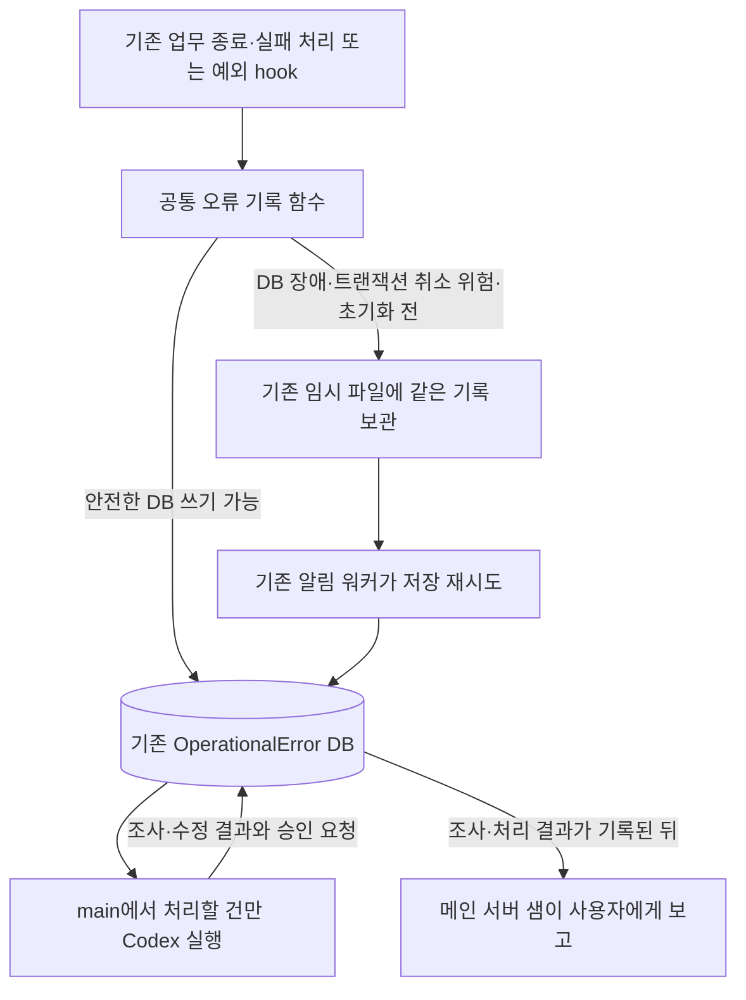

# Exdigm 운영 실패 분류·승인·자동 수정 기획

작성일: 2026-09-18 KST. 개정: 2026-09-19 KST. 상태: **주인님의 Telegram 직접 「초기 배포 승인」으로 제품 커밋 `3141ce76bef167c59700951f65edc306f01b7968`과 additive migration `0070`의 운영 배포·사후 검증 완료. 기존 오류 원문·이력 59건 보존 확인. 단건 실행기와 메인 샘 연결 정본은 Controlroom에 보관한다. 제한 권한 연결·무인 실행 활성화와 실제 오류별 승인 저장·자동 수리·운영 전달의 종단 검증은 아직 남아 있다. 초기 배포는 과거 고객 업무 재실행 승인이 아니다. 최신 근거와 재개는 10절을 따른다.**

## 1. 목표와 확정된 경계

오류 한 건을 보면 **무슨 업무가 어디에서 왜 멈췄고, 지금 누가 무엇을 해야 하며, 무엇을 확인해야 끝나는지** 알 수 있게 한다. 동시에 **발생한 곳에서 한 번 판단하고 공통 함수로 한 번 기록한다.** 이미 결정한 실패를 다른 프로그램이 업무 테이블에서 다시 찾아 같은 판단을 만드는 구조를 공식 경로로 남기지 않는다.

주인님이 결정한 자동 범위는 **수정·검증·리뷰·커밋까지 자동, 배포는 승인**이다. 큰 구조·업무 규칙·권한·데이터 의미 변경은 적용 전에 구체적 변경안을 승인받는다. 사용자 알림과 승인 창구는 주인님의 2026-09-19 지시에 따라 **메인 서버 Hermes 샘(`sam1065_bot`)**으로 변경한다. 로컬 쥬디의 Gmail 기능과 Exdigm 직원별 Hermes는 보존한다.

2026-09-19 주인님이 실행 책임을 명시적으로 확정했다. **Exdigm 코드는 실패 발견·즉시 기록, main Codex는 분석·수정·검증·리뷰·커밋·승인 요청 작성, 샘은 알림·승인 접수·승인된 배포·배포 검증·결과 통보**를 맡는다. 주인님은 큰 변경과 배포 여부를 결정한다. 양쪽 에이전트는 같은 조정실의 프로젝트 지침·관련 스킬·정책을 사용하며 기존 오류 DB의 같은 사건과 처리 이력으로 인계한다. Codex가 배포 요청을 작성하고 샘이 주인님께 전달하는 것은 서로 다른 책임이다.

같은 날 확정한 보고 기준은 **오류 발생 자체는 알리지 않고, Codex의 1차 조사·처리 결과를 보고한다**는 것이다. 초기에는 Codex가 처리한 모든 실제 사건의 결과를 보고한다. 정상적인 종료로 확인된 경우, 외부 조건 대기, 수정 불필요, 조사·수정 중단도 결과에 포함한다. 심각도나 분류를 이유로 에이전트가 보고 대상을 임의로 줄이지 않는다. 향후 보고 제외 대상은 주인님이 별도로 지정한다. 샘의 승인된 배포·검증 결과 보고도 유지한다.

기획을 자세히 쓰기 위해 실행 프로그램을 늘리지 않는다. 이번 정본은 **Exdigm의 공통 기록, main Codex의 조사·수정, 기존 샘의 소통·승인된 배포**라는 실제 목적을 중심으로 정리한다. 기록 서비스 서버, 분류 전용 워커, 승인 전용 웹 화면, 전달 장부용 새 테이블을 먼저 만드는 이전 초안은 채택하지 않는다. 샘은 기존 조정실 지침과 공식 배포 경로를 사용한다.

### 현재 코드와의 차이 — 직접 확인

| 현재 구현 | 확인 근거 | 설계에서 바꿀 점 |
|---|---|---|
| 오류 순간 공통 로그 처리기가 임시 JSONL 파일에 저장 | `common/operational_errors.py:OperationalErrorHandler.emit`, `install_exception_hooks` | DB에 안전하게 기록할 수 있으면 같은 호출 안에서 즉시 저장. 임시 보관은 기록 불가 상황에 사용 |
| 기존 알림 워커가 약 5초마다 파일을 DB로 옮김 | `deliver_notification_dispatches` → `collect_notification_dispatches` → `collect_operational_errors` → `_collect_logs` → `_record` | 기존 워커는 DB에 못 쓴 임시 기록의 재전달만 담당. 실패 의미를 다시 판단하지 않음 |
| 같은 워커가 업무 상태도 조회해 오류 기록 생성 | `_job_sources`의 13개 모델·14개 조회 조건, `_collect_jobs` | 실패를 확정한 기존 업무 종료 지점에서 공통 기록 함수를 호출하고, 검증한 대상의 재탐색 코드를 제거 |
| 공통 업무 종료 지점이 일부 이미 존재 | `data_extraction/services/execution.py:pipeline_execution`, `_finish_run`; 업로드는 `services/resume_uploader.py` | 각 `except`마다 별도 구현을 복제하지 않고 기존 종료·실패 처리 지점을 먼저 재사용 |
| 원문과 처리 이력 저장 구현이 존재 | `OperationalError`, `_record`, `record_processing_result`, 기존 관리 명령 | 같은 모듈과 모델을 확장. 새 기록 서버·별도 오류 DB를 만들지 않음 |
| 샘가 새 오류를 10분마다 읽음 | 로컬 `Gmail and Exdigm 10-minute monitor`, ID `41796002f11e` | 같은 작업에서 기존 오류의 후속 분류·승인 요청·수정 결과도 읽게 함 |

여기서 **알림 워커는 이미 운영 중인 별도 프로세스**이고, **오류 기록 함수는 업무 프로그램 안에서 호출되는 코드**다. 함수마다 워커가 있는 것이 아니다. 실제 서비스는 `Exdigm_exdigm_notification_dispatcher`, 실행 명령은 `python manage.py deliver_notification_dispatches --limit 100 --sleep 5`다. 일반 알림·직원 lifecycle도 함께 처리하므로 이 프로세스 전체를 제거하지 않는다.

현재 파일 보관에는 확인된 이유가 있다. `tests/test_operational_alerts.py`에는 업무 트랜잭션이 취소돼도 오류 기록을 보존하는 사례, DB 저장 실패 뒤 같은 파일을 재처리하는 사례, `QuerySet.update`와 일부 실패를 수집하는 사례가 있다. **현재 코드를 읽은 근거이며 이번 문서 작업에서 이 검사를 재실행한 것은 아니다.** 직접 기록 전환은 이 보호 결과를 유지해야 한다.

## 2. 하나의 공식 기록 경로

**정상 기록은 발생 시 호출에서 DB 저장까지 마친다. 5초 뒤 다시 찾아야 기록되는 구조를 기본으로 삼지 않는다.** DB에 쓸 수 없는 동안 DB 저장까지 즉시 완료한다고 주장할 수는 없다. 그때만 기존 파일에 즉시 보존하고 같은 오류 번호로 재전달한다.

호출자가 이용하는 오류 기록 진입점은 하나다. 기존 `_record`의 DB 저장·중복 방지, `safe_error_text`의 비밀값 제거, `OperationalErrorHandler`의 위치·호출 경로 추출과 파일 보관을 통합해 재사용한다. 함수 이름 변경 자체가 목표는 아니다. 새 진입점 아래에 같은 저장 책임을 가진 두 구현을 남기지 않는다.

| 기록 시점 | 공통 함수가 할 일 | 보존할 결과 |
|---|---|---|
| DB 사용 가능, 업무 저장 취소에 영향을 받지 않는 위치 | 기존 Django 저장 기능으로 즉시 오류 기록 | 발생 시각·기록 시각·원천 번호·관측 내용 |
| 확정된 업무 실패 상태를 저장하는 정상 종료 처리 | 실패 상태와 오류 행을 같은 기존 DB 트랜잭션에서 확정 | 업무 상태만 commit되고 오류 행이 빠지는 중단 구간 제거 |
| 취소될 수 있는 업무 도중의 예외 관측 또는 이미 실패한 연결 | 그 트랜잭션에 진단 기록을 얹지 않고 기존 파일에 즉시 보관 | 업무 rollback과 관계없이 오류 원문 보존 |
| Django/모델 초기화 전 또는 DB 장애 | DB 초기화를 억지로 반복하지 않고 같은 파일 보관 사용 | 원래 예외 동작과 진단 자료 보존 |
| 임시 기록 재전달 | 기존 워커가 이미 완성된 기록을 같은 DB 저장 구현에 전달 | 의미 재판정·새 오류 번호 생성 없이 한 번 반영 |
| DB 반영 후 응답만 소실 | 같은 번호의 저장 여부를 확인 | 중복 행·중복 Codex 실행 방지 |

업무상 실패는 **기존 공통 종료 처리에서 실패 상태와 오류 행을 함께 확정**한다. 상태를 먼저 commit하고 뒤에서 오류 함수를 부르는 틈을 남기지 않는다. 이 정상적인 실패 결과 저장과, 취소될 수 있는 업무 도중 관측한 예외를 구별한다. 후자는 공통 함수의 기존 파일 보관으로 보호한다. 같은 저장 책임을 재사용하되 `on_commit`에만 맡겨 rollback 때 관측 오류가 사라지게 하거나 업무 트랜잭션을 강제로 commit하지 않는다. 확정 실패 저장 자체가 실패하면 그 저장 실패의 관측을 보존하며, commit되지 않은 업무 결과를 확정 상태로 보고하지 않는다. 재귀적인 오류 기록도 막는다.

### 책임 중복을 실제로 없애는 전환

1. 기존 `_job_sources`가 다루는 모든 업무의 실패·일부 실패·재시도 소진·잠금 회수 시점을 찾는다. 현재 대상은 업로드 장부, 추출 실행/배치, 후보자 임베딩/배치, 이력서 생성, 미팅 처리, 후보자 검수, 자동 게시 run/site, 뉴스 수집, FileData, 외부 SearchSession이다.
2. 각 업무의 기존 확정 처리 지점에서 공통 함수를 호출한다. 이미 확정된 업무 판정·번호·단계·원인 자료를 전달하며 수집기용 별도 실패 조건표를 복제하지 않는다. 공통 종료 함수가 없는 경우에도 같은 책임의 분산 지점부터 정리한다.
3. 해당 업무의 공식 실행 경로에서 정상·실패·일부 실패·bulk update·늦은 commit·commit 직전/직후 종료·중단 복구를 확인한 다음 그 업무의 `_collect_jobs` 조회 조건을 제거한다. 기존 정상 취소·진행 중 재시도를 오류로 바꾸지 않는다.
4. 모든 대상이 전환되면 `_job_sources`·`_collect_jobs`와 그 전용 조회·식별 계산을 제거한다. 전환 중에도 같은 사건 번호를 사용해 새/구 수집이 중복 기록하지 않게 한다. 전환용 조회를 영구 병행하지 않는다.
5. `_collect_logs`의 임시 파일 재전달, 정상 업무 알림과 lifecycle 처리는 유지한다. 기록 장애 복구와 업무 실패 재탐색은 다른 기능이다.

예외 hook과 업무 종료가 **같은 실패**를 관측하면 원천 작업·시도·단계 식별자를 전달해 같은 기록에 연결한다. 관련 번호가 없는 두 로그를 문구가 비슷하다는 이유로 합치지 않는다. 업무 장부의 상태는 화면·재시도·산출물 관리에 필요하므로 보존하고, 진단 자료와 후속 조치의 정본만 `OperationalError`에 둔다.

프로세스 강제 종료나 서버 전원 차단은 사라진 프로세스가 스스로 함수를 호출할 수 없다. 이미 있는 업무 재개/잠금 회수 코드가 중단을 확인한 시점에 같은 함수로 남긴다. 그 경로가 없는 유형까지 “즉시 감지”한다고 보고하거나 새 전원 감시 시스템을 이번 범위에 추가하지 않는다.

## 3. 누가 언제 무엇을 맡는가

| 실제 주체 | 실행 시점 | 책임과 완료 결과 |
|---|---|---|
| Exdigm 업무 코드와 공통 기록 함수 | 오류/업무 중단을 확정한 즉시 | 원인 조사에 필요한 사실과 이미 확인한 업무 판정을 한 번 기록. 원천 상태를 재탐색하는 별도 정상 수집 단계 없음 |
| 기존 Exdigm 알림 워커 | 기존 약 5초 반복 | DB에 못 쓴 임시 기록 재전달. 새 의미 판단·수정·승인 없음 |
| main Codex와 최소 실행 연결 코드 | DB에 조사/수정할 건이 있을 때 | 같은 실행에서 자료 확인→분류/원인 조사→허용된 작은 수정→검증·리뷰·커밋. 큰 변경은 적용 전 제안을, 검증된 수정은 배포 요청을 같은 DB에 기록해 샘에게 인계 |
| 메인 서버 샘 | 처리 결과는 10분마다 확인, 사용자 답변은 수신 시 처리, 배포는 해당 승인 뒤 | 조사·처리 결과 전건 보고와 승인 요청 전달, 승인·거절·보류 기록, 승인된 커밋의 공식 배포·배포 검증·결과 기록과 통보. 최초 오류·진행 시작은 알리지 않으며 코드 수정은 main Codex에 인계 |
| 주인님 | 샘이 설명한 큰 변경/배포 요청을 검토할 때 | 정확한 요청과 변경안/커밋에 승인·거절·보류를 결정해 샘에게 답변 |
| 업무 담당자·계정 소유자 | 보완·인증 요청을 받았을 때 | 기존 접수/인증 경로로 조치. 실제 업무 결과를 확인한 뒤 같은 기록을 갱신 |

main에서 Codex를 시작하는 연결 자체는 필요하지만 **새 상시 관리자 서버를 만들지는 않는다.** 단건 실행 코드 하나를 기본 진입점으로 하고 main의 기존 systemd 기능으로 주기 실행한다. 대기 건 읽기·중복 시작 방지·Codex 호출·결과 저장이 그 코드의 범위다. 업무 실패 발견·내용 분류·알림 발송을 다시 구현하지 않는다. 별도 webhook·큐·분류 워커·복구 워커를 덧붙이지 않는다.

신규 실행 제안값은 **60초마다 처리 대기 확인, 동시 Codex 1개, 호출당 60분 상한, 같은 사건·같은 근거로 자동 호출 1회**다. 이 값은 설계안이며 현재 설치된 예약이나 사용자 확정 운영값은 아니다. 단건 검증 뒤 활성화한다. 기존 Codex 실행 제한과 OS의 프로세스 관리·잠금을 우선 사용한다. 상한에 걸리면 미완료 자료와 재개 조건을 기록하고 같은 입력을 무한 재실행하지 않는다.

오류 기록 즉시성과 Codex 실행 주기는 다르다. 업무 처리 요청에서 장시간 Codex 수리를 기다리지 않는다. main의 60초 조회는 **이미 DB에 남은 사건의 다음 행동**만 찾는다. 빈 조회·자료 보완 대기·승인 대기에 Codex를 호출하지 않는다.

**동시 1개는 조사·수정이 실행 중인 작업에만 적용한다.** 검증된 수정본을 보관하고 DB에 배포 요청을 남긴 뒤에는 실행과 작업 공간 소유를 끝낸다. 승인 대기 A가 남아 있어도 다음 조회에서 B를 처리한다. 각 수정은 현재 운영 기준에서 독립적으로 시작하며 A의 미승인 변경을 B에 포함하지 않는다. 승인 대기는 시간 제한 없이 기록으로 유지하고 주인님 응답을 추측하지 않는다.

## 4. 분류는 5가지이고 판단은 한 번만 한다

| 분류 | 확정할 근거와 예 | 다음 행동·담당 | 종료 조건 |
|---|---|---|---|
| C1 `user_action` 자료·사용자 조치 대기 | 원본의 필수 정보 부족, 소유자의 인증 필요. 연락처 보완·메일 링크 로그인 | 기존 컨설턴트 안내/샘 전달에 필요한 담당자·원본 링크·구체적 행동 기록. Codex 수리 없음 | 실제 보완·인증과 원래 업무 결과 확인 |
| C2 `expected_stop` 정상적인 업무상 종료 | 명시적 취소·업무 규칙상 제외·확인된 중복 완료 | 기존 업무 사유 보존. 정상 취소를 새 오류나 새 Codex 호출로 만들지 않음. Codex가 조사 후 정상 종료로 판정한 처리 결과는 초기 전건 보고에 포함 | 정상 종료 근거가 확인됨. 모든 정상 취소를 새 오류로 수집하지 않음 |
| C3 `external_wait` 외부 조건 대기 | 확인된 외부 장애·한도·정비와 재개 조건 | 기존 업무 재시도 기능이 담당. 다음 확인 조건/시각만 기록 | 조건 회복과 실제 업무 결과 확인. 재시도 소진은 남은 행동 기록 |
| C4 `defect` 프로그램 결함 | 정상 계약을 깨뜨린 원인을 원본·코드·재현/실행 증거로 확인 | main Codex가 작은 수정 또는 큰 변경 승인 요청 | 수정·운영 반영·원래 필수 결과 확인. 커밋만으로 복구 완료 아님 |
| C5 `unclassified` 미확인 | 위 판단에 필요한 근거가 없거나 모순됨 | main Codex가 조사. 부족한 증거와 재개 조건 기록 | C1~C4로 확인 후 해당 완료 조건 적용. 미확인 자동 종료 없음 |

C1~C4는 실패의 성격이고 C5는 근거 부족 동안의 임시 분류다. 긴급도·작은/큰 변경·진행 상태를 분류 종류에 섞지 않는다.

업무 코드가 이미 확정한 구조화된 판정은 공통 기록 함수가 그대로 연결한다. 최초 편입은 검증된 `EXPECTED_MISSING_DATA_STATES`, 기존 `notify_resume_missing_fields`와 담당자/원본 연결이다. 로그인 링크·인증 대기도 실제 공식 판정과 재개 경로를 확인해 연결한다. 오류 문구 키워드로 새 분류표를 만들지 않는다.

의미 해석·근본 원인 확인이 필요한 경우에는 C5로 남기고 **수리를 맡을 같은 Codex 실행에서** 판단한다. 분류 전용 LLM을 먼저 호출하고 수리용 LLM이 같은 내용을 다시 조사하는 방식을 필수 단계로 만들지 않는다. 주인님이 요청한 문제해결·SSP 검토와 필수 코드 리뷰는 같은 책임의 중복 감지가 아니라 수정 검증 절차로 유지한다.

- 원본에 연락처가 없으면 C1이지만 원본에 있는데 추출기가 잃었다면 C4 후보를 조사한다.
- `timeout`만 보고 C3로 확정하지 않는다. 외부 장애·우리 요청 결함을 구별할 근거가 필요하다.
- 담당자가 아직 연결되지 않았다고 확인된 C1을 C5로 바꾸지 않는다. 분류는 유지하고 담당 연결이라는 남은 행동을 적는다.
- C1 안내 기능이 별도로 고장났다면 보완 건과 안내 결함 건을 연결한다. 자료 부족이라는 이유로 안내 결함을 숨기지 않는다.
- 기존 컨설턴트 보완 안내를 다시 만들지 않는다. 샘에는 주인님이 해야 할 일·담당 미정·관리자 판단이 필요한 사항을 전달한다.

## 5. DB 기록과 후속 처리도 기존 한 경로를 확장한다

**기존 `OperationalError`와 `processing_history`를 정본으로 쓴다.** 새 DB, 요청 전용 테이블, 별도 기록 API 서버를 먼저 추가하지 않는다. 현재 `projects/services/operational_errors.py`와 `record_operational_error_result` 관리 명령에 필요한 제한 동작을 확장한다. 문서의 “기록 기능”은 이 기존 코드의 책임이며 별도 실행 서비스 이름이 아니다.

| 남길 정보 | 작성 책임과 뜻 |
|---|---|
| 원래 오류 | 공통 함수: 기존 id·발생/기록 시각·위치·실제 오류·traceback·원천 작업/시도/단계. 조사 뒤 덮어쓰지 않음 |
| 분류와 근거 | 확정 업무 판정 또는 Codex: C1~C5, 판단자·시각·근거·확인 정도. 반증 뒤 수정은 이력으로 남김 |
| 원인 | Codex: 관측 현상·가설·확인 원인을 구별. 최초 이탈 단계·증거 참조. 모르면 미확인 |
| 현재 다음 행동 | 해당 처리 주체: 무엇을 누가 해야 하는지, 대상 자료/커밋, 재개 조건과 개정 번호 |
| 조사·수정 결과 | Codex/실행 연결: 실행 번호, 기준·결과 커밋, 실제 수정·검증·리뷰, 성공/실패·남은 일 |
| 변경/배포 요청 | 같은 오류의 현재 행동과 이력: 요청 번호·개정, 구체적 변경 범위·영향·증거·복구안. 별도 승인 장부를 중복 구현하지 않음 |
| 사용자 결정 | 명시적 지시를 받은 기존 조정실: 누가 언제 어떤 요청/개정/커밋에 승인·거절했는지와 지시 근거 |
| 최종 결과 | 실제 업무 확인 주체: 산출물·전달·사용 증거, 복구 성공/정상 종료/사용자 취소의 구별 |

새 조회에 필요한 분류·현재 행동·개정과 실행/요청 자료만 기존 모델에 확장한다. 현재 행동은 `investigate` 조사, `user_action` 보완, `external_wait` 외부 대기, `repair` 수정, `approve_change` 변경 승인, `approve_deploy` 배포 승인, `verify_result` 업무 결과 확인, `none` 추가 행동 없음으로 구분한다. 실행 여부는 기존 처리 상태와 실행 기록으로 나타내고 별도의 12단계 사건 엔진을 만들지 않는다.

기존 `processing_status`는 마지막 처리 결과이고 `pending`은 처리 기록 없음이다. 새로운 전체 사건 종료값으로 재해석하지 않는다. `processing_history`의 과거 항목은 보존하고 새 항목에 실행/이력/개정 식별과 필요한 구조화된 자료를 추가한다. 대기·승인 요청이나 배포 성공을 기존 업무의 복구 성공으로 대신 쓰지 않는다.

현재 행동 변경·그 이유·요청 자료는 기존 행 잠금과 트랜잭션에서 함께 저장한다. 같은 사건/개정/단계 결과의 재전송은 같은 이력으로 식별해 중복 추가하지 않는다. 요청 내용이 달라지면 개정을 올리고 예전 승인을 새 행동에 재사용하지 않는다. 한 사건에 동시에 다른 원인의 조치가 필요하면 원천을 연결한 별도 사건으로 관리하며 기존 원문을 억지로 새 의미로 바꾸지 않는다.

메일·이력서 본문 전체와 인증값은 DB 이력에 복제하지 않는다. 보호된 원본 참조와 필요한 최소 근거를 남기고 기존 관리자 읽기·일반 직원 차단·비밀값 제거를 유지한다.

## 6. 자동 수리 한 건의 진행과 완료

| 순서 | 누가 무엇을 하는가 | 반드시 남길 결과 |
|---|---|---|
| 1. 기록 | Exdigm이 발생 즉시 공통 함수 호출 | 원래 오류와 확인된 분류 또는 C5, 다음 행동 |
| 2. 시작 | main 단건 연결 코드가 처리할 건 한 개와 작업 공간 소유를 확인 | 사건/개정/실행 번호·기준 코드. 이미 처리 중/대기인 건 재호출 없음 |
| 3. 조사 | main Codex가 원본·현재 코드·실행 판본을 대조 | 원인·확인 정도, C1~C5와 다음 행동. 사람이 할 일이면 그 내용을 기록하고 종료 |
| 4. 판단과 수정 | 같은 Codex가 자동 범위인지 판단 | 작은 결함이면 이어서 수정·검증·리뷰. 큰 변경이면 구체적 변경안을 남기고 적용 전 종료 |
| 5. 커밋과 요청 | 같은 Codex가 검증된 변경을 커밋하고 연결 코드가 실제 결과 대조·보관·저장 후 작업 공간 반환 | 수정 내용·검사·기준/결과 커밋·보관 참조·배포 승인 요청. 운영은 아직 고치기 전 상태이며 다음 사건 처리 가능 |
| 6. 전달·결정 | 기존 샘가 새 행동/결과를 알리고 주인님이 결정 | 정확한 요청·개정·변경안/커밋의 승인·거절. 메시지 전달과 승인은 다른 사실 |
| 7. 승인된 실행 | 지시받은 기존 조정실 에이전트가 같은 공식 수정/배포 경로 사용 | 승인 범위 실행 결과와 운영 판본·서비스 확인 |
| 8. 업무 확인 | 업무 담당 기능/조정실이 원래 업무 결과 확인 | 실제 필수 산출물·전달·사용 결과, 최종 종료 또는 남은 재처리 요청 |

호출 지시는 현재 조정실의 지침과 관련 스킬을 읽도록 하고 **문제해결 게이트를 명시적으로 요청**한다. 순서는 현상 잠금 → 연속 질문 → 버드뷰 → 결과 대조 → 근본 원인 판정 → 해결책 → 적용·검증 → 재발 판정이다. 이후 SSP·최소 구현·변경 무결성·공식 검증·필수 리뷰를 따른다. 지침·스킬 내용을 실행 스크립트에 다시 복사해 별도 판본을 만들지 않는다.

작은 수정은 확인된 원인을 고치면서 업무 규칙·입출력·권한·데이터 의미를 보존하고 영향과 되돌릴 범위를 특정할 수 있어야 한다. 원래 실패·같은 원인의 변형·기존 성공을 확인한다. 줄 수나 파일 수만으로 정하지 않는다. DB 의미·후보자 병합·필수조건·공용 구조·권한·새 서비스·외부 효과·대량 자료 수정·지침/승인 기준 변경은 큰 변경 검토 대상이다.

Codex 종료 코드 0이나 JSON 형식 통과를 실제 수리 성공으로 취급하지 않는다. 연결 코드는 같은 실행의 실제 커밋·검증 증거·허용 범위를 대조한다. 확인할 수 없으면 미완료로 남긴다. 원인 미확인을 승인 요청으로 떠넘기지 않고 부족한 증거를 구체적으로 적는다.

main은 `/home/chaconne/controlroom/exdigm`에서 실행하고 제품 코드·Git·검증은 SSH로 `/home/chaconne/exdigm-debug`를 사용한다. `scripts/debug_workspace.sh`와 기존 리뷰 절차를 재사용하며 운영 checkout을 직접 수정하지 않는다. 한 실행 중 controlroom 지침 판본을 교체하지 않고 동기화는 실행·미전송 작업을 정리한 뒤 수행한다.

## 7. 샘의 알림과 승인 답변을 같은 오류에 연결한다

메인 서버 `/home/chaconne/.hermes`의 기존 샘과 Telegram 개인 대화를 사용한다. 샘은 기존 Hermes 예약으로 10분마다 기존 처리 이력에서 아직 전달하지 않은 조사·처리 결과를 읽어 보고한다. 오류 발생 원문과 `in_progress`의 조사·수정 시작은 보고 대상이 아니다. 주인님의 답변은 Telegram 수신 시 처리하므로 다음 10분 조회를 기다리지 않는다. 로컬 PC가 꺼져 있어도 메인 서버와 Telegram 연결이 정상이라면 전달·답변 처리가 계속된다.

보고는 기존 `processing_history`의 `succeeded`/`failed` 결과를 사용한다. 여기서 succeeded는 해당 처리 단계의 결과이며 원래 업무의 복구 완료를 자동으로 뜻하지 않는다. 확인한 문제, 원인과 근거 또는 남은 불확실성, 실제 처리 또는 제안, 검증 결과, 주인님의 판단·행동 필요 여부를 설명한다. 원인 미확인·수정 중단도 무엇을 확인했고 왜 멈췄으며 다음에 무엇이 필요한지 보고한다. Codex의 결론은 샘이 다시 조사하거나 추측으로 바꾸지 않는다.

분류별 보고 제외는 두지 않는다. 확인된 정상 종료도 결과로 보고하며, 하나의 사건에 쌓인 미전달 결과는 순서대로 함께 설명해 빠뜨리지 않는다. 실제 사건이 아닌 명시적 시험 자료와 승인 접수만 기록한 영수증은 별도 처리 결과 보고가 아니다. 이후 진행이나 승인으로 바뀐 과거 요청은 과거 결과로 설명하고 현재 승인 요청처럼 다시 요구하지 않는다. 결과 조회 자체의 실패는 기존 로그와 실행 자료에 보존하고 확인 위치를 전진시키지 않으며, 조사 전 장애 문구를 주인님께 직접 발송하지 않는다.

샘은 오류 UUID, 요청 개정, 변경 내용·영향·검증·복구안과 배포할 정확한 커밋을 설명한다. 주인님은 해당 메시지에 승인·거절·보류 의사를 답한다. 의미와 요청 대상을 판단하는 책임은 샘에게 있다. 모호한 답변은 범위를 확인하며 오류 원문·예약 프롬프트·단순 열람·시간 경과를 승인으로 해석하지 않는다.

`exdigm/skills/exdigm-error-control`은 샘의 처리 절차이며 `scripts/decision.py`는 이미 있는 결과 관리 명령을 연결한다. 도구는 현재 Hermes 실행의 Telegram 개인 대화·허용된 사용자·실제 원본 메시지를 대화 장부와 대조하고, 요청 개정·내용 해시·커밋과 메시지 시각을 확인한다. 예약 실행이나 CLI만으로 결정을 기록할 수 없다. 기존 `OperationalError.processing_history`에 결정과 요청 식별·메시지 출처·메시지 해시를 기록한다. 승인 원문은 Hermes 대화 장부에 있고 고객 자료나 전체 대화를 오류 DB에 복제하지 않는다.

같은 요청·결정을 다시 전송하면 고정된 기록 번호와 최초 저장 인수를 재사용한다. 응답 소실을 두 번째 승인·배포로 처리하지 않는다. 승인 성공 응답과 실제 실행 성공은 구분한다. 다른 처리로 개정이 달라졌으면 실행 허가를 반환하지 않는다. 샘은 실제 작업 잠금을 확보한 뒤 승인 개정을 다시 확인하고 기존 결과 명령으로 실행 시작을 먼저 기록한다. 그 개정을 확보한 실행만 승인된 작업을 진행한다.

- 변경 승인은 특정 제안의 구현 권한이다. 샘이 승인된 제안과 근거를 main Codex에 전달하고 같은 문제해결·SSP·최소 구현·리뷰 지침을 적용한다. 구현 승인은 배포 승인이 아니다.
- 배포 승인은 특정 검증된 커밋의 운영 반영 권한이다. 샘이 기존 `exdigm-deploy`와 8절의 debug 잠금·예약을 사용한다. DB의 요청 개정·`base_commit`·`commit`·`repair_ref`를 실제 Git과 대조하고 공식 `scripts/deploy/deploy.sh prod`로 배포한다. 다른 미승인 변경을 섞지 않는다.
- 운영 기준이 바뀌면 원본 수정본을 보존하고 새 기준에서 검증한 결과·차이를 남긴다. 새 커밋을 이전 커밋의 승인으로 배포하지 않는다.
- 거절·보류는 결정만 기록하고 실행하지 않는다. 승인 대기는 다른 오류의 조사를 막지 않는다. 작업 공간이 사용 중이면 해당 승인 작업만 대기로 남긴다.
- 배포와 실제 업무 결과·남은 행동은 같은 오류의 기존 처리 이력에 남긴다. 과거 업무 재실행·메일 발송·게시·자료 정정은 승인한 대상과 외부 효과 범위에 따른다.
- 배포 중 코드 수정이 필요하면 샘은 실패 근거와 검증 결과를 같은 오류 이력에 남겨 main Codex의 수정으로 연결한다. 샘이 배포 승인 대상 코드를 임의로 바꾸지 않는다. Codex가 만든 새 커밋은 검증 결과와 함께 새 배포 요청으로 인계한다.

전달 코드는 Controlroom `.controlroom/scripts/exdigm/hermes` 하나로 관리한다. 실제 예약용 두 Python 파일은 Hermes의 스크립트 경로 규칙에 따라 샘의 `scripts/`에 설치하고 해시를 대조한다. 기존 쥬디 확인 위치와 전달 완료 개정만 인계하며 이전 프로필 실행 장부에 연결된 미완료 전달은 섞지 않는다. 샘 작업 ID는 샘의 기존 상태 파일에 보관하고 같은 작업의 실제 `completed+delivered` 영수증 뒤에만 확인 위치를 전진시킨다. 확인 위치에는 실제 보고한 마지막 결과의 개정을 저장하며, 그 뒤의 진행 중 개정을 전달 완료로 처리하지 않는다. 사건 생성 시각이 오래됐어도 미전달 결과는 읽고, 원문·진행 기록은 결과 페이지 수를 차지하지 않는다. 조회 실패는 빈 조회로 숨기지 않는다. 보고 본문도 기존 대화에 연결해 답변 시 문맥을 유지한다.

쥬디의 기존 작업 `41796002f11e`는 `gmail_daily_context.py`를 직접 사용해 Gmail만 처리한다. 기존 ID·일정·Gmail 규칙·origin·모델·인증·대화는 보존한다. 엑스다임용 별도 기록 서버·승인 웹 화면·승인 폴링 워커는 추가하지 않는다. 샘의 답변 처리에서 기존 관리 명령·조정실 절차를 사용한다.

현재 운영 DB에 새 승인 필드가 없으므로 기존 검증 제품 커밋과 migration `0070`의 초기 배포가 먼저 필요하다. 오류 UUID가 없는 이 설치 요청은 샘을 통한 일반 조정실 승인으로 진행하며 가짜 오류를 만들지 않는다. 알림 이전·승인 도구 검증과 실제 운영 승인 저장·배포 검증은 구분해 10절에 기록한다. main 자동 조사 실행기의 제한 신원 및 타이머 활성화는 별도의 미완료 단계다.

## 8. 중단·충돌 때도 같은 실행을 이어 간다

| 상황 | 같은 경로에서 처리할 일 |
|---|---|
| 업무 DB 장애/rollback | 공통 기록 함수가 기존 파일 보관, 기존 워커가 같은 번호 재전달. 원래 업무 성공·실패를 바꾸지 않음 |
| main이 DB/SSH에 연결하지 못함 | 새 수리를 시작하지 않고 연결 실패 증거 보존. 상태 대조 전 실행 여부 불명의 작업을 재호출하지 않음 |
| 로컬과 main이 같은 debug를 사용 | 같은 작업 공간 소유/OS 잠금 사용. 기존 변경·미배포 커밋을 확인하고 하나의 writer만 허용 |
| Codex 종료/상한 초과 | 실제 원격 프로세스·파일·커밋·기록 대조 후 중단 단계 저장. 잠금 시간 경과만으로 새 writer를 시작하지 않음 |
| 커밋 후 DB 결과 저장 실패 | 남은 실행 증거와 Git으로 같은 실행의 결과만 다시 저장. 수정·커밋 재생성 없음 |
| 배포 승인 대기 | 검증된 커밋을 실행별 Git 참조로 보관하고 clean 작업 공간을 시작 기준으로 복귀. DB 요청 저장과 반환 확인 뒤 예약 해제. 다음 사건은 독립적으로 처리 |
| 배포 중 응답 소실 | 운영 판본·서비스·공식 결과부터 확인. 배포·업무 효과를 무작정 반복하지 않음 |
| 같은 원인 재발 | 기존 결과를 보존하고 새 발생/시도를 연결. 근거 변화 없이 같은 패치 자동 반복 없음 |
| 기록/실행 연결 자체 오류 | 제한된 로컬 진단 자료와 한 번의 운영 조치 요청. 자기 오류가 Codex를 무한 호출하는 고리 차단 |

main Codex에는 debug 수정·검증에 필요한 권한만 연결하며 사용자 승인·운영 쓰기를 스스로 수행할 권한을 자동 범위로 주지 않는다. 현재 넓은 `chaconne` SSH 접속 성공은 이 제한을 검증한 것이 아니다. 기존 운영/개발 권한과 공식 명령을 활용해 실제 경계를 확인한 뒤 무인 실행한다. 새 서버로 책임을 나누는 것으로 권한 검증을 대신하지 않는다.

### 작업 공간 소유와 결과 재전송의 실행 계약

로컬 에이전트와 main은 debug의 `runtime/operational-repair.lock`에 같은 배타 잠금(`flock`)을 사용한다. 잠금 안에서 `runtime/operational-repair.json`의 `run_id`를 확인하고, 미예약일 때만 고유 UUID로 예약한다. 로컬 수동 개발도 먼저 예약해야 하며 일반 개발의 소유 번호와 재개 계획은 해당 작업 계획에 남긴다. main 실행기는 같은 작업을 `repair_once.py`의 `workspace_lock`으로 수행한다. 파일이 남아 있으면 OS 잠금이 풀렸어도 이전 작업이 끝난 것으로 판단하지 않는다.

수정·검증 동안 OS 잠금을 유지한다. 수정 없는 조사 종료는 시작 커밋/clean 상태와 DB 결과 저장을 확인한 뒤에만 예약을 해제한다. 검증된 수정의 배포 승인 대기는 아래 순서로 보관하고 예약을 해제한다. 변경 잔여·실행 여부 미확인·보관/반환 실패는 예약을 유지한다. main은 원격 해제 응답까지 받아야 실행 기록을 닫는다. 예약 인계는 이전 writer 종료, 실제 파일·HEAD·운영 판본, DB의 실행 번호/현재 개정, 보존할 커밋과 다음 담당을 대조한 뒤에만 한다. 중단된 writer를 강제로 재시작하거나 예약 파일만 먼저 지워 우회하지 않는다.

1. 검증된 실제 커밋과 검사 증거를 확인하고 최종 DB 인수를 먼저 고정한다. 기존 `handling_context`에 `base_commit`, `commit`, `repair_ref=refs/operational-repairs/<실행 UUID>`, `workspace_reserved=no`를 넣되 아직 DB에 전송하지 않는다.
2. 같은 잠금 안에서 clean detached HEAD, 시작 기준과 운영 기준 일치, 수정 커밋의 시작 기준 포함 여부를 확인한다. Git `update-ref`의 미존재 조건으로 그 커밋을 보관한다. 이미 같은 참조가 있으면 동일 커밋일 때만 이어 가며 다른 값을 덮어쓰지 않는다.
3. 보관이 확인된 후에만 `git switch --detach <시작 기준>`으로 작업 공간을 반환한다. 강제 reset/clean/stash는 사용하지 않는다. 이미 반환된 재전송은 같은 보관 참조와 clean 기준을 다시 확인한다. 다른 커밋·미커밋 변경·운영 기준 변경이면 보존하고 중단한다.
4. 고정한 결과를 기존 DB 결과 명령으로 저장한다. 사건은 `approve_deploy`로 남고 `workspace_reserved=no`가 되어 다음 사건 확보를 막지 않는다. 반환 상태와 원격 예약 해제를 확인한 뒤 실행을 끝낸다. 보관·반환·DB 응답 중간에서 끊겨도 같은 결과/참조만 확인·재전송하며 Codex를 다시 실행하지 않는다.

보관 참조는 Git 자체의 기능이며 새 워커·큐·테이블·작업 공간을 만들지 않는다. 승인 대기 수정본은 공유 debug의 현재 HEAD와 별개로 유지된다. 개정 이전의 수동 예약과 보관 정보 없는 중단 자료는 자동 전환하거나 삭제하지 않으며 기존 소유·결과 대조로 인계한다.

main의 실행 자료는 배포 설정으로 정한 전용 `state_root` 아래에 보관한다. `active.json`은 진행 중 실행 번호와 시작 HEAD, 실행별 폴더는 사건 사본·CLI JSONL·최종 결과·DB에 보낼 인수를 가진다. 최종 `result-payload.json`을 저장한 뒤 DB 응답이 끊기면 다음 호출은 동일 인수/같은 entry_id만 재전송한다. `interrupted-payload.json`도 처음 기록한 내용 그대로 재전송하며 새 Codex는 시작하지 않는다. 사람이 사건을 먼저 처리했으면 개정/소유 불일치로 중단한다.

`approve_deploy`는 실제 debug HEAD=전체 커밋 SHA, 시작 HEAD와 다름, clean 상태를 확인해야 한다. 최종 보고의 검사 문장에 더해 같은 CLI 실행 JSONL의 실제 `command_execution`에 공식 `scripts/debug_workspace.sh test`와 `check`의 종료 코드 0이 있어야 한다. 실행 자료 경로와 해당 명령 ID를 같은 DB 처리 자료에 연결한다. 이 기계 검사는 실행 증거의 존재 확인이며, 실패 원인·검사 범위·작은 변경 여부의 의미 판단은 같은 Codex의 지침/리뷰 책임이다. 실제 제한 권한과 종단 수리 성공의 검증을 대신하지 않는다.

## 9. 구현 순서와 최소 구현 기준

주인님의 v2 구현 승인으로 1~3단계 코드를 작성했다. 10절의 검증 범위와 운영 반영 상태를 구분하며, 4단계의 운영 배포·제한 권한 연결·예약 활성화는 별도 승인 후 진행한다.

| 단계 | 기존 구현의 변경 | 인수 조건 |
|---|---|---|
| 1. 기록 경로 통합 | 공통 기록 함수의 즉시 DB 저장·기존 파일 보관을 연결하고 기존 업무 종료 지점에서 호출. 검증한 `_collect_jobs` 분기 제거 | 원래 수집 범위 보존, 정상 시 즉시 기록, rollback/DB 장애 보존·복구, 최종 재탐색 코드 제거 |
| 2. 분류·조치·전달 | 같은 `OperationalError`/이력/관리 명령에 분류·다음 행동·승인 요청·결과 추가. 기존 보완 안내와 샘 조회 연결 | 5종별 담당/재개/종료 조건, 기존 행의 후속 결과 전달, 원문·Gmail·일반 알림 보존 |
| 3. main 단건 자동 수정 | 단건 실행 코드로 기존 Codex CLI·SSH·debug·스킬·검증·커밋 연결 | 같은 실행에서 조사와 작은 수정, 큰 변경/배포 승인 대기, 중복·권한·작업 공간 경계 확인 |
| 4. 승인 뒤 결과와 반복 실행 | 명시적 승인에 따른 기존 배포·업무 검증, 검증된 단건 코드를 systemd로 주기 실행 | 실제 원래 업무 결과·DB 이력·샘 전달 확인. PC 종료·프로세스 중단에서 보존/재개 |

**최소 구현 게이트의 설계 판단:** 기록·보관·재전달·업무 종료·DB 이력·알림·검증·배포는 저장소의 기존 구현 재사용인 **2단계**를 우선한다. main의 반복 실행과 잠금은 설치된 systemd/OS 기능을 활용한다. 코드 작성 직전에 실제 검색과 필요한 추가 부분을 잠그며 아직 미확인인 구현을 재사용 완료로 보고하지 않는다.

필수 추가는 기존 기록 경로를 연결하는 변경, 분류/다음 행동의 최소 저장 확장, main에서 기존 Codex를 시작·결과 기록하는 단건 연결이다. 별도 기록 서비스·분류 워커·요청 테이블·승인 웹 화면·두 번째 샘 예약은 이 목표의 필수 전제가 아니므로 만들지 않는다. 같은 함수 이름을 여러 곳에 붙이거나 기존 수집기를 그대로 둔 채 직접 기록 경로만 추가한 상태는 통합 완료가 아니다.

### 공식 경로에서 확인할 사례

| 사례 | 확인 결과 |
|---|---|
| 정상 환경의 예외 | 실제 업무/로그 진입점에서 DB 기록. 5초 수집기 호출 없이 조회 가능 |
| 업무 실패·일부 실패 | 기존 공식 종료 지점에서 원래 수집 대상과 같은 범위 기록. `QuerySet.update`도 누락 없음 |
| 업무 상태 저장 직후 종료 | 실패 상태와 오류 행이 함께 commit돼 재탐색 없이 기록 존재. commit 전 종료면 확정 실패로 오인하지 않고 원래 중단 복구 계약 유지 |
| rollback·초기화 전·DB 중단 | 오류 원문 보존, 원래 업무 동작 유지, 복구 후 같은 DB 번호 한 건 |
| 신규 직접 기록/구 수집 중첩 | 같은 사건이 두 행·두 Codex 실행이 되지 않음. 전환 완료 뒤 구 조회 분기 없음 |
| 같은 예외와 업무 실패 | 원천 식별자가 연결된 같은 사건을 중복 처리하지 않음. 별개 사건은 임의 병합하지 않음 |
| 취소·정상 완료·재시도 중 | 기존 정상 제외 유지. 새 오류·알림·수리 없음 |
| 자료 부족·메일 링크 | 실제 필요한 행동·담당자·원본 링크·기존 안내. 보완 뒤 필수 업무 결과 확인 |
| 원본에는 정보가 있음 | 자료 부족으로 숨기지 않고 유실 원인 조사 |
| 외부 한도·미확인 | 근거에 따라 C3/C5 구별. 기존 재시도 주체 1개, 미확인 자동 종결 없음 |
| 작은 결함 | 같은 Codex 실행의 조사·SSP·최소 구현·검증·리뷰·커밋. 배포 대기 종료 |
| 승인 지연 | A를 승인 대기로 보관한 뒤 B를 처리. 두 Git 참조·DB 요청 보존, 각 수정은 운영 기준에서 독립 시작, 운영은 무승인 변경 없음 |
| 큰 변경 | 적용 전 구체적 변경안·영향·검증·복구와 승인 요청 |
| 단계 성공·기존 행 갱신 | 커밋/검사 성공 뒤에도 배포/보완 행동 조회 가능, 후속 결과를 샘가 읽음 |
| PC 종료·전달 실패 | 사건과 요청 보존, 복귀 후 발견. 준비/조회 실패를 전달 성공으로 오기록하지 않음 |
| 권한·승인 | Codex가 사용자 승인/운영 쓰기를 스스로 실행하지 못함. 정확한 요청 개정·커밋만 승인 범위로 사용 |
| 동시 수정·중단·결과 저장 실패 | 사용자 변경·미배포 커밋 보존. 실제 프로세스/판본 대조 후 같은 실행 재개 |
| 운영 결과 | 배포만으로 해결 완료 표시하지 않고 원래 산출물·전달·사용 확인 |
| 과거 자료·식별 | 원래 오류·이력·Asia/Seoul·기존 번호 보존. 과거 오류 일괄 재처리/재발송 없음 |

제품 검사는 기존 원격 `scripts/debug_workspace.sh test`·check, 보호 검사·카탈로그 갱신·필수 리뷰를 사용한다. 즉시 DB 기록 때문에 달라지는 예상 지연만 명시적으로 변경하고, rollback·DB 장애·중복·비밀값·일반 알림 보호 기대값은 유지한다. 실제 메시지·운영 업무 재처리는 해당 검증의 승인 범위에서만 실행한다.

## 10. 현재 확인과 재개 정보

### 무인 가동 준비의 안전한 실검증 — 2026-09-19 후속

- 요청은 가동 준비 조사와 가능한 검증이다. 계정/SSH/권한 변경, timer 활성화, 제품 코드·운영 DB 변경, 배포, 과거 고객 작업 재실행은 제외했다. 기준 Controlroom `000df23f294f8287307755542d5cb3d62957fe67` clean에서 시작했고 제품 운영/debug/origin은 `3141ce76bef167c59700951f65edc306f01b7968` 및 clean을 전후 확인했다.
- 기존 검사를 재사용했다. main 실행기 `python -m unittest -v test_repair_once` **22개**, 승인 도구 `python -m unittest -v test_decision` **10개**, 알림 `python -m pytest -q -p no:cacheprovider test_monitor.py` **16개** 통과. 실행기는 실제 임시 Git/worktree/flock도 쓰지만 Codex/DB 응답은 모의한다. 승인/알림 검사는 격리 SQLite·fixture이며 실제 사용자 승인이나 운영 전달이 아니다. Hermes venv에 pytest가 없어 알림만 기존 uv의 격리 도구 환경(`uv run --no-project --with pytest`)에서 통과했으며 Hermes 환경을 바꾸지 않았다.
- 제품은 원격 공식 `scripts/debug_workspace.sh test tests/test_operational_alerts.py tests/test_operational_error_records.py`에서 **78개 통과, 기존 경고 5개**, `scripts/debug_workspace.sh check` 정상이다. 개발 전용 테스트 DB에서 즉시 기록·rollback/DB 장애 보존·개정 충돌·과거 건 미확보·한 실행 소유·결과 관리 명령의 claim/read/동일 결과 재전송을 확인했다. 이번 합계 **126개**는 격리/개발 검사이며 실제 무인 종단 성공 수가 아니다. 원격 비로그인 PATH에 uv가 없어 코드 조회는 기존 `/home/chaconne/.local/bin/uv`를 명시했다.
- 실환경 읽기 전용 확인: 공식 `shell-readonly`의 `exdigm_debug_ro`/DB `exdigm`/read-only `on`, migration0070 적용 1건, 오류 **59건 전부 unclassified/none/revision0**, 조사·수리·승인 대기 행동 0건. monitor의 기존 `collect_context`만 호출해 신규/변경 0건과 상태 파일 불변을 확인했다. 승인 도구의 decide나 운영 결과 쓰기는 실행하지 않았다.
- 기존 샘 job `130323c787e0`은 10분·enabled/scheduled·`attach_to_session=true`다. 최근 영수증 5개는 `completed/suppressed`이며 실제 요청 전달 시험으로 해석하지 않는다. 설치된 조회/체크포인트 2파일과 decision.py는 Controlroom 원본과 SHA-256이 같다. Codex 0.153.2/ChatGPT 로그인은 확인했으나 이번에 실제 수리 LLM을 호출하지 않았다.
- 현재 debug 예약 파일은 없고 기존 lock 파일을 읽기 전용으로 열어 배타 flock 확보·해제를 확인했다. 새 예약은 만들지 않았다. main/Exdigm의 passwd 목록에 수리 전용 신원은 없고, main의 `.config`·`.local/state`·`/etc/exdigm`·정본 실행기 경로에서 제한 연결 JSON을 찾지 못했다. 수리용 systemd unit도 발견되지 않았다. 현재 넓은 chaconne 연결에 기존 preflight를 부정 시험한 결과 실제 원격 검사에서 **`Automatic repair needs its restricted execution identity`**로 거절됐다. 이를 통과시키거나 배치 설정으로 저장하지 않았다.
- **가동 차단 사유와 최소 다음 조치:** 별도 승인 범위에서 main/Exdigm의 제한 실행 신원과 `record_command` 환경·설정부터 마련해야 한다. debug는 운영 `/home/chaconne/exdigm/.git`을 공유하므로 debug 수정/검증·객체/보관 ref 권한을 주면서 운영 checkout·main ref·Git config/hooks·배포·운영 DB/발송·사용자 승인 권한은 열지 않아야 한다. 기존 chaconne 권한은 그대로 보존한다. 실제 제한 신원으로 경로/참조/DB/승인 거부 경계 및 정식 `--check`를 검증한 뒤, 명시적으로 승인된 격리 사건의 실제 수리→결과 저장→샘 전달/승인 연결을 확인한다. 그 이후에만 별도 승인으로 timer를 활성화한다. 설정 없는 상태에서 전체 preflight/종단 성공을 주장하지 않는다.
- machine-readable 증거: main `/home/chaconne/.local/state/exdigm-unattended-readiness-20260919T091357Z/result.json`; 실제 argv·cwd·종료 코드·로그는 같은 폴더 `commands.json`과 개별 `.log`에 있다. 이번 기록은 재개 정보만 추가하며 기능/권한 구현이나 운영 가동 완료가 아니다.

### 오류 발생 알림을 처리 결과 보고로 변경 — 2026-09-19

주인님의 최신 지시는 최초 오류를 알리지 않고 Codex가 1차 확인한 문제·원인·처리 또는 제안·검증·판단 요청을 보고하라는 것이다. 초기에는 Codex가 처리한 실제 사건의 결과를 전부 보고하며 이후 제외 기준은 주인님이 정한다. 같은 오류의 여러 완료 결과도 빠뜨리지 않고, 실패·중단·확인된 정상 종료를 에이전트가 임의로 제외하지 않는다.

기준선은 Sam이 초기 배포 결과를 기록하고 역할 확정 문서를 합친 Controlroom `000df23f294f8287307755542d5cb3d62957fe67`이다. 로컬/main의 기존 작업을 확인하고 clean 상태에서 시작했다. 기존 monitor 16개 검사가 통과했다. 샘 작업 `130323c787e0`의 예약·모델·origin·승인 스킬과 기존 결과 관리 명령을 그대로 사용한다. 설치 변경 전 활성 실행·미완료 전달이 없음을 확인했고 원본은 샘의 `backups/exdigm-result-reports-20260919`에 보관했다.

최소 구현 게이트: 2단계에서 멈춤 — 기존 `record_processing_result`의 status/revision/처리 이력과 기존 결과별 전달 확인을 재사용한다. 새 분류기·DB 필드·워커를 만들지 않는다. 코드 변경은 기존 결과 조회 SELECT와 JSON 변환, 보고 프롬프트, 관련 검사에 한정한다. 제품 기록/자동 확보/수정 코드와 일반 직원 알림·쥬디 Gmail은 변경하지 않는다.

리뷰 계약:
1. 원천: 최신 사용자 보고 기준과 정책 1·3·7절. 초기 오류는 조용히 보관하고 처리 결과는 전건 보고.
2. 역할: 기존 조회 코드는 완료 이력과 전달 개정을 고르고, 샘은 주인님이 판단할 수 있도록 기록된 의미를 설명한다.
3. 경계: 000df23 대비 `.controlroom/scripts/exdigm/hermes`의 조회·프롬프트·검사와 정책. 직접 소비자는 기존 Hermes 예약·전달 확인이며 생산자는 제품의 기존 처리 이력 명령이다.
4. 입력: 기존 DB의 원문과 append-only 이력, 실제 전달 완료 개정, 현재 요청 개정. 기존 개정이 없는 과거 이력은 새 결과로 소급 발송하지 않는다.
5. 절차: 아직 안 보낸 succeeded/failed 결과를 개정 순으로 읽고 보고. 원문·in_progress·승인 접수만의 영수증은 결과 조회에서 제외. 완료 결과가 준비된 뒤 실제 전달 확인 전까지 확인 위치 보존.
6. 출력: 각 사건의 미전달 결과 배열과 마지막 보고 개정, 현재 개정을 함께 제공. 사건 생성 시각 또는 더 최신 in_progress 때문에 결과를 빠뜨리거나 미전달 결과를 읽음 처리하지 않는다.
7. 보호: 같은 결과 재알림 방지·전달 실패 후 재조회·다른 작업 영수증 차단·UTC/KST 비교·원문/기존 DB·승인 및 배포 경계 보존.
8. 비목표: 심각도별 임의 생략, 원인 추측, 새 자동수리 활성화, 제품 배포, 과거 사건 소급 재실행.
9. 검증: 기존 16개와 실제 PostgreSQL read-only CTE 검사 1개(14가지 선택 사례 및 전체 생성 probe/JSON 변환 확인) 통과. CTE는 SELECT 안의 가상 자료이며 운영 행을 생성·수정하지 않는다. 변경 전에는 최초 오류가 보고되는 실패를 확인했고 변경 후에는 첫 오류/진행은 제외, 완료·중단·정상 종료·여러 결과·이후 진행·재전달·페이지 제한 사례가 통과했다.

직접 code-review-loop에서 변경 diff와 기존 이력 생산/전달 소비 경로를 대조했으며 승인된 finding과 열린 계약 질문이 없다. 조회/보고의 완료 이력 선택, 실제 전달 개정, 승인 접수와 후속 결과 구분을 확인했다. 프롬프트의 모든 결과 보고·원인 미확인 표시·과거 요청의 재승인 방지 지침은 구체적인 입력 사례로 검토했다. 실제 LLM 결과 문구 비교나 새 결과를 사용자에게 전송하는 종단 검증은 수행하지 않았으며 SQL 가상 자료 검증과 구분한다.

### 승인된 초기 운영 배포 완료 — 2026-09-19 18:00 KST

- 이번 직접 승인 문구는 **「초기 배포 승인」**이다. 승인한 제품 SHA `3141ce76bef167c59700951f65edc306f01b7968`만 이전 운영 `851382afac9c8b6a00b401bfb4a2ba2e54a75514`에서 공식 `scripts/deploy/deploy.sh prod`로 한 번 배포했다. 18:00:27 KST `prod ok 3141ce76`, 종료 코드 0이다. 오류 UUID에 연결되지 않은 초기 설치이므로 가짜 오류·승인 DB 기록을 만들지 않았다.
- 작업 소유: 기존 수동 예약 `c8fef26b-0c4b-4904-9afb-fa8fc5694960` 원문, 정책의 이전 검증 기록, 실제 clean HEAD·운영 기준, 실행 중 writer 없음과 OS 잠금을 대조한 뒤 같은 실행 번호로 main 샘이 인계했다. 검증·배포는 `runtime/operational-repair.lock`의 배타 잠금 아래 진행했다. 아래 검증식 중단 때 예약은 남겼고, 운영 SHA·clean 상태·동일 예약을 잠금 전후 다시 대조해 배포 없이 검증만 재개했다. 최종 결과와 원문·완료 예약 사본을 보관한 후 예약을 해제했다. 별도 SSH 재조회에서 예약 파일 없음과 잠금 재확보 가능을 확인했다.
- 공식 사전 검사: Django check 정상, 오류/업무 검사 248개, 추출 결과 검사 96개, 보호 계약 216개 통과(총 560개). 보호 기준 `6dd406439be5a52d5ce1f1660ebd05ca621df715`와 보호 파일 18개를 유지했다. 새 이미지의 DOC/DOCX/PDF 실제 업로드 전달 계약도 통과했다. 사후 Django check도 정상이다. 기존 경고는 보존했으며 검사·기대값·보호 기준을 완화하지 않았다.
- 판본·실행: GitHub `refs/heads/main`, `origin/main`, 운영 clean main, debug clean detached HEAD, 실제 app/SSE/notification dispatcher의 `/app/.source-commit`이 모두 승인 SHA와 일치한다. 이미지 `exdigm_app:20260919175808`, 이미지 ID `sha256:22fe71c80bc0992eda05de2ea11dea1d4e10304859d375349f56bed8bf35a3e8`. 앱 3개 서비스의 update completed, DB·app·SSE·notification·nginx 5개 모두 1/1, 작업자/지원 11개 active·jobs 0·drain off, 실제 systemd 실행 명령과 `main.settings.deploy`의 read-write 모드, 공개 HTTPS 200을 확인했다.
- DB 검증은 공식 `shell-readonly`의 `exdigm_debug_ro`/`transaction_read_only=on`/DB `exdigm`에서만 수행했다. 배포 전 미적용 migration은 `projects.0070_operationalerror_handling` 하나였다. 운영 적용 시각은 17:59:28.304957+09:00이며 사후 미적용 migration은 없다. 새 `category`·`next_action`은 varchar(20), `handling_revision`은 integer 및 0 이상 CHECK, `handling_context`는 jsonb이며 모두 NOT NULL이다. `next_action` 인덱스도 확인했다. 기존 컬럼의 자료형·null 계약은 동일하다.
- 기존 오류 59건 전체 행(원문·시각·처리 상태·`processing_history` 포함)을 배포 전후 SHA-256으로 비교해 모두 동일함을 확인했다. 신규 4필드만 비교에서 제외했으며 기존 59건은 전부 `unclassified/none/0/{}`다. 사후 전체 오류도 59건이다. 과거 업무 재실행·재발송이나 오류 일괄 재분류는 하지 않았다.
- 보호 범위: DB 및 직원 Hermes 6개·Telegram 연결·provisioning 컨테이너의 ID/이미지가 전후 같다. 별도 worktree `exdigm-hermes-debug-20260916`의 `836eb5a645e1769b3576e8e22dfffe289efacd7f`, `exdigm-roster-debug-20260916`의 `8084524bdbea4b6cb8de905b7d1398899187140f`와 clean 상태, 기존 보관 ref를 보존했다. 제품 소스를 추가 수정하지 않았고 DB 인프라·Hermes 배포·권한 변경·새 타이머 활성화는 하지 않았다.
- 검증 중단 이력: 첫 read-only 검증은 드라이버가 JSON `{}`를 문자열로 반환해 Python dict 직접 비교가 실패했다. 실제 JSON을 해석한 동일 의미의 검증으로 다시 조회해 통과했다. 결과 묶음 검사도 배포 로그의 성공 문구를 잘못 예상해 한 번 중단됐으며, 실제 `Image document contracts passed:`와 정확한 이미지 digest를 확인한 뒤 마감했다. 두 실패 로그를 보존했다. 제품 코드나 DB를 바꾸거나 배포를 반복한 것이 아니다.
- 증거는 **Exdigm 서버와 main 양쪽 동일 절대경로** `/home/chaconne/.local/state/exdigm-initial-deploy-20260919T085455Z/`에 있다. `deploy.log`, `deploy-exit.log`, `test.log`, `extraction-tests.log`, `contracts.log`, `db-before.json`, `db-after-verified.json`, `schema-constraints.json`, `runtime-after.json`, `workers-after.log`, `worker-write-mode.log`, `https-after.log`, `reservation-before.json`, `reservation-completed.json`, `result.json`을 참조한다. 원격 증거 34개 파일은 `SHA256SUMS.json`으로 main 사본과 일치함을 확인했다. 고객 원문·비밀값을 공용 문서/GBrain에 복제하지 않는다.
- **남은 단계:** 아래 제한 실행 신원/SSH·DB 기록 권한 검증, 승인된 격리 사건 한 건의 실제 오류별 승인 저장·자동 수리·샘 전달 종단 확인, 그 이후 별도 승인 범위의 systemd 활성화다. 이번 초기 배포 성공으로 무인 자동 수리나 과거 고객 업무 복구가 완료됐다고 판정하지 않는다. 아래 초기 배포 승인 대기·운영 필드 부재·수동 예약 보존 문구는 당시 이력이다.

### 메인 샘으로 알림·승인 이전 — 2026-09-19

주인님의 최신 요청은 쥬디 대신 메인 서버 샘이 연락하고 승인을 받는 것이다. 아래 쥬디 구현 기록은 이전 단계의 이력이며 현재 경로는 7절이다.

변경 전 Controlroom `c89970b7e044c459db169d66b6f90175739c9b02`의 로컬·main Git은 clean이었다. 쥬디 알림 검사 15개를 기준선으로 실행했다. main의 기존 `hermes-gateway.service`, 프로필 `/home/chaconne/.hermes`, Telegram `sam1065_bot`, 실제 owner 개인 대화·메시지 장부와 현재 세션 환경변수 주입을 확인했다. 샘에는 기존 cron job이 없었고 쥬디 작업 `41796002f11e`는 10분 Gmail/Exdigm 통합 작업이었다.

최소 구현 게이트는 2단계 재사용에서 멈춘다. 기존 2개 조회/전달 확인 스크립트를 `.controlroom/scripts/exdigm/hermes`로 옮기고 작업 ID만 설치 상태에서 받는다. 신규 승인 helper는 기존 `record_operational_error_result`, main `repair_once`의 명령 실행·원자 저장, Hermes의 실제 세션 환경·대화 장부를 연결한다. 새 승인 DB·API 서버·감시 워커는 만들지 않는다. 샘의 기존 예약과 대화 수신이 각각 알림·답변을 맡는다.

리뷰 계약:
1. 원천: 최신 샘 지정과 기존 수정 자동/배포 승인 경계, 이 문서 7~8절.
2. 역할: 샘은 설명·답변 의미 판단·승인된 작업 연결, 도구는 기존 기록의 식별·판본·중복 확인.
3. 경계: Controlroom c89970b7 대비 monitor 이전, 신규 `exdigm-error-control`와 이 문서/README. 직접 소비자는 Hermes cron/대화 장부 및 기존 제품 결과 명령이다.
4. 입력: 실제 owner Telegram 개인 메시지, 오류 UUID·현재 요청 개정·내용 해시·정확한 커밋. cron/CLI는 승인 입력이 아니다.
5. 절차: 같은 내용·개정을 확인하고 결정 기록, 실제 잠금 후 개정을 다시 확보해 실행, 결과 기록. 응답 소실은 같은 결정 인수 재전송.
6. 출력: 기존 처리 이력에 결정 근거와 요청 연결. 현재 개정이 달라지면 실행 불가. 전달 완료 영수증 뒤에만 알림 확인 위치 갱신.
7. 보호: Gmail 내용 처리·ID/일정/전달 대상/모델, Sam 인증·모델·기존 대화, 제품 코드/운영 DB 원문, 다른 Hermes, 기존 미배포 커밋/수동 예약 보존.
8. 비목표: 주인님 대신 승인, 제품 커밋 무승인 배포, 무인 Codex 제한 권한·타이머 활성화, 고객 업무 재실행.
9. 검증: monitor 기존 15개와 설치 ID 누락 검사 1개 통과. main 실제 Hermes Python에서 승인 검사 10개 통과(원본 발신자/메시지, cron·타인·과거 답변 차단, 요청 변경, 응답 소실, 후속 개정, 거절/보류, 변경안 보존). skill validator 통과. fixture 검사는 실제 운영 승인 저장·배포를 대신하지 않는다.

직접 `code-review-loop`와 스킬 리뷰에서 공유 상태에 남은 과거 승인 값을 새 요청의 승인으로 설명할 수 있는 프롬프트를 확인했다. 현재 이력의 기록 번호와 승인 기록 번호가 같을 때만 방금 받은 결정으로 설명하도록 수정했다. 승인 후 실제 실행 시작 전에 같은 DB 개정을 확보하는 절차도 명시했다. 갱신된 diff와 직접 소비자를 다시 대조해 추가 finding이나 열린 코드 계약 질문은 없었다. 운영 승인 종단 경로는 초기 배포 전이므로 검증 완료로 주장하지 않는다.

현재 제품 debug의 검증 커밋은 `3141ce76bef167c59700951f65edc306f01b7968`, 운영 기준은 `851382afac9c8b6a00b401bfb4a2ba2e54a75514`다. 운영 DB에 category/next_action/handling_revision/handling_context가 아직 없음을 조회로 확인했다. 초기 배포 승인 요청도 샘으로 전달하고, 명시적 승인 전에는 제품 배포를 진행하지 않는다.

설치와 실제 확인:
- 구현 커밋 `e292131d254a847db865fcb1f84dd687b592dc48`를 `kitpush`/main `kitpull`로 동기화했다. 신규 스킬은 기존 manage-skill 명령으로 Exdigm 배치 목록에 등록했고 의존/원본 검사를 통과했다.
- 샘 작업은 `130323c787e0`, `Exdigm 10-minute monitor`, 10분 주기다. 기존 Telegram owner origin으로 전달하며 `attach_to_session=true`로 요청 내용을 같은 대화에 연결한다. 모델/provider를 따로 지정하지 않아 기존 샘 설정을 따른다. 처음에는 paused로 만들고 쥬디 확인 위치를 옮긴 뒤 활성화했다.
- 쥬디 `41796002f11e`는 `Gmail 10-minute monitor`/`gmail_daily_context.py`로 변경했다. 활성 실행·미완료 오류 전달이 없는 시점에 전환했다. Gmail 처리 1~9항을 그대로 보존했고 기존 스크립트 해시, 일정·다음 실행·origin·model/provider·skills·활성 상태가 같음을 확인했다. 원본은 로컬 `%LOCALAPPDATA%/Temp/exdigm-sam-20260919/`에 보관했다.
- 샘 설치 2개 조회 스크립트와 승인 스킬/도구는 정본과 해시가 같다. Hermes native `skill_view`에서 새 절차가 실제 조회된다. 기존 gateway를 공식 graceful restart로 갱신했고 성공 PID는 `2981621`이었다. 인증·모델·기존 대화·다른 Hermes 프로필은 보존했다. 이후 정본을 바꿀 때에도 설치 사본을 같은 내용으로 갱신하고 검증한다.
- main에서 공식 `shell-readonly` 조회가 성공했고 새/변경 오류는 0건이었다. 같은 샘 job을 native cron으로 즉시 실행해 실행 `33bc2134c3144ea3b4beacfc92f39c12`가 `completed/suppressed`임을 확인했다. 오류가 없으므로 실제 경보 전달 사례를 만든 것은 아니다.
- 초기 배포 승인 요청은 기존 `hermes send`로 샘 Telegram에 보냈다. 응답은 `success=true`, message `1132`, `mirrored=true`다. 발송 영수증은 샘의 `state/exdigm-initial-deploy-request-20260919.json`에 있다. 사용자가 읽었거나 승인했다고 판정하지 않는다. 새 필드가 없어 오류 UUID를 만들지 않고 일반 조정실 초기 설치 요청으로 보냈다.
- 재개: 주인님이 샘의 해당 메시지에 승인/보류/거절로 답한다. 승인 시 샘은 `controlroom-work`, 프로젝트 지침, 이 문서 7·8절을 읽고 정확한 debug/운영 커밋과 기존 수동 예약을 확인한다. 수동 예약 `c8fef26b-0c4b-4904-9afb-fa8fc5694960`과 미배포 수정은 이번에 해제·변경하지 않았다. 실제 소유자/프로세스를 확인한 뒤 승인한 초기 배포를 이어받는다. 코드에는 승인 필드가 있지만 운영 반영 전이므로 실운영 승인 저장·승인 후 배포의 종단 검증은 아직 완료가 아니다.

### 이전 구현·검증 결과 — 2026-09-19

- 승인 범위: v2의 수정·검증·리뷰·커밋. 운영 배포·운영 DB migration·새 반복 실행 활성화는 하지 않았다. 운영 체크아웃은 `851382afac9c8b6a00b401bfb4a2ba2e54a75514`의 clean main이며 debug는 그 판본에서 이 기능만 변경했다. 제품 커밋은 `3141ce76bef167c59700951f65edc306f01b7968`(23개 파일)이며 debug는 clean detached HEAD다. 승인 대기 예약은 `c8fef26b-0c4b-4904-9afb-fa8fc5694960`으로 보존했다. DB의 자동 실행 사건 번호는 아닌 이번 로컬 구현 작업 소유다.
- 정식 저장은 `common.record_operational_error` → `projects.services.operational_errors.record_error_event` → 기존 `_record` 한 경로다. 알려진 확정 실패는 업무 종료 함수에서 상태와 함께 저장하고, 업무 rollback 위험/초기화 전/DB 장애의 예외 관측은 기존 파일 보관을 쓴다. `_job_sources`·`_collect_jobs`와 업무 재탐색 SQL을 제거했다. 재전달만 남은 기존 collector는 파일이 없으면 업무 DB 조회가 0회다.
- 기존 종료 지점: 업로드 장부, 추출 실행/잠금 회수, FileData 읽기/추출 종료, 추출 배치, 후보자 임베딩/배치, 검수, 미팅, 자동 게시 run/site, 뉴스 run, 외부 검색 종료/중단 복구. `RecommendationResumePrecomputeJob`은 추적 코드에서 실행 생산자가 없음을 확인했으며 모델을 지우거나 가상의 새 실행기를 만들지 않았다.
- `OperationalError`의 분류·다음 행동·개정·처리 자료 4필드와 additive migration `0070_operationalerror_handling`을 추가했다. 원래 오류와 기존 처리 이력을 보존한다. 구 데이터의 기본값은 `unclassified/none/revision=0`이므로 자동 과거 수리 목록을 만들지 않는다. 기존 결과 관리 명령에 개정 비교, 동일 결과 재전송, 한 사건 확보를 확장했다.
- 자료 부족은 기존 `notify_resume_missing_fields`의 실제 담당자·원본 링크를 재사용한다. 로그인 열람 미지원은 기존 `resume_link_login_required` 판정을 연결한다. 근거가 없는 나머지는 `unclassified/investigate`다. 같은 예외가 업무 종료와 후킹에 중복 기록되지 않으며, 오류 저장 자체의 로그는 다시 수집하지 않는다.
- FileData의 기존 Django Extract(epoch)는 기본 시간대 wall time을 썼다. 새 UTC epoch와 108개 5분 구간 차이가 발생하는 것을 확인해 기존 식별값을 보존했다. 전환 당시 직접 기록/구 수집의 같은 번호 검사를 통과한 뒤 구 수집을 제거했다.
- 검증: 변경 전 오류/이력 60개·업무 313개, 변경 후 15개 업무 파일 묶음 535개 통과. 마지막 중복 기록 보강 후 오류/이력/임베딩 98개, 테스트 자료 재사용 위치 정리 후 미팅/음성 검수 23개 통과. Django check 정상, 보호 계약 18개 파일 유지 및 관련 216개 검사 통과. catalog는 current/valid, broken reference 없음. 변경 제품 파일 23개의 Ruff와 diff 검사도 통과했다.
- 검사 중 새 fixture의 잘못된 필드와 `--reuse-db`에 migration 기본자료가 없는 경우를 바로잡았다. 공통 `tests/conftest.py`는 보호 검사에서 금지되어 이번 변경을 되돌렸고, 해당 미팅 테스트의 한 fixture를 음성 검수 테스트가 재사용한다. 기존 검사·기대값을 완화하지 않았다. `--create-db`는 개발 계정 권한으로 금지되어 사용하지 않는다.
- 쥬디 정본은 Controlroom 루트의 `.controlroom/scripts/exdigm/judy`다. 기존 로컬 프로필 scripts의 2파일과 작업 `41796002f11e`의 Exdigm 지시만 반영했다. Gmail 단독/통합 스크립트, 작업 ID·10분 일정·origin·모델·활성화 값은 보존했다. 새 작업과 직접 메시지는 만들지 않았다.
- 쥬디는 기존 `cron/executions.db`의 같은 실행이 `completed+delivered`일 때만 오류별 개정을 확인 완료로 반영한다. prepared/failed/suppressed/queued/unknown은 완료가 아니다. 시각은 UTC/KST 표기 순서가 아닌 같은 실제 시각으로 비교한다. 관련 15개 검사와 로컬 기존 Gmail 통합 검사 6개 통과. 구 schema 운영 DB의 공식 조회는 성공했으며 당시 신규/변경 0건이었다. 실제 승인 요청 전송은 검증하지 않았다.
- 쥬디 원본 백업은 로컬 임시 폴더 `exdigm-repair-policy-detail-20260919/judy-before-implementation`이다. 조회 실패는 빈 결과로 숨기지 않으며 기존 확인 위치를 보존한다.
- main 실행기는 Controlroom `.controlroom/scripts/exdigm/repair_once.py`다. Linux에서 15개 검사 통과: 한 건 확보, 중단 재실행 금지, 고정 결과 재전송, 사람의 선행 처리 보존, 한 번의 형식 보정, 실제 OS 잠금 충돌/예약/해제 실패, 검사 실행 증거 없는 배포 요청 거절. 원격 잠금 실험은 임시 폴더에서 했다.
- main Codex 0.153.2의 실제 읽기 전용 실행은 종료 코드 0, AGENTS/README 읽기와 schema 응답 검증이 성공했다. 증거는 main `/home/chaconne/.local/state/exdigm-repair-validation-20260919/cli-readonly.jsonl`이다. 기존 넓은 SSH 신원은 preflight에서 거절됐고 사건 확보/자동 수정 호출은 발생하지 않았다. 실제 제한된 실행 계정/SSH 권한/결과 기록 명령과 무인 수리는 아직 연결하지 않았다.

### 리뷰 계약과 직접 리뷰 결과

- 원천·목적: 주인님의 v2 승인과 이 문서 2~8절. 발생 지점의 단일 기록 → 같은 Codex 조사/수정 → 같은 DB 처리 이력 → 기존 쥬디 전달이다.
- 경계·base: 제품 `851382a` 대비 이번 23개 파일 diff와 직접 호출자/소비자; Controlroom `3ea7256` 대비 이 정책/README/프로젝트 지침과 `.controlroom/scripts/exdigm` 추가. 개인 프로필은 보관한 기존 파일/기존 작업 설정과 비교한다.
- 입력: 이미 확정된 업무 판정 또는 예외 관측, 사건 UUID·발생 시각·안전한 진단 자료; 사람/자동 처리에는 관측 개정·실행 UUID. 운영 데이터/인증값은 읽기 전용 조회 범위만 사용한다.
- 절차·출력: 확정 상태와 오류 행은 함께 commit/rollback, 임시 관측은 같은 번호로 재전달. 원문은 불변이고 처리 결과만 append. 자동 확보 후 같은 근거로 다시 호출하지 않으며 수정 커밋은 배포 대기로 남긴다. 쥬디는 실제 전달 결과 뒤에만 확인 위치를 옮긴다.
- 보호·비목표: 일반 업무 알림·재시도·취소·Gmail·개인 Hermes·기존 파일/이력 보존. 별도 분류 워커/승인 UI/새 테이블/운영 배포·실고객 메시지는 범위 밖이다.
- 검증 관점: 변경 diff와 1차 호출/소비자에서 즉시성, 원문 보존, 중복/rollback, 개정 충돌, 실행 중단/재전송, 실제 전달 영수증을 대조한다. 근거는 위 공식 검사와 단건 실행기/쥬디 테스트다.
- 승인 finding과 수정: 응답 소실 후 저장 인수 재계산, 중단 이력 인수 변경, 선행 수동 처리 덮어쓰기, 예약 해제 미확인 성공 처리, 오류 저장의 자기 재기록, raise 이전 확정된 예외의 중복 후킹, UTC/KST 확인 위치 역행을 재현하고 같은 경로에서 수정했다. 검증 문구만으로 배포 요청을 허용하던 연결도 실제 검사 명령의 실행 증거 확인으로 보강했다.
- 마지막 갱신 diff 전체를 직접 다시 검토했다. 코드 계약의 열린 질문은 없으며 최종 공식 검사와 Ruff/diff 통과 후 승인 finding 없음으로 마감했다. 실제 제한 권한과 운영 종단 효과는 확인하지 않은 활성화 조건으로 분리한다.

### 운영 반영 전에 남은 실행 준비

1. 제품 커밋과 migration `0070`의 운영 반영 승인을 받는다. 기존 `scripts/deploy/deploy.sh prod`를 사용하고 원문/기존 이력·작업자·HTTPS를 확인한다. 과거 업무의 일괄 재실행은 포함하지 않는다.
2. main의 자동 실행 신원과 Exdigm SSH 접근은 운영 checkout·main ref·배포 설정·운영 DB/외부 발송 권한을 변경할 수 없어야 한다. debug 코드·검증 DB·동일 worktree의 Git 객체/메타데이터 및 보관 전용 `refs/operational-repairs/`에 필요한 권한을 실경로별로 검증한다. 보관 참조 권한을 주면서 `refs/heads/main`과 배포 권한까지 열지 않는다. 현재 `chaconne`의 넓은 권한을 설정값 이름만 바꿔 통과시키지 않는다. 주인님 계정이나 기존 권한을 축소·덮어쓰지 않는다.
3. 설정 JSON의 필수 값은 `restricted_user`, `code_ssh`(argv 배열), `record_command`(기존 결과 관리 명령을 실행할 제한된 argv 배열), `codex_command`(설치된 CLI argv), `project_root`, `debug_root`, `production_root`다. 사용자/키/환경 경로는 실제 배치값을 확인한 뒤 넣으며 현재 가상의 기본값이나 인증값을 배포하지 않았다. 결과 기록 신원은 사건 확보·해당 행 처리 이력에 필요한 범위만 가져야 한다.
4. 배치가 준비되면 `python3 <Controlroom>/.controlroom/scripts/exdigm/repair_once.py --config <검증한 설정> --state-root <전용 실행 자료> --check`를 실행한다. 이는 DB 확보/Codex 호출을 하지 않는 실제 신원·worktree 검사다. 이후 승인된 격리 시험 사건 한 건으로 기록→호출→검사/커밋→같은 DB 결과→샘 전달까지 확인한다. 실고객 업무/메일·게시를 시험 입력으로 삼지 않는다.
5. 위 종단 확인 후에만 기존 systemd의 oneshot/timer에 같은 명령을 연결한다. 제안 주기는 60초, 동시 1개, 60분 상한이다. 예약/실행 자료/원격 프로세스가 미정리면 다음 수리를 시작하지 않는다. 타이머 단위나 서비스를 현재 설치·활성화한 상태가 아니다.

### 승인 대기와 작업 소유 분리 — 2026-09-19 후속 보완

주인님은 밤중 승인 요청이 아침까지 대기해도 다른 오류 처리가 계속되어야 한다고 지적했다. 이전 실행기는 검증된 미배포 커밋 때문에 debug 예약과 DB의 `workspace_reserved=yes`를 유지해 다음 사건을 막았다. 이 대기 조건을 실행 중 잠금과 분리했다. 실행기·테스트·이 정책·README만 변경하며 제품 코드, 실제 debug의 수동 예약/커밋, 쥬디 작업, 배포 권한은 변경하지 않는다.

- 기준선: Controlroom `4eacbedbc3308ff1f215ac10c959d3aa6428dfa6`, 작업 전 clean. 설치된 main 실행기의 기존 15개 검사 통과. 제품 debug `3141ce76`, 운영 `851382a` 및 수동 구현 예약은 보존한다.
- 최소 구현: 4단계의 Git 기본 기능 사용. 기존 `.controlroom/scripts/exdigm`에서 `update-ref/repair_ref/switch/worktree` 검색으로 별도 보관 구현이 없음을 확인했다. `park_repair`는 같은 실행기의 Git 보관·반환 단계이며 새 실행 역할·작업 공간·DB 테이블은 없다.
- 검증: main의 격리된 임시 Git 저장소와 실제 worktree/잠금으로 A 승인 대기 뒤 B 처리, 각 수정의 독립된 시작 기준, 두 보관 참조와 운영 HEAD 보존을 확인했다. 중단 후 같은 참조 재개, 다른 커밋/미커밋 변경/참조 충돌/운영 기준 변경의 중단도 확인했다. 기존 15개를 포함해 총 22개 검사 통과. Codex 응답과 DB 전달은 이 검사에서 모의했으며 실제 제한 계정·제품 DB·쥬디 전달의 종단 검증을 대신하지 않는다.
- 재개: 자동 실행은 활성화하지 않았다. 8절의 새로운 보관/반환 계약을 사용하되 개정 전 수동 예약과 보관 정보 없는 중단 실행은 자동 해제하지 않는다. 쥬디 답장 승인 저장과 자동 배포 연결도 이번 보완에 포함되지 않는다.

후속 코드 리뷰 계약은 다음과 같다.

1. 원천: 주인님의 승인 지연 지적, 기존 v2 구현 승인, 이 문서 3·7·8절.
2. 상위 역할: 같은 단건 실행기가 완료된 수정본을 보존하고 다음 사건에 debug를 반환한다. 승인 대기 자체는 실행 슬롯을 차지하지 않는다.
3. 경계: 위 Controlroom base 대비 실행기 `park_repair/execute_once`, 그 테스트와 정책/README diff. 직접 소비자는 기존 DB 결과 명령의 `handling_context`와 `claim_automatic_repair`의 예약 조건, 기존 Git 배포 경로다.
4. 입력: 실행기가 확보한 사건/실행 번호·기준 HEAD, 실제 검증된 clean detached 커밋, 고정된 결과 인수와 실행 증거. 다른 writer가 있는 작업 공간은 사용하지 않는다.
5. 절차: 최종 결과 고정 → Git 참조 보관 → clean 기준으로 반환 → 같은 DB 결과 저장 → 예약 해제 확인. 중간 실패는 같은 결과만 다시 처리한다.
6. 출력: DB의 `approve_deploy`와 보관 참조·기준/결과 SHA, `workspace_reserved=no`; 다음 사건은 이전 미승인 커밋 없이 시작한다. 실패 시 변경·참조·실행 자료를 보존한다.
7. 보호: 동시 writer 한 개, 같은 실행의 Codex 재호출 금지, 결과 재전송 동일성, 사용자 변경·기존 이력·승인 경계, 운영/쥬디 비변경.
8. 비목표: 승인 답장 수신·자동 승인/배포, 운영 권한 구성, 타이머 활성화, 기존 수동 예약 전환, 제품 오류 분류/저장 변경.
9. 검증 근거: 기존·추가 22개 검사와 전체 diff, DB 결과 명령의 문자열 메타데이터 저장 및 예약 조건, 공식 배포의 detached/clean/fast-forward 계약. 리뷰는 주 에이전트가 `code-review-loop`로 직접 수행한다.

후속 diff 전체와 직접 소비자를 위 계약으로 대조했다. 승인된 finding과 열린 코드 계약 질문이 없으며, 22개 검사·변경 Python 2파일 Ruff·diff 검사가 통과했다. 승인 답장 수신/자동 배포 및 실제 제한 신원 검증은 이 코드의 완료 주장에 포함하지 않는다.

### v2 설계 당시 기준선

- 조정실: 로컬 `C:\Users\chaconne\controlroom`, main `/home/chaconne/controlroom`; Exdigm 진입점은 각각 `controlroom/exdigm`이다. 편집 기준선은 Controlroom `3a76f2bf88df8b7b05992aed70522fcaca6aa7e1`이며 이번 초안은 이 문서에서 작성했다.
- Exdigm: 운영 clean main `851382afac9c8b6a00b401bfb4a2ba2e54a75514`, debug clean detached `0b237350c87e06e288614ec807b0a6a344fa199e`를 확인했다. 관련 오류 수집 파일은 같았고 이번 읽기 시 debug 판본과 clean 상태도 재확인했다.
- main: Codex `0.153.2` 인증·실제 지침/스킬 읽기 응답, Exdigm SSH와 공용 GBrain 접속, systemd와 `Linger=yes`를 확인했다. 자동 수리 단건 코드·주기 활성화·제한 권한의 실제 수리는 아직 검증 전이다.
- 기존 쥬디 10분 작업과 스크립트는 조회만 했다. 새 오류 전용 조회·전달 전 체크포인트 전진·조회 실패를 빈 결과로 처리하는 경로를 확인했으며, 실제 알림 유실이 발생했다고 단정하지 않는다. 요청별 전달 결과 연결은 구현 검증 대상이다.
- 직접 검토는 책임 중복, 한 번의 공식 기록, 장애 시 원문 보존, 기존 모든 수집 대상의 전환, 5종별 행동, 승인·결과 구별을 기준으로 했다. 이전 초안의 별도 실행 역할과 새 승인/요청 시스템을 제거했다. 구현 완료나 제품 검사 통과로 보고하지 않는다.
- 문서 변경 범위는 이 기획, `docs/README.md`의 링크, `operational-error-alerts-20260914.md`의 현행 설명이다. 기존 설치 이력과 과거 운영 증거를 보존한다.
- 문서 검증: 변경 파일 3개와 상대 링크·코드 블록·분류 5종·즉시 기록/장애 복구 계약을 확인했고 `git diff --check`가 통과했다. 초기 설치 이력, 기존 운영 증거와 README의 다른 항목은 보존했다. 쥬디 관련 스크립트 3개의 SHA-256은 조회 전과 같고 기존 10분 작업은 enabled·scheduled 상태다. 제품 코드 검사·실제 오류 주입·자동 수리는 실행하지 않았다.
- 다음 구현 시작은 **새 장부/관리자를 만드는 일이 아니라 기존 오류 기록과 업무 종료 지점을 한 경로로 연결하는 1단계**다. 당시 운영/debug 상태·작업 소유를 다시 확인하고 기준선과 추가 성공조건을 잠근다.

## 부록 A. 기반 검증과 이전 기록

2026-09-19 초기 기반 검증에서는 공통 설치 `1d9bad9e`를 로컬/main에 적용·검증했고, 실제 Codex 증거를 main `/home/chaconne/.local/state/controlroom-policy-verify-JgovTDGi`에 보존했다. 정책 v1은 `3a76f2b`로 두 조정실과 공유 Git에 일치시켰다. 아래 설치 당시 경로·인증 대기는 이력이며 현재 경로·인증은 1절을 따른다.

2026-09-18 조회 전용 DB에서 오류 59건(처리 기록 없음 53건·처리 성공 이력 6건), 별도 FileData의 자료 부족 114건을 확인한 수치는 당시 증거다. 현재 건수로 사용하거나 일괄 재처리 대상으로 삼지 않는다. 이전 운영 근거는 [DB 오류 기록](operational-error-alerts-20260914.md), [시간·처리 결과](operational-error-time-results-20260916.md), [이력서 보완 안내](resume-expected-rejection-notification-20260918.md)를 따른다.

## 초기 설치 결정과 검증 이력 — 2026-09-18

아래는 첫 설치 당시 기록이다. 현재 경로·로그인·설치 방식은 위 현행 절을 따른다.

주인님은 로컬 데스크탑이 꺼져도 자동 수정이 가능하도록 main 서버에 Codex CLI와 기존 controlroom을 설치하고 자동 수정을 담당시키는 방향을 지시했다. 사용자가 사용하는 조정실은 로컬 PC로 유지한다. 이는 앞선 로컬에서만 개발 에이전트를 실행한다는 운영 규칙을 main의 자동 수정용 조정실까지 확장하는 결정이다.

- 자동 수정 실행 장비: main `chaconne@49.247.192.127`. Exdigm 앱·코드는 기존 `chaconne@49.247.202.197`에 유지하며 main의 Codex가 SSH로 공식 debug worktree를 수정·검증한다. 운영 checkout 직접 수정과 검증 없는 배포는 허용하지 않는다.
- 동기화 정본: 기존 `chaconne67/controlroom` Git과 공용 GBrain. 주소·경로·명령·지침을 다른 설정 묶음으로 복제하지 않는다. Git의 검토된 변경을 push/pull하며 실행 중인 작업에서 지침을 중간에 교체하지 않는다.
- 실제 설치 위치: main `~/controlroom`에 기존 저장소, `~/controlroom-workspaces/<프로젝트>`에 등록된 조정실 진입 폴더를 뒀다. main의 `~/projects/<프로젝트>`는 이미 운영 코드이므로 설치기의 기본 조정실 프로젝트 경로와 충돌시키지 않았다. 기존 `kmh-agent-kit.project.<프로필>` 등록 기능으로 분리했으며 설치 결과는 아래 실행 기록을 따른다.
- 기존 `windows-control`은 OS 제한이 없는 설치 호환 등록명이다. GBrain 본체 서비스를 설치하는 기존 `main` 역할과 혼동하지 않는다. 기존 Linux 설치기와 `kitpull`/`kitpush`를 재사용한다.
- 새 장비의 Codex 로그인, SSH 키와 신뢰할 호스트 키, Git 인증은 파일 지침 동기화와 별개의 실제 접속 조건이다. 비밀값·대화·Windows 전용 설정 전체를 Git으로 동기화하지 않는다. main의 기존 Git/SSH 인증을 먼저 검증해 재사용한다.
- 동시 수정은 중앙 DB의 작업 소유와 대상 worktree 잠금으로 방지한다. 로컬 사용자의 진행 중 수정이 있으면 서버 에이전트가 덮어쓰지 않고 작업 대기로 남긴다. 자동 실행기 구현 시 두 조정실 모두 같은 소유/잠금 계약을 사용해야 한다.
- main에는 운영 서비스와 DB도 있으므로 같은 호스트 전체 장애까지 스스로 고칠 수 있는 구조는 아니다. 자동 수정의 시간·메모리·CPU·동시 실행 제한과 중단 지점을 실행기에서 정하고 운영 부하를 보호한다. main 장애의 복구는 로컬 조정실과 기존 외부 복구 경로를 유지한다.

설치 전 직접 확인: main hostname·사용자·x86_64, Codex/controlroom 미설치, 메모리 31GiB 중 available 약 24GiB, 루트 디스크 여유 약 148GiB. 기존 main 제품 저장소는 clean이었다. GitHub controlroom SSH 읽기는 성공했다. main→Exdigm 및 GBrain 호환 SSH 주소는 신뢰 호스트 키가 없어 처음 접속 검증에서 중단됐다. 대상 서버의 기존 신뢰된 연결로 호스트 공개키를 직접 조회해 대조한 뒤 등록하여 해소했으며 StrictHostKeyChecking을 유지했다.

이번 추가 실행 범위는 조정실 기반 설치·동기화·접속 확인과 지침 정합성이다. 오류 분류/승인/자동 수리 실행기와 반복 예약의 실제 활성화는 앞선 구현 단계로 이어진다. 현재 plan과 다른 작업의 `docs/controlroom-unification.md` 변경은 별개이며 그 진행 중 내용을 보존한다.

### 당시 main 설치와 검증 상태

- 공식 standalone 설치기로 로컬과 같은 Codex CLI `0.153.2`를 `/home/chaconne/.local/bin/codex`에 설치했다. Node.js나 제품 의존성은 설치하지 않았다. 새 Bash 로그인 셸에서 `codex`와 `controlroom` 명령이 해석되고 실제 버전·exec 도움말이 정상 반환된다.
- `/home/chaconne/controlroom`을 기존 GitHub SSH 인증으로 clone하고 기존 Linux 설치기를 `windows-control` 등록으로 실행했다. main의 조정실 진입 폴더 5개는 `/home/chaconne/controlroom-workspaces/{ceoloan,exdigm,fundkeeper,rndlog,ziin}`이다. 설치 manifest가 요구하는 Venture 별도 Git도 `~/projects/venture`에 복원됐으며 실행·배포하지 않았다.
- 전역 Codex 지침, GBrain 카드, Exdigm 프로젝트 지침·문서·스킬이 같은 controlroom 정본에 연결됐음을 확인했다. 로컬 PC의 공용 카드·Exdigm 지침 배치본도 수정한 정본과 해시가 같다. 상위 지침 변경은 main 역할과 SSH 경로에 한정했고 기존 문제해결·SSP·최소 구현·검증 규칙은 유지했다. 공용 50스킬/프로필 검사는 수정 전후 통과했으며 기존 FundKeeper/TestBed 관계 경고는 같다.
- main→Exdigm은 기존 main SSH 키로 BatchMode·StrictHostKeyChecking 조건에서 성공했다. main에서 운영 clean main과 debug detached 상태를 읽었다. main→공용 GBrain도 같은 조건에서 운영 프로토콜 조회가 성공했다. 대상 서버의 신뢰된 기존 연결로 직접 확인한 호스트 공개키만 main known_hosts에 추가했으며 기존 내용과 접속 키를 보존했다.
- main의 실제 `controlroom pull`과 clean 상태의 `controlroom push`가 성공하여 양방향 Git 접근, 설치기 재실행과 등록 경로 보존을 확인했다. main의 운영 코드 4개 저장소의 HEAD와 Git 상태는 설치 전과 같고 `.bashrc/.profile`의 기존 바이트 내용도 보존됐다. 새 연결은 기존 운영 코드의 지침·docs 경로를 덮어쓰지 않았다.
- 설치 증거와 셸/known_hosts의 변경 전 사본은 main `/home/chaconne/.local/state/controlroom-bootstrap-20260918`에 있다. 이 폴더와 인증값은 공용 Git에 넣지 않는다. 원격 제품 서비스·DB·배포·재시작은 실행하지 않았다.
- 공용 GBrain의 `project/windows-control-tower-operating-context`, `project/exdigm-operating-context`, `project/exdigm-operational-error-alerts`에 main 조정실의 장기 결정과 정본 문서 참조를 반영했다. 기록 직전 동시 변경이 없음을 확인했고 재조회한 본문이 추가한 내용 및 기존 원문과 정확히 일치함을 검증했다.
- Codex `login status`는 미로그인이어서 공식 device 인증을 시작하고 주인님께 본인 인증을 요청했다. 인증값을 PC에서 임의 복사하지 않았다. 로그인 완료 후 실제 `codex exec`의 지침 적용·읽기 전용 진단을 검증해야 한다. 설치 파일과 지침 연결 확인은 LLM 실행 성공과 구분한다. 일회용 로그인 코드는 이 문서에 보관하지 않는다.
