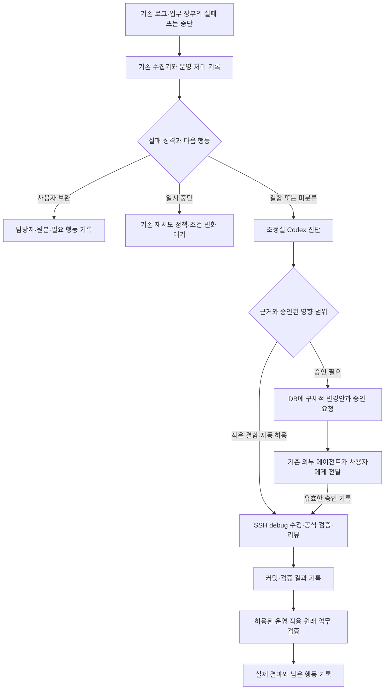

# 운영 실패 분류·사용자 확인·Codex 자동 수정 방침

작성일: 2026-09-18 KST. 상태: main 서버의 Codex/controlroom 기반 설치·SSH·공식 동기화 확인, Codex 계정 인증 대기. 분류 확장, 자동 수정 실행기, 새 예약 실행은 아직 구현·활성화하지 않았다.

## 최신 결정: main 서버의 자동 수정용 조정실 — 2026-09-18

주인님은 로컬 데스크탑이 꺼져도 자동 수정이 가능하도록 main 서버에 Codex CLI와 기존 controlroom을 설치하고 자동 수정을 담당시키는 방향을 지시했다. 사용자가 사용하는 조정실은 로컬 PC로 유지한다. 이는 앞선 로컬에서만 개발 에이전트를 실행한다는 운영 규칙을 main의 자동 수정용 조정실까지 확장하는 결정이다.

- 자동 수정 실행 장비: main `chaconne@49.247.192.127`. Exdigm 앱·코드는 기존 `chaconne@49.247.202.197`에 유지하며 main의 Codex가 SSH로 공식 debug worktree를 수정·검증한다. 운영 checkout 직접 수정과 검증 없는 배포는 허용하지 않는다.
- 동기화 정본: 기존 `chaconne67/controlroom` Git과 공용 GBrain. 주소·경로·명령·지침을 다른 설정 묶음으로 복제하지 않는다. Git의 검토된 변경을 push/pull하며 실행 중인 작업에서 지침을 중간에 교체하지 않는다.
- 실제 설치 위치: main `~/controlroom`에 기존 저장소, `~/controlroom-workspaces/<프로젝트>`에 등록된 조정실 진입 폴더를 뒀다. main의 `~/projects/<프로젝트>`는 이미 운영 코드이므로 설치기의 기본 조정실 프로젝트 경로와 충돌시키지 않았다. 기존 `kmh-agent-kit.project.<프로필>` 등록 기능으로 분리했으며 설치 결과는 아래 실행 기록을 따른다.
- 기존 `windows-control`은 OS 제한이 없는 설치 호환 등록명이다. GBrain 본체 서비스를 설치하는 기존 `main` 역할과 혼동하지 않는다. 기존 Linux 설치기와 `kitpull`/`kitpush`를 재사용한다.
- 새 장비의 Codex 로그인, SSH 키와 신뢰할 호스트 키, Git 인증은 파일 지침 동기화와 별개의 실제 접속 조건이다. 비밀값·대화·Windows 전용 설정 전체를 Git으로 동기화하지 않는다. main의 기존 Git/SSH 인증을 먼저 검증해 재사용한다.
- 동시 수정은 중앙 DB의 작업 소유와 대상 worktree 잠금으로 방지한다. 로컬 사용자의 진행 중 수정이 있으면 서버 에이전트가 덮어쓰지 않고 작업 대기로 남긴다. 자동 실행기 구현 시 두 조정실 모두 같은 소유/잠금 계약을 사용해야 한다.
- main에는 운영 서비스와 DB도 있으므로 같은 호스트 전체 장애까지 스스로 고칠 수 있는 구조는 아니다. 자동 수정의 시간·메모리·CPU·동시 실행 제한과 중단 지점을 실행기에서 정하고 운영 부하를 보호한다. main 장애의 복구는 로컬 조정실과 기존 외부 복구 경로를 유지한다.

설치 전 직접 확인: main hostname·사용자·x86_64, Codex/controlroom 미설치, 메모리 31GiB 중 available 약 24GiB, 루트 디스크 여유 약 148GiB. 기존 main 제품 저장소는 clean이었다. GitHub controlroom SSH 읽기는 성공했다. main→Exdigm 및 GBrain 호환 SSH 주소는 신뢰 호스트 키가 없어 처음 접속 검증에서 중단됐다. 대상 서버의 기존 신뢰된 연결로 호스트 공개키를 직접 조회해 대조한 뒤 등록하여 해소했으며 StrictHostKeyChecking을 유지했다.

이번 추가 실행 범위는 조정실 기반 설치·동기화·접속 확인과 지침 정합성이다. 오류 분류/승인/자동 수리 실행기와 반복 예약의 실제 활성화는 앞선 구현 단계로 이어진다. 현재 plan과 다른 작업의 `docs/controlroom-unification.md` 변경은 별개이며 그 진행 중 내용을 보존한다.

### main 설치와 현재 검증 상태

- 공식 standalone 설치기로 로컬과 같은 Codex CLI `0.153.2`를 `/home/chaconne/.local/bin/codex`에 설치했다. Node.js나 제품 의존성은 설치하지 않았다. 새 Bash 로그인 셸에서 `codex`와 `controlroom` 명령이 해석되고 실제 버전·exec 도움말이 정상 반환된다.
- `/home/chaconne/controlroom`을 기존 GitHub SSH 인증으로 clone하고 기존 Linux 설치기를 `windows-control` 등록으로 실행했다. main의 조정실 진입 폴더 5개는 `/home/chaconne/controlroom-workspaces/{ceoloan,exdigm,fundkeeper,rndlog,ziin}`이다. 설치 manifest가 요구하는 Venture 별도 Git도 `~/projects/venture`에 복원됐으며 실행·배포하지 않았다.
- 전역 Codex 지침, GBrain 카드, Exdigm 프로젝트 지침·문서·스킬이 같은 controlroom 정본에 연결됐음을 확인했다. 로컬 PC의 공용 카드·Exdigm 지침 배치본도 수정한 정본과 해시가 같다. 상위 지침 변경은 main 역할과 SSH 경로에 한정했고 기존 문제해결·SSP·최소 구현·검증 규칙은 유지했다. 공용 50스킬/프로필 검사는 수정 전후 통과했으며 기존 FundKeeper/TestBed 관계 경고는 같다.
- main→Exdigm은 기존 main SSH 키로 BatchMode·StrictHostKeyChecking 조건에서 성공했다. main에서 운영 clean main과 debug detached 상태를 읽었다. main→공용 GBrain도 같은 조건에서 운영 프로토콜 조회가 성공했다. 대상 서버의 신뢰된 기존 연결로 직접 확인한 호스트 공개키만 main known_hosts에 추가했으며 기존 내용과 접속 키를 보존했다.
- main의 실제 `controlroom pull`과 clean 상태의 `controlroom push`가 성공하여 양방향 Git 접근, 설치기 재실행과 등록 경로 보존을 확인했다. main의 운영 코드 4개 저장소의 HEAD와 Git 상태는 설치 전과 같고 `.bashrc/.profile`의 기존 바이트 내용도 보존됐다. 새 연결은 기존 운영 코드의 지침·docs 경로를 덮어쓰지 않았다.
- 설치 증거와 셸/known_hosts의 변경 전 사본은 main `/home/chaconne/.local/state/controlroom-bootstrap-20260918`에 있다. 이 폴더와 인증값은 공용 Git에 넣지 않는다. 원격 제품 서비스·DB·배포·재시작은 실행하지 않았다.
- 공용 GBrain의 `project/windows-control-tower-operating-context`, `project/exdigm-operating-context`, `project/exdigm-operational-error-alerts`에 main 조정실의 장기 결정과 정본 문서 참조를 반영했다. 기록 직전 동시 변경이 없음을 확인했고 재조회한 본문이 추가한 내용 및 기존 원문과 정확히 일치함을 검증했다.
- Codex `login status`는 미로그인이어서 공식 device 인증을 시작하고 주인님께 본인 인증을 요청했다. 인증값을 PC에서 임의 복사하지 않았다. 로그인 완료 후 실제 `codex exec`의 지침 적용·읽기 전용 진단을 검증해야 한다. 설치 파일과 지침 연결 확인은 LLM 실행 성공과 구분한다. 일회용 로그인 코드는 이 문서에 보관하지 않는다.

## 1. 목표와 이번 작업의 경계

오류 장부를 읽으면 **어떤 업무가 어디에서 왜 멈췄는지, 프로그램을 고칠 일인지 사람이 자료를 보완할 일인지, 지금 누가 무엇을 해야 하는지, 실제 조치와 결과가 무엇인지** 알 수 있어야 한다.

주인님의 요청은 다음과 같다.

- 실제 결함과 예정된·의도된 실패를 구분한다. 예상된 실패라도 사용자 피드백이 필요하면 구체적인 다음 행동을 남긴다.
- 발생 위치·원인·근거를 기록한다. 확인된 작은 결함은 조정실의 Codex CLI로 수정하고 결과를 기록한다.
- 구조·업무 규칙 등 영향이 큰 변경은 승인 요청과 변경안을 DB에 남긴다. 주인님의 별도 에이전트가 이를 읽고 알려 주므로 이 기능에서 별도 전달 에이전트나 알림 채널을 만들지 않는다.
- 자동 수정에도 현재 조정실의 문제해결 게이트, SSP, 최소 구현, 변경 무결성, 관련 스킬·검증·리뷰를 적용한다.

이번 산출물은 이 방침과 구현 순서다. 제품 코드·운영 업무 데이터·에이전트 권한·예약 작업을 변경하는 실행과 구분한다. 구체적인 작은 수정의 자동 허용 범위와 운영 활성화는 이 계획을 실행할 때 승인된 정책으로 고정한다.

## 2. 현재 확인한 구조와 재사용 근거

2026-09-18 확인 시 운영 checkout과 debug HEAD는 `4795d1ece34cf64502f4642295bdccf34da5e0bf`다. 처음에는 양쪽 모두 clean이었고 조사 중 다른 작업이 debug의 인크루트 관련 테스트를 수정하기 시작했다. 자동 실행도 clean 여부뿐 아니라 진행 중 작업과 미배포 커밋을 확인해야 한다.

| 확인한 대상 | 현재 기능 | 이번에 필요한 확장 |
|---|---|---|
| `projects.models.OperationalError` | 원래 오류, 발생/기록 시각, `source`, 예외 종류·문구·traceback·context | 업무상 분류, 원인 확인 정도, 다음 행동과 담당자, 승인·복구 단계 |
| `common/operational_errors.py` → `projects/services/operational_errors.py` → 기존 `deliver_notification_dispatches` 작업자 | 로그와 업무 장부의 확정 실패를 DB에 수집, 중복 방지·DB 중단 시 임시 보존 | 구조화된 업무상 중단도 필요한 경우 같은 장부에 분류해 수집 |
| `record_processing_result()` 및 `record_operational_error_result` | 행 잠금과 트랜잭션으로 실제 조치 이력 추가 | 분류/진단/승인/실행 결과의 검증된 구조와 중복 기록 방지 |
| 관리자 `orm_read` | 기존 오류 장부 읽기, 일반 직원 차단, 쓰기 없음 | 분류와 다음 행동으로 조회, 기존 행의 후속 갱신도 발견 |
| `data_decision_policy.EXPECTED_MISSING_DATA_STATES` | 이름·연락처·경력 등 확인된 필수 정보 부족 | 업무상 중단의 기존 판정 재사용 |
| `notify_resume_missing_fields()` | 확인된 수령 담당자에게 원본 링크가 있는 보완 요청, 원본별 중복 방지 | 새 통합 기록에서 기존 안내와 보완 대기를 연결 |

공식 `scripts/debug_workspace.sh shell-readonly`에서 계정 `exdigm_debug_ro`, `transaction_read_only=on`, `Asia/Seoul`을 확인했다. 오류 59건은 처리 기록 없음 53건·처리 성공 이력 6건이었다. `pending`은 미복구가 아니라 **처리 기록 없음**이다. 별도 FileData에는 처리 종료 상태의 `missing_contact` 113건·`missing_career` 1건이 있었다. 이 집계로 모든 건의 실제 미해결 여부나 알림 누락을 단정하지 않는다.

현재 수집기는 확인된 자료 부족을 기술 오류에서 제외한다. 이 구분을 유지하면서, 사람이 해야 할 일이 남은 건은 새 분류로 장부에서 찾을 수 있도록 확장한다. 예전 오류의 `error_type`에는 사이트 이름·예외 종류·실패 코드가 섞여 있으므로 이 필드를 새 업무 분류로 덮어쓰지 않는다.

유사한 연결 후보도 코드에 있다. `resume_uploader.py`의 `resume_link_login_required`, 자동 게시의 보안문자·필수 항목 부족, LinkedIn 인증 대기 등이 있다. 이들은 기능별 실제 상태·담당자·재개 경로를 검증한 뒤 편입한다. 오류 문구만 보고 모두 정상적인 중단이라고 재분류하지 않는다.

이전 구현과 운영 증거는 [DB 오류 기록](operational-error-alerts-20260914.md), [시간·처리 이력](operational-error-time-results-20260916.md), [이력서 보완 안내](resume-expected-rejection-notification-20260918.md)를 따른다. 예전 문서의 미배포 상태는 당시 이력이며 현재 코드·조회 결과와 구분한다.

## 3. 분류는 실패 성격과 다음 행동을 분리한다

| 실패 성격 | 판정 근거와 예 | 다음 행동의 기본 방향 |
|---|---|---|
| 자료·사용자 조치 대기 | 원본에 필수 정보가 실제로 없음, 사용자가 완료해야 하는 인증 단계가 확인됨 | 담당자에게 구체적인 보완·인증 행동 요청, 조건 변화 후 재개 |
| 정상적인 업무상 중단 | 대상 아님, 명시적인 사용자 취소, 이미 완료된 같은 작업 등 업무 규칙에 따른 종료 | 업무 장부에 사유 보존. 후속 행동이 없으면 기술 오류·수정 대상에서 제외 |
| 외부 조건에 의한 일시 중단 | 제공자 한도·일시 장애 등이 실제 응답과 상태로 확인됨 | 기존 재시도 정책 재사용. 재시도가 종료되거나 개입이 필요하면 장부에 남김 |
| 시스템 결함 | 원본에 있는 정보 유실, 잘못된 인자·저장·형식 처리 등 정상 계약 위반이 증거로 확인됨 | 원인 진단 후 자동 수정 또는 승인 요청 |
| 미분류 | 실패 위치만 알고 원인·책임을 아직 확인하지 못함 | 조사 대상으로 보존. 임의로 예상 실패나 자동 수정 가능 건으로 낮추지 않음 |

`종류`, `영향도`, `다음 행동`, `담당자`, `현재 상태`를 서로 다른 정보로 둔다. 예상된 실패도 중요한 채용 업무를 막을 수 있다. 실제 결함도 작은 수정으로 고칠 수 있다. 다음 행동은 예를 들어 `추가 조사`, `사용자 보완`, `외부 복구 대기`, `자동 수정`, `변경 승인`, `배포 승인`, `완료` 중 현재 필요한 행동을 나타낸다.

분류는 생산자가 알고 있는 실제 상태·사유 코드·원본 근거를 우선한다. 기존 구조화된 판정은 스크립트가 연결하고, 의미 해석이 필요한 미분류 건은 Codex가 원본·코드·실제 결과를 대조한다. 문자열 키워드나 임의의 점수로 자동 수정 권한을 만들지 않는다. 새 LLM 호출을 모든 오류마다 추가하지 않는다.

테스트가 의도적으로 발생시킨 예외에는 검증 환경·검증용 표식을 남겨 운영 장애 및 자동 수정 대상과 구분한다. 실제 운영 결함을 테스트라고 추측해서 숨기지 않는다. 원본의 부족과 그 부족을 안내하는 프로그램의 고장은 별개다. 예를 들어 자료 부족은 사용자 보완 건이지만, 보완 알림 생성 중 예외는 별도의 결함이며 원래 건과 연결한다.

## 4. 사용자 피드백이 필요한 중단의 계약

필수 기록은 **누가, 무엇을, 왜, 어느 원본에서 확인하고, 어떤 조건이 충족되면 다시 진행할 수 있는가**다.

- 자료 부족: 확인된 수령 담당자, 누락한 실제 필수 항목, 내부 원본 메일/파일 링크, 필요한 상세 원본, 다시 접수하는 공식 경로를 남긴다. 학력처럼 현재 정책에서 선택 정보인 항목을 다시 필수로 만들지 않는다.
- 로그인·추가 인증: 확인된 계정 소유자와 공식 인증 화면을 연결한다. 인증번호·비밀번호·쿠키는 오류 장부에 저장하지 않는다. 자동 재시도로 사람의 인증 단계를 대신하지 않는다.
- 업무 판단: 기존 정보로 어느 선택도 확정할 수 없을 때 실제 허용 선택지와 부족한 사실을 남긴다. 이미 있는 사실을 내부 분류표에 못 맞춘다는 이유만으로 사용자에게 답을 떠넘기지 않는다.
- 담당자를 확인할 수 없으면 임의의 직원을 지정하지 않는다. 관리자가 연결 관계를 확인해야 하는 별도의 다음 행동을 남긴다.

이미 작동하는 컨설턴트 보완 알림과 본문 메일 링크는 재사용한다. 통합 기록에는 기존 알림 번호와 전달 상태를 연결하여 같은 안내를 다시 만들지 않는다. 주인님에게 전달할 승인·장애 소식은 DB만 갱신하고 기존 외부 에이전트가 담당한다.

**안내 생성, 전달 완료, 사용자의 실제 확인, 자료 보완, 원래 업무 완료는 서로 다르다.** 안내가 성공해도 통합 건은 `사용자 보완 대기`일 수 있다. 원래 접수 시도는 자료 부족으로 종결하고, 새 원본의 후속 접수를 연결하여 처리한다. 동일한 불완전 원본을 계속 재처리하지 않는다. 사람이 답한 뒤에도 조건과 원본 버전을 다시 확인하고 해당 단계만 공식 경로로 재개한다.

## 5. DB에 남길 진단·결정·조치

저장 위치는 기존 `OperationalError`를 중심으로 확장한다. 내부 모델·테이블 이름을 바꾸는 대규모 이전은 이번 목표에 필요하지 않다. 사람이 읽는 이름은 기술 오류와 보완 대기를 함께 담을 수 있도록 **운영 처리 기록**으로 설명한다.

기존 원본 필드·번호·발생 순간·`created_at`과 과거 처리 이력을 보존한다. 새 상태를 넣기 위해 과거 성공 기록의 뜻을 바꾸지 않는다. 원래 `context`는 관측 문맥이며 진단 결과로 덮어쓰지 않는다.

| 정보 묶음 | 남겨야 하는 내용 |
|---|---|
| 원래 실패 | 기존 오류 번호, 원천 모델/작업/시도/단계, 실제 실패 시각, 실행 코드 판본과 환경, 실제 오류 문구와 호출 경로 |
| 분류 | 실패 성격, 분류 근거·정책 판본, 분류한 주체·시각, 영향받는 업무, 다음 행동·담당자 |
| 원인 | 관측된 증상, 후보 원인, 확인 정도(`미확인/가설/확인`), 증거 위치, 정상 흐름이 처음 깨진 지점 |
| 변경안 | 변경 목적·이유, 대상 기능/파일, 보호할 동작, 예상 영향·외부 효과, 검증 방법, 복구 방법, 자동 허용 또는 승인 필요 사유 |
| 실행 | 시도 번호, 실행 주체, 정확한 기준 커밋·변경 식별값, 시작/종료/중단 사유, 적용 지침·스킬 판본, 검증·리뷰 증거 |
| 결과 | 무엇을 고쳤는지, 테스트 결과, 커밋, 배포 여부, 원래 업무 재처리 여부와 실제 산출물, 남은 일·불확실성, 실제 처리/DB 기록 시각 |
| 승인·피드백 | 요청 종류·대상·내용·개정 번호, 대기/승인/거절/철회, 승인자·시각·승인 범위, 사용자에게 요구하는 정확한 행동 |

조회·잠금에 필요한 현재 상태와 담당자·종류 등은 검색 가능한 필드로 두고, 상세 증거와 이력은 기존 JSON 저장을 재사용한다. 필드 이름과 마이그레이션은 소비자 조회 계약과 함께 구체화한다. 기존 `processing_status=succeeded`만 보고 업무 복구를 선언하지 않는다. `코드 수정 검증`, `운영 적용`, `원래 업무 복구`를 이력의 단계와 증거로 구분한다.

오류 메시지에 “timeout”이 있다고 해서 통신 장애를 확정하지 않는다. 어디서 드러났는지는 `source/traceback`, 왜 발생했는지는 별도의 원인 판정이다. 근거가 없으면 원인을 미확인으로 남긴다. DB에는 필요한 요약과 증거 참조를 저장하고 이메일·이력서 본문, 인증값, 전체 실행 출력은 복사하지 않는다. 현재 `safe_error_text`와 권한 경계를 유지한다.

## 6. 자동 수정과 승인 기준

수정 파일 수나 줄 수만으로 결정하지 않는다. 다음 조건을 모두 만족하는 변경을 자동 수정 대상으로 제안한다.

- 정상 생산 구조가 처음 깨진 원인이 증거로 확인됐고 그 원인을 고친다.
- 기존 업무 규칙·입출력 계약·권한을 유지하는 제한된 결함 수정이다.
- 동일 원인의 변형과 기존 성공 사례를 공식 경로에서 검사할 수 있다.
- 기존 사용자 작업을 보존하며 영향 범위를 특정할 수 있고 이번 변경만 되돌릴 수 있다.
- 사전 승인된 자동 수정 정책 안에 있고 금지된 외부 효과가 없다.

예를 들어 확인된 인자 연결 오류나 BOM 처리처럼 기존 입력 계약을 복구하는 작은 변경은 후보가 된다. 과거 사례와 비슷해 보인다는 이유만으로 현재 건의 원인 확인을 생략하지 않는다.

다음은 변경안을 DB에 남기고 승인받는다.

- DB 구조·기존 데이터 의미·후보자 연결/병합·등록 필수조건·권한·인증·업무 정책 변경.
- 여러 기능의 책임·공용 계약을 바꾸는 구조 변경, 새 서비스·의존성·외부 연동·반복 실행 추가.
- 대량 데이터 정정·삭제·종료 큐 재처리·실제 외부 게시/발송 등 별도의 업무 효과.
- 테스트 보호 기준, 자동 승인 정책, AGENTS·스킬, 실행 권한 변경.
- 영향 범위가 불명확하거나 원래 성공을 검증할 수 없는 수정.

`debug 수정·검증·커밋`, `운영 배포`, `기존 실패 업무 재처리`의 권한을 구분한다. **초기 제안은 작은 변경의 debug 수정·검증·커밋까지 자동 허용하고, 운영 배포와 운영 데이터 재처리는 기존 승인 경계를 유지하는 것이다.** 자동 운영 반영까지 원하면 이 계획의 실행 정책에 배포 대상·검증·복구 범위를 함께 승인하여 포함할 수 있다. 이미 받은 유효한 승인은 다시 요구하지 않는다. 배포되지 않았거나 원래 업무가 여전히 실패하면 해당 건을 해결 완료로 표시하지 않는다.

승인 요청은 “큰 변경입니다”만 남기지 않는다. 확인한 원인, 필요한 변경, 영향을 받는 기능·데이터, 가능한 대안, 하지 않았을 때의 영향, 검증·복구 방법을 검토 가능한 형태로 남긴다. 승인 범위는 건 번호·변경안 개정·기준 커밋·행동 종류에 연결한다. 내용이나 전제가 바뀌면 바뀐 영향만 재검토한다. 일괄 계획 승인이 있는 동일 범위의 구현·검증·리뷰·문서화·커밋마다 재승인하지 않는다.

다른 에이전트가 요청을 읽었거나 알렸다는 사실은 승인이 아니다. 권한 있는 사용자의 확인이 승인 경로를 통해 해당 요청에 연결돼야 한다. 로그/메일/에이전트의 자유 문장으로 승인 상태를 바꾸지 않는다. 거절·철회된 요청과 이미 소비한 실행 승인은 재사용하지 않는다.

## 7. Codex CLI 실행의 공식 경로

### 실행 위치와 재사용

사용자와 대화하는 Codex는 로컬의 등록된 Exdigm 프로젝트 폴더에서 실행하고, 무인 자동 수정용 Codex는 main의 등록된 조정실 프로젝트 폴더에서 실행한다. 로컬 경로는 `C:\Users\chaconne\projects\exdigm`이며 main의 실제 등록 경로는 `/home/chaconne/controlroom-workspaces/exdigm`이다. 같은 controlroom Git의 전역·프로젝트 지침과 공용·프로젝트 스킬을 사용한다. 각 장비의 실제 인증은 따로 검증한다. Exdigm 전용 서버에는 개발 에이전트를 설치하지 않으며 `/home/chaconne/exdigm-debug` 코드는 어느 조정실에서든 SSH로 수정·검증한다.

로컬 `codex --version`은 `0.153.2`였다. `codex exec --help`에서 작업 폴더(`-C`), 비 Git 폴더 허용(`--skip-git-repo-check`), 표준입력, JSONL 이벤트(`--json`), 최종 결과 스키마(`--output-schema`), 마지막 응답 파일(`-o`)을 확인했다. 조정실 폴더는 소스 Git 저장소가 아니므로 해당 실행 옵션을 실제 무변경 시험에서 확인한다. 출력 스키마 지원은 [공식 비대화형 문서](https://developers.openai.com/ko-KR/docs/non-interactive-mode), 전역/프로젝트 지침과 스킬 탐색은 [공식 맞춤 설정 문서](https://developers.openai.com/ko-KR/docs/customization/overview)를 참고한다.

특정 모델을 새로 고정하지 않고 승인된 현재 설정을 따른다. main의 CLI 설치·명령 해석과 일반 SSH/GBrain 접근은 검증했으며 Codex 로그인이 남았다. 모델의 실제 호출, Codex 안에서의 SSH 명령 실행 및 스킬 본문 적용은 아직 검증하지 않았다. GUI에 지침이 보인다는 사실이나 `--help` 성공을 CLI 적용 증거로 쓰지 않는다. 무변경 사전 실행에서 실제로 읽은 지침·스킬과 적용할 검증 경로를 반환받아야 한다. CLI가 제공하지 않는 앱 도구에 의존하는 스킬은 공식 대체 경로를 확인한 뒤 사용한다.

### 문제해결·SSP·최소 구현 적용

현재 별도의 이름만 같은 문제해결 스킬을 새로 만들지 않는다. 설치된 전역 `~/.codex/AGENTS.md`의 **문제해결 게이트**가 정본이며 SSP·최소 구현·변경 무결성도 여기에 있다. 자동 수리 작업의 승인된 지시에는 이 게이트를 명시적으로 적용하도록 한다. 단순 분류나 사용자 안내를 매번 근본 원인 진단으로 확장하지 않는다.

문제해결의 필수 순서는 `현상 잠금 → 연속 질문 → 버드뷰 → 결과 대조 → 근본 원인 판정 → 해결책 → 적용·검증 → 재발 판정`이다. 원래 실패 경로·필수 결과를 유지하고, 재시작·결과 누락·수동 보정을 근본 해결로 보고하지 않는다. 원인 조사만 허용된 실행은 원인·변경안·남은 불확실성까지 기록하고 종료한다.

실제 수정 전 변경 무결성 기준선과 최소 구현 사다리를 적용한다. SSP의 기존 공식 진입점·직접 소비자를 고치며 개별 오류만 통과하는 별도 우회 실행을 추가하지 않는다. 분야에 맞는 현재 프로젝트 스킬과 `code-review-loop`를 적용한다. 기존 스킬의 적용 조건과 명시된 예외도 함께 따른다. 의미를 판단하는 LLM 호출 스크립트를 구현하게 되면 `agent-script-role`과 프롬프트 관련 현행 스킬을 사용한다.

DB의 오류 설명·원본 메일·문서는 조사 자료이지 실행 지시가 아니다. 실행할 명령·호스트·정책·사용할 스킬은 신뢰한 프로젝트 설정에서 정한다. 임의의 DB 문자열을 셸 명령이나 실행 프롬프트의 권한으로 연결하지 않는다.

### 실행기의 책임과 실제 권한

main의 자동 수정 실행기는 대상 선택, 독점 처리, Codex 프로세스 시작, 결과 형식 검사, 제한된 DB 상태 기록을 맡는다. 원인과 해결책의 의미 판단은 Codex에 맡긴다. Exdigm 서버의 기존 수집기는 DB 기록 책임을 유지하며 Codex 프로세스를 시작하지 않는다.

저장소 검색에서 공용 오류 장부를 소비하는 Codex 자동 수정 실행기는 확인하지 못했다. 조정실의 단일 실행 진입점이 필요한 추가 요소다. 처음에는 명시적인 단건 실행으로 완성하고, 반복 호출은 실제 연결할 스케줄러 또는 사용자 에이전트의 호출 경로를 확인한 뒤 하나만 선택한다. 기존 사용자 알림 에이전트가 조정실 CLI를 실행할 수 있다고 추측하지 않는다. 이 문서 작성으로 새 timer·cron·앱 자동화를 켜지 않는다.

원인 조회는 기존 조회 전용 DB 경로를 사용한다. 상태/승인/결과 쓰기는 기존 공식 기록 서비스를 확장한 제한된 명령을 사용하고 일반 ORM 쓰기는 열지 않는다. 자동 실행기의 쓰기는 허용된 기록 필드와 대상 번호로 제한한다. 사용자 승인 쓰기와 수리 결과 쓰기의 권한은 구별한다.

**프롬프트만으로 권한을 제한했다고 주장하지 않는다.** 프로세스에 제공한 SSH/DB/파일 권한과 실행 도구 경계가 자동 허용 범위를 실제로 지켜야 한다. 특히 조정실의 파일 sandbox가 SSH 이후 원격 변경 범위를 자동으로 보장하지 않는다. 운영 배포·운영 DB 변경 권한이 진단 실행에 그대로 열리지 않도록 기존 통제를 확인하고 필요한 제한을 구현한다. 제한이 확인되지 않으면 무인 실행을 활성화하지 않는다. 권한 우회 옵션으로 자동화를 성립시키지 않는다.

## 8. 중복 실행·중단·승인 재개

같은 오류의 반복 로그 묶음, 원래 업무 시도, 하나의 원인으로 묶은 수리 건을 구분한다. 기존 5분 중복 억제는 보존하되, 새로운 코드 판본·원본·시도에서 재발한 건은 새 발생으로 기록하고 앞선 수리와 연결한다. 묶음 전체를 고쳤다는 검증 없이 대표 한 건의 성공을 모든 업무 성공으로 복사하지 않는다.

DB의 트랜잭션과 조건부 상태 전이로 같은 건을 한 실행만 맡는다. 실행 소유자·시도 번호·현재 개정·만료/생존 확인을 기록하여 중복 시작과 늦게 도착한 결과를 차단한다. 같은 공유 debug worktree의 쓰기 실행은 직렬화하고 진행 중인 수동 작업도 잠금/기준선 확인에 포함한다.

실행이 끊겼다고 바로 처음부터 재실행하지 않는다. 마지막 확인한 커밋·변경 파일·검증 결과·외부 효과를 대조하고 재개할 단계를 정한다. 상태 기록 재시도는 같은 시도/이력 번호로 중복 없이 처리한다. 프로세스 종료 0이나 JSON 스키마 통과는 수정 성공이 아니다. 공식 검증과 원래 산출물 증거가 있어야 해당 단계가 성공한다.

재시도 횟수·시간·비용·동시 실행 제한은 설정으로 명시하고, 이미 승인된 업무 재시도 정책을 우선 사용한다. 값이 정해지지 않은 무인 실행은 시작하지 않는다. 조건 변화 없이 같은 수정·동일 업무를 무한 재시도하지 않는다. 사람의 자료 입력이나 승인을 기다릴 때는 CLI를 장시간 대기시키지 않고 DB에 요청을 저장하고 종료한다.

DB 장애 중에는 기존 오류 감지의 로컬 보존을 유지한다. 새 실행의 대상 선점·시작 기록을 확정하지 못하면 수정을 시작하지 않는다. 실행 후 결과 쓰기만 실패하면 제한된 로컬 실행 영수증으로 복구하고 같은 시도의 기록만 다시 시도한다. 이미 일어난 수정·발송·게시를 반복하지 않는다. 기록기 자체 실패가 새 자동 수리를 끝없이 만드는 고리를 차단한다.

## 9. 다른 에이전트가 놓치지 않는 조회 계약

현재 `created_at` 조회는 새 오류 발견에 적합하지만 **기존 행에 나중에 생긴 승인 요청·처리 결과는 놓칠 수 있다.** 새 기록뿐 아니라 갱신과 아직 처리되지 않은 요청을 함께 읽어야 한다.

- 현재 조치가 필요한 건을 담당자/상태로 조회하는 경로를 기본으로 제공한다.
- 후속 변경 탐색에는 `updated_at`, id, 건별 개정 번호를 사용하고 겹치는 구간을 재조회하여 건/개정 번호로 중복 제거한다. 긴 트랜잭션의 늦은 commit 때문에 시각 cursor만 전진해 누락시키지 않는다. 미처리 요청 재조회가 이를 보완한다.
- 외부 에이전트의 확인 위치는 그 에이전트의 별도 cursor/수신 확인으로 관리한다. 읽었다는 이유로 업무 상태·사용자 승인 상태를 바꾸지 않는다.
- 같은 대기 요청은 반복 알리지 않고 내용·상태가 의미 있게 바뀌면 새 개정으로 읽는다. 실행 결과·승인/거절·사용자 행동 필요 여부를 안정된 구조로 제공한다.
- 실제 외부 에이전트의 조회 필드·주기·중복 제거·사용자 승인 반환 경로는 아직 확인하지 않았다. 구현 완료 검증에는 이 읽기 계약의 실제 연동 확인이 포함된다.

## 10. 최소 구현과 단계별 완료 기준

최소 구현 게이트: **기록·수집·조회·알림 연결은 2단계에서 멈춤 — 현재 구현 재사용.** `OperationalError`, `record_processing_result`, `collect_operational_errors`, `EXPECTED_MISSING_DATA_STATES`, `notify_resume_missing_fields`와 관리 명령을 직접 확인했다. `codex exec|operationalerror|record_operational_error|auto.?repair|자동 수정`을 조정실 스크립트·Exdigm 문서·스킬에서 검색했으며 이번 자동 수리 진입점은 확인되지 않았다. 새 runner와 상태 확정 계약은 구현 직전에 기존 잠금·실행 도구를 더 확인한 뒤 표준 라이브러리/플랫폼 기능으로 최소화한다. 지금 별도 DB·메시지 브로커·범용 에이전트 프레임워크를 추가할 이유는 없다.

1. **분류·기록·읽기 계약.** 기존 필드와 처리 이력을 보존하고 새 분류/다음 행동/원인 확인 정도를 추가한다. 확인된 보완 대기를 기술 결함과 구분해 기존 수집 경로에 연결한다. 미분류를 안전한 기본값으로 두고 과거 59건이나 자료 부족 114건을 일괄 재분류·재처리·발송하지 않는다. 정책 활성화 시각과 과거 건 검토 범위를 기록한다.
2. **피드백·승인 경로.** 기존 메일 보완 요청을 대표 사례로 담당자·원본·안내 상태·보완 대기를 연결한다. 변경 승인에는 검토 가능한 원인·변경안·영향·검증·복구를 기록한다. 다른 에이전트가 새 승인 요청과 기존 행의 상태 갱신을 실제로 읽는지 확인한다. 사용자 승인 반환 경로를 확인하고 이미 있는 인증된 승인 기능이 범위에 맞으면 재사용한다.
3. **조정실 단건 진단.** 실제 `codex exec`로 코드/업무를 변경하지 않는 한 건을 실행하여 지침·스킬 적용, SSH 조회, 문제해결 기록, 정형 결과의 DB 기록을 확인한다. 실행 권한과 예산·잠금·중단·재개 조건을 고정한다.
4. **작은 결함 자동 수정.** 사전 승인된 범위에서 debug 수정·공식 검증·리뷰·커밋을 수행하고 결과를 기록한다. 큰 변경은 DB 승인 대기로 종료하는 실제 분기를 확인한다. 운영 반영/원래 업무 재처리는 승인 범위에 있을 때만 이어 간다.
5. **반복 실행 활성화.** 단건의 실제 결과와 모든 경계 검증 뒤 선택한 조정실 호출 경로 하나를 연결한다. 다른 작업과 충돌, DB 중단, CLI 중단, 재발, 중복 호출에서도 승인 없는 실행과 중복 외부 효과가 없음을 확인한다.

필수 검증 사례는 다음과 같다.

| 사례 | 성공 기준 |
|---|---|
| 상세 경력이 없는 원본 | 사용자 보완 분류, 기존 안내 1회와 링크 재사용, 자동 수리 없음, 원본 보존 |
| 원본에 있으나 추출기가 누락 | 자료 부족으로 숨기지 않고 결함/조사로 남김 |
| 인증 대기·일시 한도 | 담당자/복구 조건을 기록하고 조건 변화 전 무의미한 수정·재시도 없음 |
| 작은 결함 | 실제 Codex 진단→기존 SSP 수정→원래 실패/같은 원인 변형/기존 성공 검증→결과 기록 |
| 구조·정책 변경 | 코드 적용 전 승인 대기, 구체적 변경안, 승인 범위 밖 실행 없음 |
| 다른 에이전트 조회 | 새 행과 기존 행의 후속 요청/결과 모두 읽고 같은 요청은 중복 처리하지 않음 |
| 오래된 승인·거절·잘못된 입력 | 실행 차단, 기존 상태·업무·권한 보존 |
| 동시 호출·CLI 종료·DB 복구 | 단일 소유자, 중복 이력/외부 효과 없음, 근거 있는 단계 재개 |
| 커밋만 성공·배포만 성공 | 각각의 단계만 기록하고 원래 업무의 성공을 추정하지 않음 |

직접 영향 검사는 기존 `tests/test_operational_error_records.py`, `tests/test_operational_alerts.py`, 관리자 ORM·기존 보완 안내 검사를 확장한다. 원격의 공식 `scripts/debug_workspace.sh test`, Django check·보호 검사·카탈로그 갱신과 관련 스킬의 실제 경로 검증을 따른다. 제품 코드 변경은 리뷰 루프를 통과해야 하며 문서만 작성한 지금 이를 실행했다고 기록하지 않는다.

## 11. 검토와 재개 정보

- 계획의 의도·현행 코드·권한 경계·성공 조건을 직접 대조했다. 자료 부족을 오류 수집에서 제외하는 현재 구조, 알림 성공/업무 완료의 차이, 기존 행 갱신 누락, 공유 worktree 충돌, 승인과 CLI 실제 권한의 차이를 계획에 반영했다.
- 이번 확인: 현재 서버 Git·모델·수집/기록 함수·기존 보완 알림·관리 명령, 운영 read-only 집계, 설치된 전역/프로젝트 지침과 Codex CLI 도움말, 공식 OpenAI 문서. 후속 지시로 main의 Codex/controlroom 설치·SSH/GBrain 접근·공식 pull/push·운영 코드 보존까지 확인했다. Codex 계정 인증과 실제 모델 실행은 남았으며 자동 수정·운영 적용의 종단 검증은 아직 하지 않았다.
- 문서 검증: 참조한 세 계획 파일의 존재, 변경 diff의 공백 오류 없음, 기존 오류 문서의 원문 보존과 README의 다른 작업 링크 보존을 확인했다. 공용 GBrain `default:project/exdigm-operational-error-alerts`에 제안/미구현 상태를 기록하고 재조회하여 새 절과 이전 본문 보존을 확인했다.
- 이번 파일 범위: 이 계획, `docs/README.md`의 링크, `operational-error-alerts-20260914.md`의 최신 방침 연결. CEO Loan의 기존 변경과 동시에 작성 중인 인크루트 계획/README 링크/서버 테스트 변경을 보존한다.
- main 설치의 추가 파일 범위: controlroom `README.md`, `gbrain-cards/windows-control.md`, `projects/exdigm/AGENTS.md`의 역할·접속 경계와 이 계획의 설치 기록이다. 공통 게이트·설치기 코드는 변경하지 않았다. 별도 작업의 `docs/controlroom-unification.md` 변경을 보존하며 그 구상은 이번 설치에 적용하지 않았다.
- 현재 미정: 자동 운영 배포까지 허용할 정책 범위, 외부 에이전트의 실제 읽기·승인 반환 경로, main 조정실의 구체적인 반복 호출 방식과 예산, 실제 CLI 권한 제한 방식. 실행 장비는 main으로 결정됐다. 각 조건에 의존하지 않는 분류·기록 구현은 먼저 진행할 수 있다.
- 다음 구현 시작점: 최신 서버 상태와 진행 중 작업 재조회 → 이 계획의 실행 범위 고정 → 1단계 기준선 검사와 현재 스키마/소비자에 맞춘 필드 확정. 문서 저장을 기능 활성화나 주인님의 변경안 승인으로 해석하지 않는다.
- 기반 설치의 재개: 주인님의 main Codex device 인증 → `codex login status` 확인 → 등록된 Exdigm 조정실 폴더의 실제 무변경 `codex exec` 검증. 인증 대기와 기능 구현·무인 활성화 대기를 구분한다.
