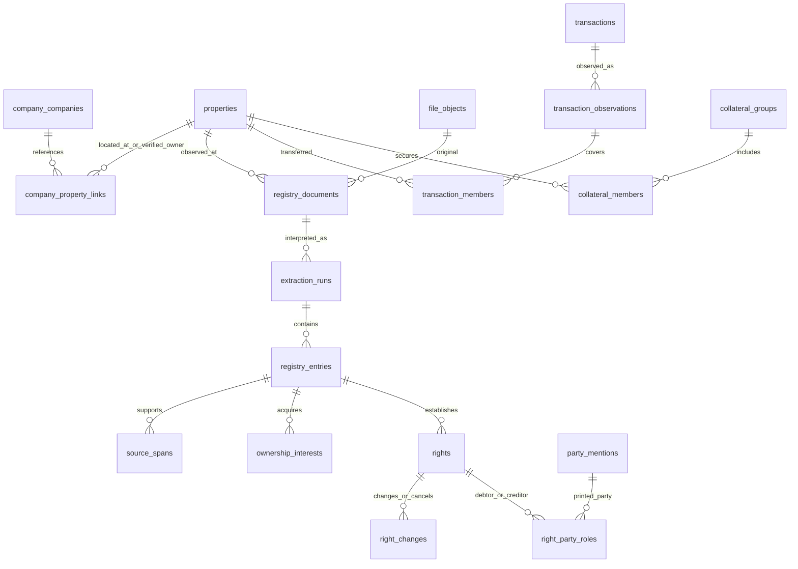

# IROS 부동산 등기 표본과 DB 저장 모델

작성일: 2026-09-17. 상태: **실제 10건 열람·원본 보관·표본 구조화 완료 / 운영 적용 전 설계 제안**.

주인님 요청에 따라 CRETOP 상세정보가 저장된 모기지 대상 회사에서 무작위 후보를 뽑아 실제 IROS 등기를 열람했다. 원본과 분석용 구조화 자료는 별도 마운트 디스크에 보관했다. 운영 DB에는 이번 자료를 적재하지 않았으며, 새 스키마·권한·웹 다운로드 기능은 아직 만들지 않았다.

## 1. 결과와 자료 위치

- 열람 PDF 10개, 고유번호 10개, 총 41쪽, 선불 열람료 7,000원. 말소사항 포함, 주민등록번호 미공개 조건이다.
- 소유권 취득 관련 기록 28건: 매매 17행, 보존 6행, 증여 3행, 신탁 이전·귀속 2행. 동일 매매목록의 지분 이전 여러 행을 하나의 거래로 연결해야 한다.
- 근저당 설정 기록 43개와 부기·변경·말소 관계를 구조화했다. 열람 시점에 말소되지 않은 근저당 10개, 모두 말소됐거나 을구에 기록이 없는 건물 4개다. **43개는 43개의 실제 대출을 뜻하지 않는다.**
- 전세권·압류·가압류·가처분 등 그 밖의 권리 설정 기록 18개를 별도로 정리했다.
- 이번 본문에서 매매가격, 실제 대출 잔액, 대출 만기를 확보하지 못했다. 이 값들은 NULL과 사유로 남겼다.
- PDF 전체 41쪽을 화면으로 확인하고 PDF 고유번호·페이지 수·주요 소유권 지분·권리 변경·말소선을 대조했다. 공식 텍스트 파서의 표제부 분리 오류 1건을 발견해 표본 판단에서 보완했다.
- 원본 PDF 10개 828,650바이트를 업로드한 후 SHA-256을 원본과 대조했다. 수집기의 입력 데스크톱은 전후 Default였고, 수집용 Chrome의 전경 전환은 관측되지 않았으며 모든 실행 후 소유 프로필 Chrome이 종료됐다. 사용자가 다른 앱으로 옮긴 전경 이벤트는 별도로 기록했다.

| 자료 | 실제 위치 |
|---|---|
| 설계 정본 | 조정실 `~/controlroom/projects/ceoloan/docs/iros-real-estate-model-20260917.md` |
| 표본 구조화 JSON 작업본 | `C:\\iros-agent\\studies\\20260917_sample10_model\\structured_samples.json` |
| 후보·제외·실행·파일 manifest 작업본 | 같은 폴더의 `selection.json`, `manifest.json`, `*_monitor.json`, `*_archive.json` |
| PDF 글자·표 위치·벡터선 자료 | 같은 폴더의 `*_layout.json` |
| 보관 서버·마운트 | `chaconne@49.247.45.243`, `/mnt` = `/dev/vdb1` ext4 별도 약 98GiB 디스크 |
| 원본 PDF 정본 | `/mnt/ceoloan/registry/original/2026/09/<IROS 고유번호>/<SHA-256>.pdf` |
| 구조화·근거 자료 보관 정본 | `/mnt/ceoloan/registry/studies/20260917_sample10_model/` |

원본 및 개인 이름·사업자번호·주소를 포함한 표본 JSON은 Git에 넣지 않는다. 이 설계 문서에는 표본 코드를 사용한다. `/mnt/data`는 기존 MySQL 자료 경로이므로 사용하지 않았다. 디스크에 저장했다는 사실과 웹에서 다운로드할 수 있다는 사실은 별개다. 현재는 서버 파일과 manifest가 보관 결과이며, 웹 링크를 제공할 인증 다운로드 경로는 아래 설계의 구현 대상이다.

### 표본의 구성과 한계

읽기 전용 운영 DB 조회에서 모기지 대상 20,519개 중 CRETOP 상세 저장 기록과 주소값이 있는 회사 3,900개를 확인했다. 회사 주소의 값 존재는 주소의 정확성을 보장하지 않는다.

무작위 seed `087d33ad8e6a4506e24378cf968ea103`로 대상 ID를 해시 정렬해 후보 30개 순서를 고정했다. 앞에서부터 15개를 검토해 10개를 열람했다. C05·C09는 도로명 검색 무결과, C08은 같은 주소에 고유번호 2개, C10은 주소 필드에 '표준산업분류(10차)', C13은 검색 결과에서 정확히 일치하는 건물을 찾지 못해 제외했다. 이 후보들은 결제하지 않았다.

성공 표본은 모두 **건물 등기**다. 전체 회사의 자산 보유나 부채 분포를 추정하는 통계 표본으로 사용하지 않는다. 숙박업 모기지 대상과 주소로 특정 가능한 건물에 치우친 자료다. 토지·집합건물·대지권·매매목록·공동담보목록·신탁원부의 실제 판독 계약은 추가 표본 검증이 필요하다.

| 표본 | PDF 쪽수 | 표제부/갑구/을구 항목 | 취득 관련 행 | 근저당 설정 기록 | 말소되지 않은 근저당 |
|---|---:|---:|---:|---:|---:|
| C01 | 3 | 3/4/5 | 2 | 2 | 1 |
| C02 | 4 | 2/8/8 | 2 | 4 | 2 |
| C03 | 5 | 3/10/10 | 3 | 4 | 2 |
| C04 | 6 | 2/25/8 | 5 | 4 | 1 |
| C06 | 8 | 3/18/25 | 8 | 10 | 1 |
| C07 | 2 | 2/2/3 | 2 | 1 | 0 |
| C11 | 3 | 2/2/4 | 2 | 2 | 0 |
| C12 | 2 | 3/2/0 | 1 | 0 | 0 |
| C14 | 6 | 2/12/20 | 2 | 15 | 3 |
| C15 | 2 | 2/1/2 | 1 | 1 | 0 |

C04의 기존 파서는 표제부를 7개로 나눴으나 실제 표는 2개다. 이 표의 항목 수는 원문 대조 후 값이다. '말소되지 않음'은 해당 열람 문서의 등기 상태를 뜻하며, 실제 금융부채 잔액이나 법적 우선순위의 판정은 아니다. 역사 범위는 보존된 등기기록까지이며, 전산이기 이전 모든 거래가 들어 있다고 가정하지 않는다.

## 2. 이 표본이 요구하는 모델의 핵심

| 관측 사례 | 저장해야 하는 차이 |
|---|---|
| C01: 1996년 매매 → 2021년 증여, 2014년 근저당의 채무자만 2021년 변경 | 취득 원인과 권리 최초 설정일을 보존. 채무자 변경을 새 대출·새 근저당으로 만들지 않음 |
| C01·C02: 옛 채무자 이름·주소에만 말소선 | 권리 전체 말소와 필드의 옛 값 말소를 구분 |
| C03: 전세금·가압류 청구금액·근저당 최고액, 소유자의 이름·국적 변경 | 금액 종류와 당사자 역할을 분리. 이름 변경은 소유권이전이 아님 |
| C04: 같은 매매목록을 참조하는 지분 취득 3행, 지분 '10분의2.4' | 거래 1개와 지분 배분 여러 개. 지분을 정확한 분수로 저장 |
| C04: 공동담보목록 번호만 존재 | 목록의 미수령 상태를 저장. 건물별 최고액을 회사 전체 대출로 중복 합산하지 않음 |
| C06: 신탁 이전 → 신탁재산 귀속 → 매매 | 수탁자·등기명의자·매수인을 구분. 신탁원부 없는 수익자는 미확인 |
| C06: 아파트 한 건만 공동담보에서 소멸 | 담보 구성원 일부 해제와 본건 근저당 전체 말소를 분리 |
| C11: 소유자와 채무자가 다른 회사, 근저당권자가 국가 | 소유자·담보 제공자·채무자·채권자를 별도 역할로 연결. 채권자를 은행으로 제한하지 않음 |
| C12: 본건·창고·사랑채·보일러실·정자가 같은 '1층'에 반복 | 면적을 부속건물/구성요소/층별 여러 행으로 저장. 층 번호 하나로 덮어쓰지 않음 |
| C14: 같은 사람이 1/2을 취득한 뒤 남은 1/2 추가 취득 | 최신 소유권 행만 사용하지 않고 남은 지분을 누적해 현재 1/1 계산 |
| C14: 같은 은행·같은 날짜·같은 최고액의 설정 2건, 서로 다른 접수번호 | 금액·은행·날짜만으로 권리를 합치지 않음 |
| C14: 말소 1행이 근저당 6개를 지목 | 등기 사건과 대상 권리는 일대다 관계 |
| C07·C11·C15: 모든 근저당 말소, C12: 을구 '기록사항 없음' | 확인된 현재 0건과 추출 실패/상태 미확인을 구분 |

근저당의 채권최고액을 실제 잔액으로 사용할 수 없다. 법원 사례도 채권최고액 등기만으로 실제 피담보채권의 존재나 액수를 추정하지 않는다. [서울북부지방법원 공개 사례](https://slbukbu.scourt.go.kr/dcboard/new/DcNewsViewAction.work?cbub_code=000213&gubun=44&pageIndex=1&scode_kname=&searchWord=&seqnum=9463)

거래가액 등기 규정은 모든 취득 원인·모든 시대의 가격을 제공하지 않는다. 여러 부동산이나 당사자 구성이 포함되면 본문 대신 매매목록을 참조할 수 있다. 거래가격은 **목록/계약 전체 가격인지, 개별 부동산·지분 가격인지** 범위를 같이 보존해야 한다. [거래가액 등기에 관한 업무처리지침, 2025-01-31 시행](https://www.law.go.kr/LSW/admRulInfoP.do?admRulSeq=2200000106191)

## 3. 도메인 용어와 데이터 소유

용어의 정본은 [부동산 등기 모델 설계 용어](iros-model/CONTEXT.md)다. 아래 표는 이 설계에서의 주요 연결을 설명한다. 이 용어 문서는 현재 제품의 운영 CONTEXT에 새 저장 스키마를 적용한 문서가 아니다.

| 용어 | 모델에서의 뜻 |
|---|---|
| 부동산 | IROS 고유번호로 구별되는 등기 대상. 회사나 주소 문자열과 다른 개체 |
| 사업장-부동산 연결 | 회사 주소 검색으로 찾았다는 근거. 해당 회사의 소유 자산이라는 뜻이 아님 |
| 등기 문서 | 특정 열람시점의 기록을 담은 PDF. 재열람하면 다른 문서가 추가될 수 있음 |
| 판독 실행 | 같은 PDF를 특정 추출기·모델·계약 버전으로 구조화한 불변 결과 |
| 등기 항목 | 표의 실제 표시/순위번호와 각 칸을 보존한 원문 행. 부기번호·옛 번호 포함 |
| 취득 | 매매·증여·상속·경매·신탁·보존 등 구분된 원인으로 지분을 받은 기록 |
| 거래 | 여러 항목·부동산·당사자를 묶는 계약/매매목록 단위. 가격의 저장 단위 |
| 근저당 | 일정 최고액까지 담보하는 등기상 권리. 실제 대출 계약·잔액과 별개 |
| 공동담보 그룹 | 동일 담보권의 부동산 집합. 목록·관계가 확인되어야 합칠 수 있음 |
| 현재 | 선택한 판독 문서의 열람시점 기준. 조사 시점과 등기원인일·접수일은 다름 |
| 원문 근거 | 문서·쪽·표 영역·순위번호·필드·말소선과 연결되는 위치 정보 |

원격 정본 `CONTEXT.md`는 회사 정본은 `company`, CEO Loan 업무는 `ceoloan`으로 분리하고 CEO Loan 웹 역할이 `company`를 읽고 `ceoloan`만 쓰도록 정한다.

**권고 결정:** 등기 사실은 공유 자산 사실이므로 중앙 DB `company_main.real_estate`라는 전용 스키마에서 관리한다. 회사명·사업자번호는 기존 `company.companies`를 참조하며 복사하지 않는다. 모기지 대상·상담·담당자·통화 상태는 기존 `ceoloan`에 남긴다. CEO Loan 마이그레이션으로 `company`나 새 공유 스키마를 만들지 않는다.

추후 적용 시 중앙 데이터 담당 마이그레이션과 수집 전용 역할이 `real_estate`를 쓰고, CEO Loan 웹은 승인된 조회 뷰와 인증된 파일 조회 권한만 받는다. **현재 ceoloan DB 역할의 쓰기 권한을 확대하지 않았다.** 이 스키마와 역할은 이번 설계의 제안이며 운영 합의·적용은 다음 구현 단계다.

대안은 `company`에 모든 등기 테이블을 넣거나 `ceoloan`에 자료를 복제하는 것이다. 전자는 회사 식별 정보와 자산·권리 이력을 함께 관리하는 부담이 커지고, 후자는 다른 서비스가 같은 자산을 또 수집하고 고치게 된다. 전용 공유 스키마와 회사 참조를 선택하면 중앙 사실과 영업 업무의 경계를 유지할 수 있다.

## 4. 관계 구조

다음은 구현 전 논리 모델이다. 분석에 필요한 값은 열로 저장한다. JSONB는 원문 칸·말소선·계약별 비정형 조건·검증 결과를 보존하는 데 사용하며, 이름·지분·기준 날짜·금액·권리 상태를 JSON에만 숨기지 않는다.



### 공통 타입과 참조 규칙

모든 테이블의 기본 키는 UUID, 생성시각은 timestamptz다. 아래 표에서 생략한 `id`·`created_at`와 참조 필드 인덱스를 공통으로 갖는다. 주요 날짜는 `date`, 원본의 열람·실행시각은 시간대가 있는 `timestamptz`다. 원문이 날짜만 제공하면 시각을 만들어 넣지 않는다.

금액은 `numeric(20,2)`와 ISO 통화코드 `char(3)`로 저장하며 KRW 원문은 정수 원 단위로 보존한다. 지분은 분자·분모 `numeric(38,0)`, 분모 > 0, 원문 지분 문자열을 함께 보관한다. '10분의2.4'는 정확하게 6/25로 환산하고 변환 근거를 남긴다. 통화·지분·면적에 float를 사용하지 않는다. 정확히 환산한 분수의 분자/분모가 허용 크기를 넘으면 원문을 유지하고 수치 확정을 보류한다. 면적은 `numeric(18,6)`·원문 단위·정규화 m²·변환 방법을 보관한다.

모든 판독 사실은 `extraction_run_id`를 갖거나 동일 실행의 원문 항목 FK로 그 실행에 연결된다. 서로 다른 판독 실행의 항목·당사자 표기·권리를 섞는 참조는 저장 단계에서 거부한다. 부동산·확인된 당사자·거래 식별 그룹·공동담보 식별 그룹은 여러 문서가 함께 참조할 수 있는 개체다. 이 식별 개체와 각 문서의 관측 사실을 구분한다.

### A. 파일·열람·판독

| 테이블 | 주요 필드와 저장 규칙 |
|---|---|
| `file_objects` | `storage_backend text`, `storage_key text`, `sha256 char(64)`, `byte_size bigint`, `mime_type text`, `original_filename text`, `access_scope text`, `download_path text nullable`, `link_status text`, `hash_verified_at timestamptz`. PDF·추출 JSON·위치 자료를 각각 파일 객체로 관리. UNIQUE(backend,key), SHA-256 인덱스. DB에 PDF 바이트를 넣지 않음 |
| `registry_reads` | `request_id UUID`, `run_id text`, `requested_company_id UUID FK company`, `source_address_id UUID FK`, `address_input text`, `selected_property_id UUID FK nullable`, `expected_unique_number text`, `selection_evidence_file_id UUID`, `requested_at/paid_at/finished_at timestamptz`, `status text`, `fee_amount numeric`, `currency char(3)`, `payment_transaction_no text nullable`, `approval_no text nullable`, `document_id UUID nullable`, `failure_stage/error_code text nullable`. 결제 성공·PDF 미수령도 따로 기록. 결제정보 비밀값은 저장하지 않음 |
| `registry_documents` | `property_id UUID`, `original_file_id UUID`, `read_id UUID nullable`, `document_kind text`, `includes_cancellations bool`, `id_disclosure_mode text`, `registry_state text`, `registry_office_code/name text`, `viewed_at timestamptz`, `viewed_at_raw text`, `page_count int`, `source_uid_raw text`, `issued_or_viewed_mode text`, `source_title text`, `history_coverage text`. 원본 해시와 고유번호로 중복 문서 판별, 열람용/발급용 구별 |
| `extraction_runs` | `document_id UUID`, `schema_version/extractor_version/prompt_version/model_id text NOT NULL`, `started_at/finished_at timestamptz`, `status text`, `structured_file_id/layout_file_id UUID`, `validation_report jsonb`, `reviewer/reviewed_at`, `title_complete/ownership_complete/encumbrances_complete bool`, `unresolved_annex_count int`, `failure_detail jsonb nullable`. 사용하지 않는 프롬프트·모델 버전은 사전 정의된 not-used 값, 사용했다면 실제 버전 필수. 자동 추출과 검증된 결과를 구분. 확정 결과는 불변으로 보존 |

`registry_reads.status`는 `requested → candidate_verified → payment_ready → payment_confirmed → document_received → source_verified`와 `selection_failed/payment_uncertain/paid_document_pending/failed`를 구분한다. 거래번호는 수단+provider 범위에서 고유하게 관리하되 한 결제에 여러 문서가 들어가는 미래 배치는 결제와 읽기 연결표를 추가하기 전 지원하지 않는다. 이번 공식 경로처럼 1건씩 운영하면 이 모델로 결제 상태와 복구를 추적할 수 있다.

### B. 부동산과 회사 연결·표제부

| 테이블 | 주요 필드와 저장 규칙 |
|---|---|
| `properties` | `registry_unique_number text UNIQUE`, `property_kind text`(land/building/unit), `registry_office_code text nullable`, `parent_building_id UUID nullable`, `published_extraction_id UUID nullable`. 주소·회사명은 PK가 아님. 토지와 건물은 같은 주소라도 다른 고유번호로 관리. 집합건물의 전유부와 건물 부모 관계는 근거 확보 후 연결 |
| `company_property_links` | `company_id UUID FK company.companies`, `property_id UUID`, `source_address_id/source_snapshot_id UUID nullable`, `read_id/document_id UUID nullable`, `link_role text`(business_address_search_result/registered_owner_verified/other_verified), `property_scope text`(whole_building/unit/floor_or_portion), `source_address_raw text`, `match_method text`, `evidence_span_id UUID nullable`, `verified_by/verified_at`, `observed_from/to timestamptz nullable`. 이번 10개 연결은 주소 검색 결과이며 회사 소유 확인값이 아님 |
| `property_descriptions` | `extraction_run_id UUID`, `entry_id UUID`, `property_id UUID`, `description_status text`, `land_address_raw/road_address_raw/building_name/block/unit/structure/use_raw text nullable`, `display_registration_date date nullable`, `description_cause text nullable`, `land_category_raw text nullable`, `land_area_m2 numeric nullable`, `exclusive_area_m2 numeric nullable`, `land_right_kind/share numerator/denominator nullable`, `construction_completion_date date nullable`. 모든 표제 이력 보존, 새주소로 옛주소를 덮어쓰지 않음. 준공일이 원문에 없으면 NULL |
| `area_segments` | `description_id UUID`, `segment_order int`, `component_label/component_kind/floor_label/use_raw text`, `floor_number int nullable`, `is_basement bool nullable`, `area_value numeric`, `area_unit text`, `area_m2 numeric nullable`, `area_scope text`(total/component/exclusive/share), `parent_segment_id UUID nullable`, `conversion_method text nullable`, `evidence_span_id UUID`. 총면적과 세부 구성면적을 모두 합산하지 않도록 parent와 scope 사용 |

`company_property_links`의 소유 확인은 실제 등기 당사자와 회사의 확인된 법인 식별정보 또는 별도 근거로 한다. 개인사업자의 이름이나 대표자 이름이 같다는 이유로 회사 소유로 확정하지 않는다. 사업장 층이 있는 회사 주소로 통건물 등기를 읽었다면 그 범위 차이를 저장한다.

### C. 원문 항목·필드 근거·사건 관계

| 테이블 | 주요 필드와 저장 규칙 |
|---|---|
| `registry_entries` | `extraction_run_id UUID`, `section text`(title/A/B), `subsection text`(건물표시/전유부/대지권 등), `rank_raw text`, `main_rank int nullable`, `subrank text nullable`, `former_rank_raw text nullable`, `source_order int`, `purpose_raw text`, `receipt_date date nullable`, `receipt_no_raw text nullable`, `cause_date date nullable`, `cause_raw text nullable`, `annotation_date date nullable`, `raw_columns jsonb`, `raw_text text`, `visual_cancellation_scope text`(none/field/whole/mixed/uncertain), `page_start/end int`. 식별은 실행+section+subsection+source_order, 순위번호만 고유키로 쓰지 않음 |
| `source_spans` | `extraction_run_id UUID`, `entry_id UUID nullable`, `section/subsection text nullable`, `target_table/field_path text`, `target_row_id UUID`, `page_no int`, `bbox numeric[]`(4좌표), `coordinate_system text`, `quoted_text text`, `strike_lines jsonb`, `field_state text`(current/historical/canceled/uncertain), `value_status text`, `interpretation_method text`, `confidence numeric nullable`, `review_status text`. 한 사실에 여러 span 허용. 빈 section의 명시 문구는 항목 FK 없이 판독에 연결. 좌표는 PDF point 단위 top-left 기준 [x0,top,x1,bottom]와 페이지 폭·높이를 보존. 대상 행 존재와 실행 일치는 저장 validator로 확인 |
| `entry_relations` | `from_entry_id/to_entry_id UUID`, `relation_kind text`(changes/cancels/corrects/transfers_share/releases_member), `target_scope text`(whole_right/party_field/share/collateral_member), `target_party_mention_id UUID nullable`, `share_num/den numeric nullable`, `target_reference_raw text`, `evidence_span_id UUID`, `resolution_status text`. 말소 한 행 → 여러 권리, 변경 행 → 기존 설정 권리 관계 보존 |

원문 말소선은 일부 필드에만 있을 수 있다. 말소선 존재만으로 행 전체나 권리 전체를 삭제하지 않는다. 기록의 최신 값을 만드는 책임은 원문 행 분리·시각 정보와 사건 관계를 해석하는 공식 추출 경로에 둔다. 금액을 읽은 뒤 소비자에서 경고하는 것으로 잘못된 자동 적재를 정당화하지 않는다.

### D. 당사자·소유권·거래

| 테이블 | 주요 필드와 저장 규칙 |
|---|---|
| `party_entities` | `party_kind text`(person/corporation/public_authority/unknown), `canonical_name text nullable`, `verified_corporate_registration_no text nullable`, `company_id UUID nullable`, `resolution_method/evidence/verification_status`. 확인된 법인 식별정보만 해당 namespace에서 고유화. 개인 이름이나 마스킹 식별번호는 전역 UNIQUE로 사용하지 않음 |
| `party_mentions` | `entry_id UUID`, `entity_id UUID nullable`, `mention_order int`, `role_raw text`, `name_raw text`, `id_type text nullable`, `id_masked_raw text nullable`, `address_raw text nullable`, `branch_name_raw text nullable`, `nationality_raw text nullable`, `field_state text`, `source_span_id UUID`. 문서에 나온 이름·주소를 그대로 남김. 같은 문서의 이름·표시 변경 관계는 연결하되 다른 문서의 개인을 자동 합치지 않음 |
| `ownership_interests` | `extraction_run_id UUID`, `property_id UUID`, `acquisition_entry_id UUID`, `recipient_mention_id UUID`, `transaction_observation_id UUID nullable`, `acquisition_kind text`, `acquired_share_num/den numeric`, `remaining_share_num/den numeric nullable`, `acquired_cause_date/receipt_date date nullable`, `as_of_viewed_at timestamptz`, `observed_status text`, `share_resolution_status text`. 취득 시 지분과 해당 문서 시점의 남은 지분을 구분. 일부 이전 관계는 entry_relations에 정확한 분수로 저장 |
| `transactions` | `identity_status text`(unresolved/verified), `verified_sale_list_identity text nullable`, `grouping_basis/evidence text`, `published_observation_id UUID nullable`. 여러 문서에서 같은 계약으로 확인된 거래를 묶는 영구 식별 개체. 목록 번호만으로 전국/시대가 다른 거래를 병합하지 않음 |
| `transaction_observations` | `extraction_run_id UUID`, `transaction_id UUID`, `transaction_kind text`, `contract_cause_date date nullable`, `sale_list_ref_id UUID nullable`, `price_amount numeric nullable`, `price_currency char(3) nullable`, `price_scope text`(single_property/partial_share/multiple_assets/unknown), `price_status text`, `price_source_span_id UUID nullable`, `member_scope_complete bool`. 문서별로 확인된 가격·원인·목록 범위의 불변 사실. 전역 거래의 가격 집계는 선택한 관측 1개만 사용 |
| `transaction_members` | `transaction_observation_id UUID`, `property_id UUID nullable`, `property_reference_raw text nullable`, `entry_id UUID nullable`, `seller_mention_id/buyer_mention_id UUID nullable`, `transferred_share_num/den numeric nullable`, `allocated_price numeric nullable`, `allocation_method text nullable`, `party_role_basis text`(explicit/inferred_reviewed/unknown), `evidence_span_id UUID`. 전체 거래의 부동산·배분·매도인·매수인 연결. 매도인 명시가 없으면 이전 소유자라는 추론을 사실 칸에 자동 입력하지 않음 |

현재 소유권은 남은 지분들을 당사자별로 합산한 조회 결과다. 최근 순위번호 하나로 정하지 않는다. 신탁에서 등기명의자와 수탁자, 원부의 수익자·우선수익자는 다른 역할이며 원부가 없으면 후자는 미확인이다. 주민등록번호 미공개를 유지하고 마스킹 문자열에서 생년·성별·미공개 번호를 새로 추정하지 않는다. 개인정보가 담긴 원문 필드는 접근을 제한하고 검색·로그에서는 최소 표시만 사용한다.

같은 매매목록을 서로 다른 부동산 문서에서 수집해도 검증된 거래 식별 개체 하나에 여러 관측을 연결하고 가격 관측 1개만 선택한다. 목록 원문·관할·당사자·구성 부동산으로 동일 계약이 확인되기 전에는 미해결 거래 그룹으로 남기며 정확한 포트폴리오 거래가격 합계를 제공하지 않는다.

가격이 다자·다물건 거래 전체 값이면 선택한 거래 관측에 1회 저장한다. 개별 부동산 배분은 계약/목록에 명시된 값만 `allocated_price`로 기록한다. 면적비·지분비로 나눈 분석 추정치는 별도 분석 결과에 방법·가정을 기록하며 원문 거래가액을 덮어쓰지 않는다.

### E. 근저당·다른 권리·변경·공동담보

| 테이블 | 주요 필드와 저장 규칙 |
|---|---|
| `rights` | `extraction_run_id UUID`, `property_id UUID`, `root_entry_id UUID`, `right_kind text`(maximum_amount_mortgage/fixed_mortgage/jeonse/lease/seizure/provisional_attachment/provisional_disposition/other), `setup_mode text`(initial/additional_collateral/unknown), `setup_cause_date/setup_receipt_date date nullable`, `initial_max_amount/latest_registered_max_amount numeric nullable`, `registered_fixed_claim_amount numeric nullable`, `deposit_amount numeric nullable`, `attachment_claim_amount numeric nullable`, `amount_currency char(3) nullable`, `observed_status text`, `cancellation_entry_id UUID nullable`, `scope_raw text`, `term_start/end/return_due_date date nullable`, `registry_stated_interest_rate numeric nullable`, `interest_terms_raw text nullable`, `collateral_group_id UUID nullable`. 종류별 허용 금액 열을 CHECK. 말소됐어도 마지막 등기금액 보존 |
| `right_changes` | `right_id UUID`, `entry_id UUID`, `change_kind text`(debtor_assumption/creditor_transfer/merger/amount_change/cancellation/partial_cancellation/member_release/correction), `target_scope text`, `cause_date/receipt_date/annotation_date date nullable`, `max_amount_before/after numeric nullable`, `currency char(3) nullable`, `scope_reference_raw text nullable`, `changed_fields jsonb`, `evidence_span_id UUID`. 기존 설정과 관계를 유지, 채무자 변경이나 합병을 새 권리로 세지 않음 |
| `right_party_roles` | `right_id UUID`, `party_mention_id UUID`, `role text`(debtor/creditor/jeonse_holder/collateral_provider/other), `from_entry_id/to_entry_id UUID nullable`, `from_receipt_date/to_receipt_date date nullable`, `role_status_as_of_document text`, `scope_raw text nullable`, `evidence_span_id UUID`. 다수 채무자·채권자와 변경 이력, 현재 역할 모두 조회 가능 |
| `annex_references` | `document_id UUID`, `source_entry_id UUID`, `annex_kind text`(sale_list/joint_collateral_list/trust_ledger/other), `office_namespace_raw text nullable`, `number_raw text`, `year int nullable`, `received_file_id UUID nullable`, `received_document_id UUID nullable`, `collection_status text`(referenced_only/received/verified/not_available), `scope_resolved bool`. 목록 번호의 관할·시대·문서 맥락을 보존. 전국의 같은 숫자라고 바로 병합하지 않음 |
| `collateral_groups` | `verified_annex_ref_id UUID nullable`, `identity_status text`(unresolved/verified), `verification_basis text`, `evidence_span_id UUID nullable`. 목록 원문이나 명시적 연결이 확인된 동일 담보권 집합만 그룹화 |
| `collateral_members` | `collateral_group_id UUID`, `source_extraction_id UUID nullable`, `source_annex_ref_id UUID nullable`, `property_id UUID nullable`, `property_reference_raw text`, `member_right_id UUID nullable`, `member_status_as_of_document text`, `addition_entry_id/release_entry_id UUID nullable`, `receipt_date/annotation_date date nullable`, `evidence_span_id UUID`. 문서/목록 관측별 구성 이력을 보존하고 부동산당 선택한 판독으로 현재 구성 판단. 다른 부동산 UID를 모르면 원문 참조와 미해결 상태 유지. 본건 밖 아파트 말소를 본건 전체 말소로 처리하지 않음 |

같은 채권자·금액·날짜만으로 공동담보 그룹을 만들지 않는다. 미확인 공동담보가 있으면 회사/소유자 포트폴리오의 정확한 합계는 NULL 또는 '중복 가능·해결 미완료' 상태로 제공한다. 건물별로 기록된 최고액 합계를 표시할 때도 범위를 분명히 적는다.

등기 순위번호·접수일·접수번호는 원문 사실로 저장하지만 실제 배당 우선순위나 대출 가능액을 자동 확정하지 않는다. 채무자와 소유자가 다르면 '등기상 다른 당사자'라는 관측을 남기고, 보증·실제 담보 제공 계약의 법률관계를 추정해 채우지 않는다.

**실제 대출은 별도 자료 영역:** 잔액증명·금융기관 자료를 얻는 후속 단계가 승인되면 `loan_observations`를 도입해 실제 원금·잔액 기준일·약정 대출일·만기·금리·기관·원문을 보관하고 확인된 대출-담보 연결을 만든다. IROS만으로는 이 테이블의 값을 생성하지 않는다. 채권최고액을 120%/130%로 나누거나 설정연도를 대출 시작연도로 바꿔 실제 대출값을 만들지 않는다.

## 5. 날짜·누락·현재 상태·중복 계약

### 날짜를 섞지 않는다

| 필드 | 사용 목적 |
|---|---|
| `cause_date` | 등기원인으로 적힌 계약·증여·해지 등 날짜. 거래 연도 분석 |
| `receipt_date + receipt_no_raw` | 등기 접수 순서와 사건 식별. 같은 날짜의 설정·말소 구별 |
| `annotation_date` | 접수일이 없는 부기·공동담보 변경 등에 적힌 날짜. 접수일로 복사하지 않음 |
| `viewed_at` | 이 등기 상태를 관측한 실제 열람시점 |
| `extraction_started_at/reviewed_at` | 판독·검토 처리시점 |
| `term_start/end` | 명시된 전세권 등 존속기간. 근저당 설정시점으로 대출 만기 생성 금지 |

등기 사건의 접수 순서에 따른 상태와 원인일별 거래 분석을 분리한다. 과거 시점 상태 조회는 그 시점까지의 접수·변경 관계로 재구성하며, 다른 시점에 받은 문서들의 현재 상태를 단순 합산하지 않는다. 금전 회수일·계약의 법률상 효력 발생일은 원문이나 별도 검증 없이는 생성하지 않는다.

### NULL은 사유를 갖는다

숫자·날짜 열의 NULL에는 해당 `source_spans.value_status` 또는 사실별 상태 열로 `not_stated / not_applicable / annex_not_collected / unreadable / extraction_failed / identity_unresolved / scope_unresolved`를 남긴다. 값이 있는 경우는 `observed`; 실제 금융 잔액은 별도 데이터 출처가 없으면 `not_provided_by_registry`다.

가격이 없음과 가격 0원은 다르다. 을구의 '기록사항 없음', 또는 모든 설정·말소 관계를 확인한 경우에만 **현재 등기된 근저당 건수/최고액 합계**를 0으로 계산한다. 해당 경우에도 실제 대출 잔액은 NULL이다. 판독 실패·권리 관계 미해결 때 합계를 0으로 반환하지 않는다.

### 재수집·재판독은 불변 이력으로 보존한다

1. PDF 바이트 해시가 같으면 기존 파일 객체를 재사용한다. 새로운 열람 문서는 열람시점·PDF 해시와 함께 별도로 보존한다.
2. 동일 PDF의 판독 버전은 `UNIQUE(document_id, schema_version, extractor_version, prompt_version, model_id)`로 중복 방지한다. 이 키의 버전 열은 NOT NULL이며 사용하지 않는 프롬프트·모델에는 사전 정의된 not-used 값을 사용한다. 사용한 버전을 모르면 검증된 결과로 확정하지 않는다. 확정 전 실패 재시도는 같은 실행의 시도 이력으로 관리하고 성공 결과를 따로 중복 생성하지 않는다.
3. 사실은 문서/판독 실행 안에서 불변이다. 더 나은 파서가 이전 결과를 덮어쓰지 않는다.
4. `properties.published_extraction_id`는 승인된 검증 상태의 판독으로만 바꾼다. 늦게 끝난 옛 문서가 새로운 열람 상태를 덮어쓰지 않도록 원본 viewed_at과 선택 버전을 비교한다.
5. 현재 조회는 부동산당 선택한 판독 1개에서 계산한다. 다른 판독의 동일 설정을 함께 더하지 않는다. 거래 전체 가격은 검증된 거래 그룹당 선택한 관측 1개만, 담보 포트폴리오 금액은 검증된 동일 담보권 그룹당 1개만 사용한다.
6. 여러 문서 사이 같은 사건을 연결할 때는 고유번호·section·옛/현 순위·접수일·접수번호·목적·원문 연결을 함께 대조한다. 순위번호 단독키 또는 이름·금액·날짜만으로 사건을 병합하지 않는다.
7. 목록이 없다는 이유로 본문에서 확인된 소유권·근저당 사실을 모두 버리지 않는다. 영역별 완전성과 미확인 범위를 보존하고, 정확한 전체 거래가격/포트폴리오 합계에는 제한을 적용한다.

## 6. 파일 저장과 링크 계약

### 저장 키와 실제 경로

```text
storage_backend = registry-mounted-v1
storage_key     = original/2026/09/<registry_unique_number>/<sha256>.pdf
실제 root        = DB 서버 /mnt/ceoloan/registry
실제 파일         = root + storage_key
```

파일 이름에 소유자나 주민번호를 사용하지 않는다. `original_file_id`를 문서에 연결하고 `file_objects`에 디스크 상대 키·해시·바이트 수·미디어 종류·검증시각·접근 링크를 저장한다. backend 이름의 실제 호스트·root는 서버 설정이 소유한다. 서버가 바뀌어도 부동산/거래 키를 바꾸거나 모든 DB 행에 호스트 IP를 다시 쓰지 않는다.

같은 폴더의 `.part`에 업로드 → 해시 일치 확인 → 최종 이름으로 이동 → 파일 객체 기록 → 구조화 DB transaction 순으로 확정한다. 파일 확정 후 DB 실패는 이미 보관된 파일 객체/요청을 재사용해 적재만 재개한다. DB에 원본 없는 링크를 먼저 확정하거나 결제를 다시 하지 않는다. 이후 배치의 실패 정리 정책은 요청·파일 이력을 보고 결정하며 자동 삭제하지 않는다.

이번 실제 저장 권한은 전용 디렉터리 0750, 파일 0640, 소유자 chaconne다. CEO Loan 웹에 디스크 읽기 권한이나 마운트를 추가하지 않았다. 현재 웹의 통화 녹음 `FileField`가 있어도 공개 MEDIA 저장을 등기 원본 경로로 재사용하지 않는다.

### DB에 넣을 접근 링크

권고 링크는 `download_path = /documents/registry/<document_uuid>/original/` 형태의 **영구 식별 URL 경로**다. 운영 도메인은 앱이 붙인다. 인증된 다운로드에서 DB의 문서 → file_objects → backend/key를 찾아 중앙 파일 저장소에서 전송한다. 실제 바이트 접근은 저장소 담당 서비스/표준 Storage 어댑터에 맡기며, 기존 중앙 자료 전송 기능을 확인해 재사용한다.

- 링크는 회사/문서 조회 권한을 검사한 후에만 PDF를 반환한다. 목록·자료 접근도 같은 기준을 사용한다.
- 사용자에게 서버 SSH 경로나 공개 정적 PDF 경로를 넘기지 않는다.
- 만료되는 signed URL은 요청 때 생성하고 장기 DB 링크로 저장하지 않는다.
- `download_path`가 아직 구현되지 않은 현재 표본 manifest는 `link_status=designed_not_implemented`, 접근 링크 NULL이다. 실제 저장 host/path/key/hash는 모두 보존돼 있다.
- 다운로드 구현의 성공조건은 해당 링크에서 **같은 SHA-256의 PDF 바이트를 받는 것**이다. HTTP 200이나 파일 존재만으로 완료하지 않는다.

마운트 디스크는 저장 위치이며 별도 백업은 아니다. 현재 약 22GiB 여유가 확인됐다. 이번 10개 원본은 약 0.79MiB다. 장기 수집 전 원본·JSON·위치 자료의 성장, 접근 권한, 기존 백업 경로 적용·복원 검증을 확정한다. 새 자동 백업/청소 작업은 이번에 만들지 않았다.

## 7. 추후 공식 수집·저장 경로와 검증 조건

현재 공식 경로는 `scripts/iros_dom.py`의 검색 → 정확히 1개 고유번호 → 열람 범위·미공개 → 총1통 700원 → 선불 결제 → 기존 뷰어 → PDF → `iros_ssp.parse_registry_text`로 고유번호/3개 section/원문 항목 JSON을 저장하는 데까지다. 이 파서는 소유자·금액·날짜·관계·개별 말소 상태의 완전한 구조화 기능이 없다.

권고 구현 연결은 다음과 같다.

```text
company 상세/주소 읽기
→ 요청 상태·정확한 부동산 선택 근거 저장
→ 기존 IROS 공식 열람/결제/PDF 경로
→ 마운트 원본 확정·해시·문서 메타데이터
→ PDF 표 칸·행·말소선·원문 위치 추출
→ 근거와 실제 선택지로 소유권·권리·사건 관계 해석
→ 영역별 계약 검증·필요한 검토
→ 한 DB transaction으로 판독 사실 저장
→ 검증된 published_extraction 선택
→ 회사/자산 조회와 인증 원본 링크
```

의미 판단은 기존 제품/승인된 LLM 경로에서 근거·선택지·출력 계약을 전달해 수행한다. 스크립트의 정규식이나 회사 업종 분류표로 매매·신탁·말소 범위·당사자를 임의 결정하지 않는다. 기계적 숫자/날짜 정규화·무결성 확인과 의미 해석의 책임을 분리한다. 같은 책임의 두 번째 브라우저/결제/적재 경로를 만들지 않는다.

C04는 현재 파서가 항목 시작을 연속 숫자로 추정해 표제부의 2층·3층 등을 표시번호로 오인한 사례다. 향후 자동 적재를 연결하기 전에 **실제 첫 번째 칸의 번호, 표의 셀 경계, 페이지 이어짐, 권리자 칸과 개별 말소선**을 원문 행의 생산 단계에서 보존하도록 고쳐야 한다. 이번 표본은 PDF 화면과 대조한 조사용 구조화이며, 기존 코드가 이 모델을 자동 생성한다고 주장하지 않는다.

### 저장 승인 전 필수 조건

| 검사 | 기대 결과 |
|---|---|
| 문서 식별 | 결제 선택·PDF 헤더·저장 property의 고유번호 일치, 페이지 연속·필수 section 존재 |
| 빈 영역 | '기록사항 없음'과 판독 실패의 빈 결과를 구분 |
| 셀/행 | C04 표제부 2개 복원, 층수로 가짜 항목 생성하지 않음, 이어진 페이지의 같은 행 연결 |
| 날짜/금액 | 원인일·접수일·부기일 원문 근거, 통화와 금액 종류 유지, 한글 금액 대조 |
| 소유권 | C04 지분3/10+5/10+2/10=1, C14 같은 사람의 남은1/2+추가1/2=1; 미완성/범위제한이면 이유 표시 |
| 권리/부분 변경 | C01·C02 옛 채무자 필드 말소와 권리 전체 구분; C06 공동담보 일부 소멸 구별 |
| 복수 대상 | C14 말소14 → 권리4·7·8·9·10·11 전부 연결 |
| 중복 | C14 설정12·13 유지, 재판독/재수집은 현재 합계에 두 번 반영하지 않음 |
| 목록 | 미수령 매매/공동담보/신탁 목록의 사유·참조 번호 유지. 미확인 전체 가격/부채를 계산하지 않음 |
| 파일 | 업로드 전후 해시 동일, 디스크 마운트 및 파일 권한 확인, 인증 링크로 같은 PDF 수령 |
| 실패 복구 | 결제 상태 불확실/결제완료 PDF미수령에서 재결제 차단, 기존 뷰어 재개, DB실패에서 원본 재업로드·재결제 없이 적재만 재개 |
| 권한/보존 | ceoloan 웹의 company 쓰기 금지 유지, 공유 수집 역할 분리, 기존 파일·데이터·브라우저·배치 보존 |

## 8. 분석용 조회 계약

조회 뷰는 물리적인 사실 저장과 별도로 정의한다. 모두 선택한 판독과 열람시점·완전성 상태를 반환한다.

| 조회 | 계산과 제한 |
|---|---|
| 현재 등기명의자/지분 | 남은 ownership_interests를 확인된 당사자 범위에서 합산. 취득 원인·최초/추가 취득일 포함 |
| 누가·언제 샀는가 | acquisition_kind=sale의 명시된 매수인, cause_date·receipt_date 각각 제공. 증여·보존·신탁은 별도 결과 |
| 얼마에 샀는가 | transactions에서 선택한 transaction_observations의 가격·통화·범위·가격 상태 제공. 목록 미수령이면 금액 NULL. 검증된 동일 거래 가격 1회 |
| 현재 담보 현황 | 말소되지 않은 권리·채권자·현재 채무자·최초 설정일·최고액. 판독이 불완전하면 건수/합계 미확인 |
| 은행별·설정연도별 변화 | 설정과 해지/이전/채무자 변경을 각각 사건 종류로 집계. 추가 담보 설정을 신규 대출로 집계하지 않음 |
| 등기된 담보 유지기간 | 설정 접수일→말소 접수일 또는 열람시점의 기간. 실제 대출 기간/만기로 표시하지 않음 |
| 공동담보 중복 제거 | 검증된 collateral_group별 동일 권리를 1회만 집계. 미해결 그룹은 합계의 미완성 범위 표시 |
| 위험 이력 | 가압류·압류·가처분·전세·신탁 이력과 현재 상태, 청구금/전세금 구별. 모든 과거 금액을 대출로 합산하지 않음 |

당사자 역할·거래 구성원·원문 span을 조인할 때 한 권리가 여러 행으로 늘어날 수 있다. 금액 합계는 권리/거래 ID 단위에서 먼저 집계하고 당사자 상세를 붙인다. DISTINCT(금액)으로 중복을 없애면 실제로 같은 금액인 별개 권리를 잃으므로 사용하지 않는다.

주요 인덱스는 property UID 고유키, 문서(property,viewed_at), 판독(document,version), 항목(extraction,section,rank), 사건(receipt_date,receipt_no), 소유권(property,acquisition_kind,cause_date), 권리(property,observed_status,setup_receipt_date), 역할(right,role,status), 회사 연결(company,role), 목록(kind,namespace,number)다. 개인 이름 전체검색이나 원문 로그 노출은 운영 접근 정책이 확정되기 전 만들지 않는다.

## 9. 기존 승인·보호 조건과 작업 종료/재개

### 작업 시작 기준선

- 코드 정본: `chaconne@49.247.205.170:/home/chaconne/ceoloan/repo`, main `e9c013929378815c7294f52c9e76c330ef285ce9`. 시작 때 GitHub main과 일치하고 작업트리가 깨끗했다.
- Windows `C:\\cretop-agent\\iros_dom.py`·`iros_ssp.py`는 정본 SHA-256과 일치했다.
- 기존 `20260913_pay_001` PDF를 현재 파서로 재판독하여 기존 JSON과 동일한 결과(9쪽, 표제부2/갑구4/을구35)를 확인했다.
- 운영 DB는 ceoloan 역할로 read-only session을 사용했다. 이번 작업에 DB INSERT/UPDATE/DDL·배포·문자·cron·터널·인증서 변경이 없다.
- 원본 디스크 전용 폴더와 이번 표본만 새로 저장했다. 기존 `/mnt/data`, 다른 자료·브라우저·기존 추출 파일·다른 프로젝트의 미커밋 변경을 보존했다.

### 최소 구현과 실제 경로

최소 구현 게이트: **2단계에서 멈춤**. 기존 IROS 공식 실행기·shared HiddenBrowser·DesktopObserver와 설치된 PDF/JSON 도구를 재사용했다. 신규 브라우저 runner·생산 추출기·DB 적재 코드·의존성은 만들지 않았다. 표본 의미 해석은 현재 조정실 에이전트가 원문 화면과 대조해 수행했고, 파일 변환·숫자 검사·직렬화만 도구로 처리했다.

표본 승인 범위는 1건700원·최대10건·총7,000원, 기존 선불 수단, 말소사항 포함·주민번호 미공개다. 추가 토지·매매목록·공동담보목록·신탁원부의 유료 조회는 실행하지 않았다. `--until pay`로 정확히1건·700원을 확인한 뒤 `--until save`로 결제와 원문 수령을 수행했다. 공식 코드를 바꾸지 않았고 수집용 Chrome은 실행마다 정리했다.

### 다음 구현에서 재개할 위치

현재 요청의 **표본 조사와 저장 모델 설계는 완료**다. 운영 적재·파일 다운로드·목록 추가 수집은 아직 승인/구현되지 않은 별도 단계다.

설계의 23개 테이블은 파일/판독 이력, 원문 근거, 분석용 사실, 문서 사이 식별이라는 다른 책임을 나눈 논리 모델이다. 실제 구현에서 기존 공통 저장소·당사자 식별 기능을 재사용할 수 있으면 같은 책임의 새 테이블을 중복 생성하지 않는다. 특히 transaction_observations는 여러 건물 문서의 같은 전체 매매가격을 한 번만 집계하면서 원본별 판독 이력을 보존하기 위해 transactions와 분리했다.

이 설계를 기준으로 다음 범위를 합의하면 구현할 수 있다: 중앙 스키마/수집 역할 담당자 확정 → 기존 PDF 파서의 셀/말소선 생산 구조 개선 → 10개 보관 원문을 결제 없이 재판독하는 공식 구조화 경로 → 스키마/제약/영역별 저장 validator → 마운트 파일 조회 어댑터·인증 링크 → 검증 후 표본 적재. 토지·집합건물과 목록 표본은 별도 추가 열람 범위를 정해 확보한다.

재개 시 이 문서와 `manifest.json`·`structured_samples.json`을 읽고 실제 원격 Git·DB·디스크 상태를 다시 대조한다. 이미 결제한 10건을 다시 검색·결제하여 시작하지 않는다. 현재 샘플의 페이지 기반 근거는 조사에 충분하지만 생산 계약의 행·필드별 bbox/span과 자동 수락 조건은 구현 후 검증해야 한다.

기획은 controlroom의 이 문서가 정본이며 코드와 결합될 실제 CONTEXT/ADR/SQL/테스트는 적용 단계에서 원격 코드 저장소의 기존 결정과 연결한다. GBrain에는 장기 설계 제안과 표본에서 확인한 제약만 기록하고 원문 개인정보·결제 비밀값은 넣지 않는다.
