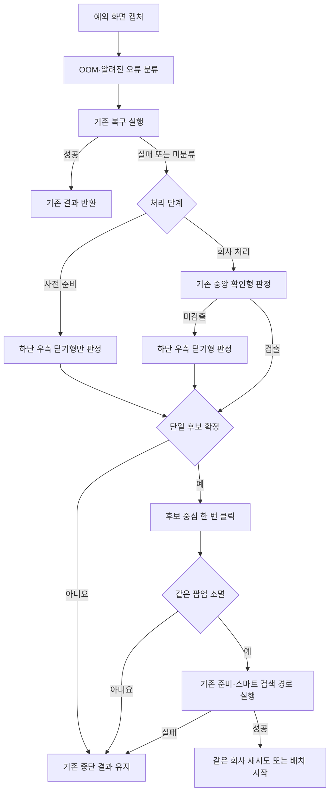

# CRETOP 비정형 닫기 팝업 복구 설계

## 목표

- 알려진 CRETOP 오류 복구를 모두 거친 뒤에만 비정형 닫기 팝업을 판정한다.
- 화면 구조가 충분히 명확할 때만 하단 우측의 단일 파란 닫기 후보를 클릭한다.
- 팝업 소멸과 기존 CRETOP 준비 경로 복귀를 확인한 경우에만 처리를 재개한다.

## 이번 장애와 근본 원인

- 장애 실행: `20260724_cretop_additional1000`
- 장애 시점: 배치 시작 전 준비
- 처리 결과: `0/1000`, 전체 미실행
- 관찰 화면: 로그인 화면 위의 `보안 업데이트로 인한 접속 안내` 팝업
- 본문 복사 결과: 팝업이 아닌 뒤쪽 로그인 화면의 글자

### 세 번의 왜

1. 배치가 시작되지 않은 이유
   - 기존 로그인 복구가 팝업 뒤쪽 화면만 보고 확인 좌표를 눌렀다.
2. 기존 복구가 팝업을 닫지 못한 이유
   - 기존에는 문구가 복사되는 알려진 서비스 팝업과 중앙 확인 버튼형 팝업만 처리했다.
3. 새 팝업이 기존 판정에 들어오지 않은 이유
   - 팝업 글자가 클립보드 본문에 나타나지 않고, 닫기 동작도 중앙 버튼이 아닌 하단 우측 글자형 버튼이었다.

근본 원인은 비정형 팝업의 글자를 읽지 못했다는 사실이 아니다. 기존 최종 경로의 마지막 실패 경계에 화면 구조로 안전한 닫기 동작을 확정하는 계약이 없었던 것이다.

## 과거 사례 확인

- 기존 KODATA 상품·DB 서비스 팝업은 복사 marker와 고정 좌표로 닫는다.
- 기존 중앙 확인 팝업은 암막, 중앙 흰 패널, 하단 단일 넓은 버튼을 영상으로 판정한다.
- 기존 범용 확인 팝업은 회사 처리 단계에서만 사용한다.
- 이번 팝업은 중앙 확인형이 아니므로 기존 검출 조건을 넓히지 않는다.
- 별도의 하단 우측 닫기형 검출기를 같은 마지막 복구 경계에 병합한다.

## SSP 수정 전 잠금

### ① 현재 최종 경로

1. `scripts/cretop_detail_collection.py`가 승인된 로컬 코드를 원격 작업기에 배포하고 해시를 확인한다.
2. 원격 `scripts/cretop_agent.py`의 `collect_batch_fast()`가 `_ensure_ready_fast()`로 로그인·서비스 팝업·세션 상태를 준비한다.
3. `_go_home_fast()`와 `_enter_smart_search_from_landing()`이 스마트 검색을 준비한다.
4. `collect_one_fast()`가 회사를 검색하고 승인된 상세 화면을 수집한다.
5. 예외 시 `_handle_company_exception()`이 OOM과 알려진 오류를 먼저 분류하고 기존 복구를 실행한다.
6. 회사 처리에서 기존 복구가 실패하면 `_recover_generic_popup_to_smart_search()`가 중앙 확인형 팝업을 마지막으로 판정한다.
7. 복구가 확정되지 않으면 증거를 남기고 배치를 중단한다.

독립 `preflight()` 명령도 `_ensure_ready_fast()` 실패를 같은 `_handle_company_exception(phase="preflight")`으로 전달한다. 배치 준비와 독립 사전 검증이 서로 다른 오류처리 경로를 갖지 않는다.

### ② 병합 위치

- 새 영상 판정은 `_handle_company_exception()`의 기존 마지막 복구 경계에만 들어간다.
- 사전 준비에서는 알려진 복구가 실패한 뒤 하단 우측 닫기형만 허용한다.
- 회사 처리에서는 기존 중앙 확인형을 먼저 판정하고, 검출되지 않을 때 하단 우측 닫기형을 판정한다.
- 클릭 후에는 기존 준비·홈·스마트 검색 함수만 사용한다.

### ③ 대체·정리 대상

- `preflight`에서는 모든 범용 영상 복구를 금지하던 기존 규칙을 교체한다.
- 새 규칙은 `preflight`에서 중앙 확인형은 계속 금지하고, 더 엄격한 하단 우측 닫기형만 허용한다.
- 기존 중앙 확인 검출기와 알려진 오류 분기는 변경하지 않는다.
- 별도 실행기, OCR 패키지, LLM 호출, 고정 팝업 좌표를 추가하지 않는다.
- 새 검출 함수 하나와 기존 복구 경계의 선택 규칙만 추가하므로 실행 경로는 하나로 유지된다.

### ④ 검증 방법

1. 실제 장애 캡처와 합성 이미지로 하단 우측 닫기형 검출 좌표를 확인한다.
2. 정상 화면, 암막 없음, 후보 여러 개, 해상도 불일치가 모두 거부되는지 확인한다.
3. 사전 준비에서 기존 복구가 실패한 뒤에만 닫기형 복구가 실행되는지 확인한다.
4. 회사 처리에서 기존 중앙 확인형과 닫기형이 같은 회사별 재시도 예산을 공유하는지 확인한다.
5. CRETOP 테스트, Ruff, Python 컴파일을 실행한다.
6. 코드 리뷰 루프에서 검증된 결함을 수정하고 같은 검사를 다시 실행한다.
7. 원격 `remote-preflight`로 실제 팝업 소멸과 스마트 검색 복귀를 확인한다.
8. 원격 사전 검증이 성공한 경우에만 추가 1000건 배치를 같은 SSP로 다시 실행한다.

## 영상 판정 계약

`detect_generic_footer_close_popup()`은 다음 조건을 모두 만족할 때만 좌표를 반환한다.

- 화면 크기가 `1920x1080`이다.
- 화면 중앙에 충분히 큰 단일 모달이 있다.
- 모달 바깥쪽에 어두운 암막이 있다.
- 모달 하단에 폭이 넓고 높이가 낮은 밝은 푸터가 있다.
- 푸터 오른쪽 제한 영역에 파란색 글자형 후보가 정확히 하나 있다.
- 후보는 푸터의 오른쪽 가장자리와 가까우며 세로 중앙에 있다.
- 후보 크기와 픽셀 수가 글자형 동작 범위에 들어온다.

팝업 본문이 `Ctrl+A` 선택 상태여도 하단 푸터가 보존되면 같은 계약으로 판정한다. 후보가 없거나 여러 개이면 클릭하지 않는다.

## 분기 순서

## 재시도와 기록

- 사전 준비의 비정형 닫기 복구는 한 번만 실행한다.
- 회사 처리의 중앙 확인형과 하단 우측 닫기형은 기존 `generic_popup_recovery_used` 예산 1회를 공유한다.
- 첫 회사 복구 성공 시 같은 회사를 검색부터 한 번 재시도한다.
- 재시도 중 같은 범용 팝업이 재발하면 닫고 스마트 검색으로 돌아간 뒤 해당 회사 오류로 기록한다.
- 클릭 전·후 캡처, 검출 유형, 패널·푸터·후보 경계, 계산 좌표, 기존 복구 실패를 함께 남긴다.

## 실패 안전

- 유료 서비스, 반복 만료, 확인된 OOM처럼 정책상 중단하는 분기에는 진입하지 않는다.
- 화면 캡처나 본문 관찰 자체가 실패하면 좌표를 추측하지 않는다.
- 영상 조건 하나라도 빠지면 클릭하지 않는다.
- 클릭 뒤 같은 구조가 남아 있거나 기존 준비 경로로 복귀하지 못하면 배치를 중단한다.

## 원격 검증 결과

- 첫 원격 검증은 독립 `preflight()`가 공통 예외처리기를 우회한다는 구조적 결함을 드러냈다.
- 독립 진입점을 공통 예외처리기에 병합한 뒤 같은 명령으로 다시 검증했다.
- 검증 실행: `20260724_cretop_generic_footer_close_preflight_v2`
- 배포 SHA-256: `ea7e3beeedb25d83043578b4027c9b8de8bdc64a2fd58a90ba566d06bd41891c`
- 실제 검출:
  - 패널: `(660,252)-(1260,901)`
  - 푸터: `(660,837)-(1260,901)`
  - 닫기 후보: `(1196,867)-(1230,890)`
  - 클릭: `(1213,878)`
- 팝업 소멸, 재로그인, 로그인 완료, 홈 초기화, 스마트 검색 marker가 모두 확인됐다.
- 같은 배포 해시로 `20260724_cretop_additional1000_footer_recovery` 1000건 작업을 시작했다.
