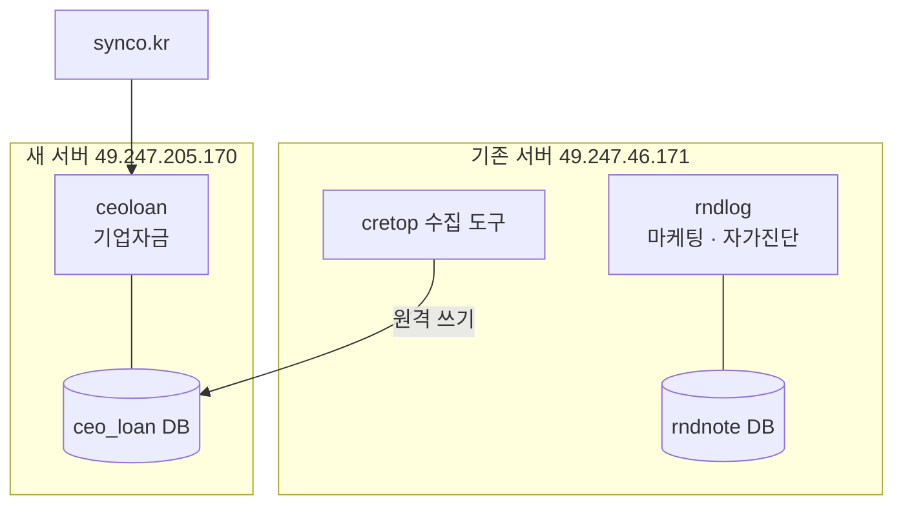
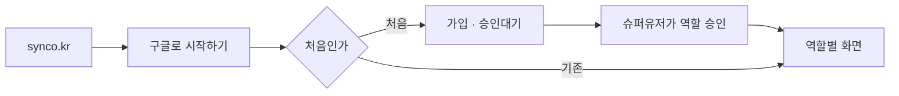

# 기업자금 서비스 분리 이전 설계 — ceoloan @ synco.kr

- 작성일: 2026-07-26
- 대상: 신규 서버 `chaconne@49.247.205.170`
- 상태: 설계 승인 완료, 구현 계획 대기

## 1. 목표

기업 자금(`funding`) 서비스를 rndlog에서 떼어 **독립 서비스 `ceoloan`**으로 새 서버에 세운다. 마케팅·자가진단은 기존 서버에 남는다.



## 2. 확정된 결정

| 항목 | 결정 |
|---|---|
| 코드 | 새 Django 프로젝트를 만든다. `funding`·`common`은 기존 코드를 가져오고 `accounts`는 새로 만든다 |
| 기존 rndlog | 기업자금을 당분간 남기되 **동결**한다(수정하지 않음). 안정화 후 제거 |
| 정본 DB | 전환일부터 새 서버가 정본. 양쪽 병행 사용 없음 |
| DB 구성 | `ceo_loan` 하나만 쓴다. Django 기본 DB로 삼고 라우터를 없앤다 |
| 옮길 데이터 | **cretop 스키마(1,867MB) + `public.leads`(26MB)만.** 대표이사·배분은 새 서버에서 동기화 명령으로 다시 만든다 |
| 수집 도구 | 기존 서버에 두고 새 서버 DB에 원격으로 쓴다 |
| 로그인 | 구글 로그인만. 아이디·비밀번호 없음 |
| 승인 | 슈퍼유저가 역할을 골라 승인 |
| 배포 | Docker Compose + nginx + certbot (rndlog와 같은 형태, Swarm은 쓰지 않음) |

## 3. 현황 — 조사로 확인한 사실

### 3.1 분리 조건

- `funding` 앱은 `common`만 참조한다. 마케팅·회사·자가진단과 얽혀 있지 않다
- 마케팅에 묶인 곳은 셋뿐이고 전부 이번 이전 대상에서 빠진다
  - `accounts/views.py`의 랜딩 상담신청, `checkup` 앱, 사이드바 메뉴 3개
- `funding_sync_ceos`가 쓰는 `public.leads`(14,084행)는 **마케팅 리드가 아니다**. `ceo_loan` DB 안의 별도 테이블로, cretop 수집 도구가 채운다

### 3.2 데이터 규모

| 대상 | 크기·건수 | 이전 |
|---|---|---|
| `cretop` 스키마 34테이블 | 1,867MB | **옮긴다** |
| `public.leads` | 26MB / 14,084행 | **옮긴다** |
| `funding_*` 테이블 | 7MB | 옮기지 않는다 — 새 서버에서 재생성 |
| 대표이사·회사·배분 | 각 7,899건 | 동기화 명령으로 재생성 |
| 통화기록·녹음 | **0건** | 실업무 기록이 아직 없다 |
| 담당자 | `tm1`·`tm2` (테스트사용자1·2) | 옮기지 않는다. 실제 TM으로 새로 등록 |

실업무 기록이 없어 사실상 깨끗한 시작이다. 테스트 계정과 그 앞으로 된 배분 7,899건을 끌고 가지 않는다.

### 3.3 새 서버

| 항목 | 상태 |
|---|---|
| OS·사양 | Ubuntu 24.04.4 LTS · 8코어 · 7.8GB RAM · 48GB(42GB 여유) |
| 설치된 것 | git 2.43, python 3.12 **뿐** |
| 없는 것 | docker, nginx, postgresql, certbot, uv |
| sudo | 무암호 가능 |
| 스왑 | 없음 |
| 아웃바운드 | 정상 |

### 3.4 도메인

- `synco.kr`·`www.synco.kr` DNS가 **이미 새 서버(49.247.205.170)를 가리킨다**
- 그래서 지금 synco.kr은 접속되지 않는다. 기존 서버의 리다이렉트 설정도 더는 타지 않는다
- 기존 서버 `deploy/nginx/nginx.conf`의 synco.kr 블록(80/443 → rndnote.co.kr/marketing/ 301)은 정리 대상이다

## 4. 프로젝트 구성

```
ceoloan/
├── main/                  설정·URL·WSGI
│   └── settings/          base.py · local.py · deploy.py
├── accounts/              구글 로그인 · 가입 · 승인 (새로 만든다)
├── funding/               기업자금 (rndlog에서 가져온다)
├── common/                mixin · 권한 가드 (가져온다)
├── templates/             base · 사이드바 · 로그인
├── assets/경영진단.xlsx    양식 (git 비추적, 따로 전달)
├── deploy/                nginx 설정·Dockerfile
├── docker-compose.yml
└── deploy.sh
```

가져오지 않는 것: `marketing`, `checkup`, `companies`, 랜딩 페이지 2개, 상담신청

### 4.1 앱 이름을 바꾸지 않는 이유

`funding` 앱 이름은 그대로 둔다. 테이블 이름(`funding_ceo` 등)이 앱 이름에서 나오므로, 바꾸면 옮겨온 DB의 테이블을 전부 바꿔야 한다.

## 5. DB — 하나로 합친다

지금 rndlog는 계정(`rndnote`)과 기업자금(`ceo_loan`)이 다른 DB라 **교차 FK를 걸 수 없다**. 새 서버는 `ceo_loan` 하나만 쓰므로 그 제약이 사라진다.

- Django `DATABASES`는 `default` 하나. 이름은 `ceo_loan`
- `FundingRouter` 삭제
- `cretop` 스키마와 `public.leads`는 Django가 모델로 관리하지 않는다. 수집 도구가 소유한다

### 5.1 마이그레이션

- 새 프로젝트에서 처음부터 `migrate`를 돌린다. `funding` 마이그레이션 파일은 그대로 가져온다
- 옮긴 DB에는 `funding_*` 테이블과 `django_migrations`가 남아 있으므로 **복원 전에 지운다** (cretop 스키마와 leads만 복원)

### 5.2 계정과 담당자 연결

`Agent.username`·`Handoff.sales_username`으로 계정과 잇는 지금 방식을 **그대로 둔다**. DB가 합쳐져 FK를 걸 수 있게 되지만, 이전만으로도 변경이 큰데 모델까지 바꾸면 실패 지점이 늘어난다. FK 전환은 별도 작업으로 미룬다.

## 6. accounts — 구글 로그인과 승인

### 6.1 역할

rndlog에서 정한 것과 같다.

| 역할 | 보이는 것 |
|---|---|
| 승인대기 | 안내 화면만 |
| 관리자 | 기업자금 관리 + TM 워크스페이스 |
| TM담당자 | TM 워크스페이스, 자기 할당분만 |
| 영업담당자 | 자기에게 전달된 건 |

### 6.2 흐름



- 첫 화면(`/`)은 로그인 하나뿐이다. 랜딩·소개 페이지는 없다
- `django-allauth` + 구글 provider
- 신규 가입자는 `role=pending`, `is_active=True`
- 승인 화면 `/accounts/approvals/` — 슈퍼유저 전용
- 역할 부여는 `accounts/services/membership.py::approve` 한 곳만 지난다

### 6.3 첫 슈퍼유저

구글 로그인만 쓰면 승인할 사람이 없어 전원이 승인대기에 갇힌다. 배포 직후 명령줄로 만든다.

```
manage.py createsuperuser  →  역할을 admin으로 지정
```

또는 지정한 이메일로 처음 가입한 계정을 자동으로 슈퍼유저·관리자로 올리는 1회용 관리 명령을 둔다. 구현 시 후자를 기본으로 하되 이메일은 설정값으로 받는다.

### 6.4 로고

- 사이드바·로그인 화면의 이름은 `ceoloan`
- rndlog 로고 마크업은 가져오지 않는다

## 7. 서버 구성

```
인터넷 → nginx (80/443, 인증서) → gunicorn (Django) → PostgreSQL 16
```

- **Docker Compose**로 올린다. 단일 서버라 Swarm은 과하다
- 컨테이너: `db`(postgres:16), `web`(gunicorn), `nginx`
- 정적 파일은 nginx 이미지 빌드 시 넣는다 (rndlog와 같은 방식)
- `deploy.sh`: 빌드 → 점검 → 마이그레이션 → 기동
- 스왑 2GB를 만든다 (RAM 7.8GB, 빌드 시 여유 확보)

### 7.1 인증서

- certbot standalone으로 `synco.kr`·`www.synco.kr` 발급 (DNS가 이미 새 서버를 가리켜 바로 가능)
- 발급·갱신 시 nginx를 잠시 내린다. 갱신 훅으로 자동화
- 인증서는 호스트 `/etc/letsencrypt`에 두고 컨테이너에 읽기 전용 마운트

### 7.2 크론

매시 5분 `funding_sync_ceos` — 수집된 회사에서 대표이사를 승격하고 배분한다.

## 8. 데이터 이전

1. 기존 서버에서 `cretop` 스키마 + `public.leads`만 덤프
2. 새 서버로 전송 (1.9GB)
3. 새 서버 DB에 복원
4. `migrate`로 `funding`·`accounts` 테이블 생성
5. `funding_sync_ceos` 실행 → 대표이사·회사 연결 생성
6. 실제 TM 계정이 승인되면 배분

## 9. 수집 도구 접속 개통

기존 서버의 수집 도구가 새 서버 DB에 쓴다.

- 새 서버 PostgreSQL이 5433 포트를 외부에 연다
- 방화벽에서 **기존 서버 IP(49.247.46.171)만** 허용한다
- `pg_hba.conf`에 해당 IP·사용자·DB를 명시하고 `scram-sha-256` 인증
- 수집 도구의 접속 정보를 새 서버로 바꾼다 (도구는 이 저장소 밖에 있어 위치 확인이 필요하다)

## 10. 진행 순서

| 단계 | 내용 | 끝났을 때 |
|---|---|---|
| 1 | 서버 기본 세팅 (docker, 스왑, 방화벽) | 컨테이너를 띄울 수 있다 |
| 2 | 새 프로젝트 골격 + `funding`·`common` 이식 | 로컬에서 화면이 뜨고 테스트가 통과한다 |
| 3 | `accounts` 구글 로그인·승인 화면 | 구글로 가입·승인·로그인이 된다 |
| 4 | DB 이전 + 수집 도구 접속 개통 | 새 서버에 회사 7,899건이 보인다 |
| 5 | 배포 (nginx·인증서·도메인) | https://synco.kr 접속된다 |
| 6 | 검증 후 전환 | 실제 TM이 새 서버에서 일한다 |

3단계는 구글 OAuth 정보가 있어야 시작한다. 1·2·4단계는 지금 진행할 수 있다.

## 11. 필요한 정보

| 항목 | 용도 | 없으면 |
|---|---|---|
| 구글 OAuth 클라이언트 ID·시크릿 | 로그인 연결 | 3단계 불가 |
| 리디렉션 URI 등록 | `https://synco.kr/accounts/google/login/callback/` | 로그인 콜백 실패 |
| 가입 허용 도메인 | 워크스페이스 도메인만 받을지 | 제한 없이 받고 승인으로만 막는다 |
| 첫 슈퍼유저 구글 계정 | 승인 권한 부여 | 전원 승인대기에 갇힌다 |
| 수집 도구 위치·실행 방식 | 접속 정보 변경 | 새 데이터가 안 들어온다 |
| `assets/경영진단.xlsx` | 결과서 양식 (git 비추적) | 경영진단 생성 불가 |
| 발신 이메일 | 전달 메일 발신 계정 | 전달 메일 발송 불가 |

## 12. 범위 밖

- rndlog의 마케팅·자가진단 기능
- rndlog에서 기업자금 제거 (안정화 후 별도 작업)
- `Agent`·`Handoff`의 계정 연결을 FK로 바꾸는 리팩터링
- cretop 수집 도구 자체의 이전
- 기존 계정(`ceo`·`chaconne`·`tm1`·`tm2`) 이전 — 구글로 새로 가입한다

## 13. 검증

각 단계는 실제로 실행해 확인한다.

| 단계 | 확인 방법 |
|---|---|
| 2 | `uv run pytest` 통과, 로컬 `runserver`로 화면 확인 |
| 3 | 구글 계정으로 가입 → 승인대기 → 슈퍼유저 승인 → 역할 화면 착지 |
| 4 | 새 서버에서 회사 목록이 뜨고 경영진단 결과서가 생성된다 |
| 5 | `curl`로 http/https × apex/www 4조합 확인 |
| 6 | 관리자 → 전달 → 영업자 수신까지 한 바퀴 |
