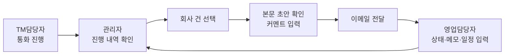

# 기업자금 관리자 페이지 · 역할 3종 · 구글 로그인 · 영업 전달 설계

- 작성일: 2026-07-26
- 대상 앱: `accounts`, `funding`
- 상태: 설계 승인 완료, 구현 계획 대기

## 1. 목표

기업자금(`funding`) 업무를 TM 혼자 쓰는 도구에서 **TM → 관리자 → 영업**으로 이어지는 업무 흐름으로 넓힌다.



## 2. 확정된 결정

| 항목 | 결정 |
|---|---|
| 영업담당자 지위 | 시스템 로그인 사용자. 자기에게 전달된 건만 본다 |
| 전달 단위 | 회사 1개 = 1건. 여러 건 선택 시 이메일 1통에 묶고 첨부는 건별로 붙인다 |
| 이메일 본문 | 자동 초안(회사 정보 요약 + 통화 녹음 요약 포함 TM 요약) + 관리자 수정 + 커멘트 |
| 계정 정책 | 구글 가입은 열되 초기 상태는 승인대기. 관리자가 역할을 골라 승인 |
| 관리자 목록 한 줄 | 회사 1개 |
| 영업 후속 입력 | 상태 + 메모 + 다음 일정 |
| 수신자 지정 | 전달할 때마다 영업담당자 1명 선택 |

## 3. 현재 코드 기준 사실

설계의 전제다. 다르면 코드가 기준이다.

- 역할이 두 곳에 흩어져 있다 — `User.is_superuser`(관리자), `funding.Agent` 레코드 존재 여부(TM담당자)
- 화면 가드는 `common/auth.py::require_staff` 하나이고 `marketing`·`funding`이 공유한다
- `funding` 데이터는 `ceo_loan` DB(`FundingRouter` 고정 라우팅), 계정은 본 DB(`rndnote`)에 있다 → **교차 DB FK 불가**
- `funding.Agent.username`이 계정과 문자열로 느슨 결합하는 기존 방식이다
- 경영진단 엑셀은 `funding/services/report.py::build(company_id, overrides)`가 바이트열을 돌려준다
- 이메일 발송기(`marketing/services/mailer.py`)는 캠페인·리드 전용이다 — 대상 모델과 추적·수신거부 규칙이 달라 재사용 대상이 아니다
- 소셜 로그인은 없다. `google-auth`는 gspread용으로만 들어 있다
- 목록 상한 패턴: `PAGE_SIZE = 100` + 「더 보기」(offset). **필터·정렬을 전부 DB에서 끝내야** 상한이 의미를 가진다
- 한글 이름·상호 정렬은 `Collate("<컬럼>", "C")`를 써야 가나다순이 된다 (DB 콜레이션이 `en_US.utf8`)

## 4. 역할 체계

### 4.1 모델

`accounts.User`에 역할 필드 하나를 추가한다. **역할의 정본은 이 필드 하나다.**

```python
class Role(models.TextChoices):
    PENDING = "pending", "승인대기"
    ADMIN = "admin", "관리자"
    TM = "tm", "TM담당자"
    SALES = "sales", "영업담당자"

role = models.CharField(
    max_length=10, choices=Role.choices, default=Role.PENDING, db_index=True
)
```

### 4.2 `is_staff`와의 관계

- `is_staff`는 앞으로 **Django admin 접근 플래그 + `marketing` 화면 가드**로만 쓴다
- `funding`·`accounts` 신규 화면은 `role`만 본다
- 두 값이 어긋나지 않도록 **승인 서비스 함수 한 곳에서만** 같이 세팅한다

| 승인 역할 | `role` | `is_staff` |
|---|---|---|
| 관리자 | `admin` | `True` |
| TM담당자 | `tm` | `True` |
| 영업담당자 | `sales` | `False` |
| 승인대기·거절 | `pending` | `False` |

영업담당자에게 `is_staff`를 주지 않는 이유: 이메일 캠페인 화면은 영업 업무와 무관하다.

### 4.3 승인 서비스 (단일 진입점)

`accounts/services/membership.py`

```
approve(user, role, *, approved_by) -> None
```

1. `user.role`, `user.is_staff`를 표대로 세팅
2. `role == tm`이면 `funding.Agent`를 `username` 기준으로 `get_or_create` 후 `is_active=True`
3. `role != tm`이고 기존 `Agent`가 있으면 `is_active=False` (배분 대상에서 뺀다. **삭제하지 않는다** — `Assignment.agent`가 `PROTECT`이고 과거 배분 이력이 남아야 한다)

역할 변경도 같은 함수를 쓴다. `Agent` 생성·비활성 경로는 이 함수 하나뿐이다.

### 4.4 가드

`common/auth.py`에 추가한다.

```
require_roles(request, *roles) -> None   # 미인증·역할 불일치면 PermissionDenied
```

- `funding` 기존 뷰: `require_staff` → `require_roles(request, ADMIN, TM)`로 교체
- `funding` 관리자 화면: `require_roles(request, ADMIN)`
- `funding` 영업 화면: `require_roles(request, SALES, ADMIN)` (관리자는 확인 목적으로 본다)
- `marketing`: `require_staff` 그대로 둔다 (범위 밖)

### 4.5 기존 계정 마이그레이션

데이터 마이그레이션 1회로 처리한다. 판정 순서가 곧 우선순위다.

1. `is_superuser=True` → `admin`
2. 활성 `funding.Agent`의 `username`과 일치 → `tm`
3. 그 외 `is_staff=True` → `admin` (지금 기업자금·마케팅을 쓰던 내부 인원. 잠기면 업무가 멈춘다)
4. 나머지 → `pending`

`funding.Agent`는 `ceo_loan` DB에 있어 `accounts` 마이그레이션에서 직접 못 읽는다. → **`funding` 앱 쪽 마이그레이션에서 username 목록을 읽어 `accounts` 쪽을 갱신**하거나, `accounts` 마이그레이션 안에서 `ceo_loan` 커넥션을 명시해 조회한다. 구현 시 후자를 기본으로 하되 라우터 동작을 실제로 확인하고 정한다.

### 4.6 로그인 착지 분기

- 지금은 `LOGIN_REDIRECT_URL = "/marketing/"` 고정이다
- 착지 뷰 `accounts.views.after_login` 하나를 두고 `LOGIN_REDIRECT_URL`을 여기로 바꾼다
- 기존 아이디·비번 로그인과 구글 로그인이 **같은 착지 뷰**를 지난다 (분기점 하나)

| 역할 | 착지 |
|---|---|
| 관리자 | `funding:admin_list` |
| TM담당자 | `funding:workspace` |
| 영업담당자 | `funding:handoff_inbox` |
| 승인대기 | `accounts:pending` (안내 화면) |

## 5. 구글 로그인

### 5.1 방식

`django-allauth` 도입. 상태값·PKCE·토큰 검증을 직접 구현하지 않는다.

- 추가 의존성: `django-allauth`
- `INSTALLED_APPS`: `django.contrib.sites`, `allauth`, `allauth.account`, `allauth.socialaccount`, `allauth.socialaccount.providers.google`
- `MIDDLEWARE`: `allauth.account.middleware.AccountMiddleware`
- `SITE_ID` 설정
- 클라이언트 ID·시크릿은 환경변수 (`.env`에는 secret만 둔다는 기존 규칙 준수)

### 5.2 URL 충돌 처리

기존 커스텀 뷰가 `/accounts/login/`, `/accounts/logout/`을 이미 쓴다.

- `main/urls.py`에서 **`accounts.urls`를 `allauth.urls`보다 먼저** 등록한다
- 기존 로그인·로그아웃 화면은 그대로 살아 있고, 구글 경로(`/accounts/google/login/…`)만 allauth가 받는다
- 기존 로그인 화면에 「구글로 로그인」 버튼을 추가한다

### 5.3 신규 가입 처리

allauth adapter를 하나 두고 명시적으로 처리한다 (signal 대신 — 실행 순서가 눈에 보이게).

- 신규 가입자: `role=pending`, `is_staff=False`
- 가입 직후 착지: `accounts:pending` 안내 화면
- 도메인 제한: 워크스페이스 도메인을 받은 뒤 adapter에서 검사한다. **도메인 값을 코드에 적지 않고 설정으로 둔다**

### 5.4 승인 화면

- 위치: `accounts` 앱 (`/accounts/approvals/`). 계정 문제이지 기업자금 문제가 아니다
- 접근: `require_roles(request, ADMIN)`
- 목록: `role=pending` 사용자 — 이메일 · 이름 · 가입일
- 동작: 역할 선택 후 승인 / 거절(`is_active=False`)
- 승인·거절 모두 `membership.approve` 계열 함수를 지난다

## 6. 관리자 페이지

### 6.1 목록

- URL: `/funding/admin/` (`funding:admin_list`)
- 기준 테이블: `CeoCompany` (회사 1행)

표시 항목

| 열 | 원천 |
|---|---|
| 선택 | 체크박스 |
| 회사명 | `CeoCompany.company_name` |
| 대표명 | `Ceo.name` |
| 담당 TM | `Assignment.agent.display_name` |
| 최근 통화일 | `CallRecord` 최대 `happened_at` |
| 반응도 | 최신 `CallRecord.reaction` |
| 통화 횟수 | `CallRecord` 건수 |
| 전달 상태 | 최신 `Handoff.status` (없으면 「미전달」) |

거르기·정렬

- 필터: 담당 TM, 최소 반응도, 전달 여부, 검색(회사명·대표명·사업자번호·전화)
- 기본 정렬: 최근 통화일 내림차순(통화 없는 회사는 뒤로, `nulls_last`) → 회사명(`Collate("company_name", "C")`)
- 상한: `PAGE_SIZE = 100` + 「더 보기」
- **필터·정렬·집계는 전부 DB에서 끝낸다.** 파이썬에서 거르면 상한이 무의미해진다

### 6.2 진행 내역 모달

행 클릭 → 모달. 담는 것:

- 통화 이력 (일시 · 결과 · 반응도 · 메모 · 다음 할 일 · 수행자)
- 통화 녹음 AI 요약 (`CallAudio.summary`)
- 회사 정보 요약 (`cretop_data.company_profile`, `bulk_company_facts`)
- 경영진단 엑셀 내려받기 (기존 `funding:company_report` 재사용)

## 7. 전달 기능

### 7.1 최종 경로

```
funding:admin_list (목록)
  └ 체크 선택 → 「영업자에게 전달」
      └ funding:handoff_form   ─ services/handoff.build_draft(company_ids) → 초안 본문
          └ (관리자가 수신자 선택 · 본문 수정 · 커멘트 입력)
              └ funding:handoff_create (POST)
                   1. Handoff N건 생성            [트랜잭션]
                   2. services/handoff.send(...)  ─ 메일 1통 + 첨부 N개(report.build)
                   3. 성공 → email_sent_at 기록 / 실패 → email_error 기록
                   └ 목록 갱신
```

### 7.2 본문 초안 (`build_draft`)

- 상단: 관리자 커멘트 자리 (입력값이 들어감)
- 회사별 블록 반복
  - 회사 정보 요약: 상호 · 사업자번호 · 대표 · 업종 · 매출 · 대출 예상 금액(`views._estimate_from_facts` 재사용)
  - TM 내용 요약: **통화 녹음 AI 요약**(최신 우선) + 최근 통화 기록 요지
- 값이 없으면 비운다. **추정값이나 대체값을 만들어 넣지 않는다**

초안은 폼을 그릴 때 1회 만들고, 실제 발송 본문은 **관리자가 제출한 텍스트**다.

### 7.3 발송

- `funding/services/handoff.py` 신규. `EmailMultiAlternatives` 직접 사용
- 첨부: 선택한 회사마다 `report.build(...)` 결과를 메모리에서 붙인다 (파일 저장 안 함)
- 대출 금액 override는 기존 `company_report` 뷰와 같은 값을 쓴다 → 화면·엑셀·메일이 한 산식을 공유
- 동기 발송. 1통이라 캠페인처럼 비동기·간격 제어가 필요 없다
- **저장 → 발송** 순서. 발송 실패는 `email_error`에 남기고 목록에서 다시 보낸다 (유령 메일 방지)

### 7.4 모달 인터페이스

- 받는 사람: `role=sales` 사용자 드롭다운 1명
- 본문: 초안이 채워진 수정 가능한 입력창
- 관리자 커멘트: 별도 입력창
- 첨부 목록 표시 (회사 수만큼)
- 미리보기 → 발송

## 8. 영업자 화면

- URL: `/funding/handoffs/` (`funding:handoff_inbox`)
- 시야
  - 영업담당자: `Handoff.sales_username == request.user.username`인 건만
  - 관리자: 전체 전달 건. 수신자 열이 추가로 보이고 **상태·메모·일정은 고치지 못한다** (영업자가 남기는 값이다)
- 표시: 회사명 · 대표명 · 전달일 · 관리자 커멘트 · 상태 · 다음 일정
- 동작
  - 상태 변경: 수신 → 진행중 → 성사 / 무산
  - 메모 입력
  - 다음 일정 입력
  - 첨부 엑셀 다시 받기 (그 시점에 다시 생성)
  - 전달 본문 다시 보기 (`body_snapshot`)

관리자는 목록의 「전달 상태」 열에서 이 결과를 바로 본다.

## 9. 신규 모델

`funding.Handoff` (ceo_loan DB)

```python
class Handoff(BaseModel):
    class Status(models.TextChoices):
        RECEIVED = "received", "수신"
        IN_PROGRESS = "in_progress", "진행중"
        WON = "won", "성사"
        LOST = "lost", "무산"

    company = models.ForeignKey(CeoCompany, on_delete=models.PROTECT,
                                related_name="handoffs")
    sales_username = models.CharField(max_length=150, db_index=True)  # 교차 DB → 느슨 결합
    sent_by = models.CharField(max_length=150)                        # 전달한 관리자
    admin_comment = models.TextField(blank=True)
    body_snapshot = models.TextField()        # 보낸 본문 그대로
    status = models.CharField(max_length=12, choices=Status.choices,
                              default=Status.RECEIVED, db_index=True)
    sales_memo = models.TextField(blank=True)
    next_due = models.DateField(null=True, blank=True)
    email_sent_at = models.DateTimeField(null=True, blank=True)
    email_error = models.TextField(blank=True)
```

- `sales_username`이 문자열인 이유: `funding`은 `ceo_loan` DB라 `accounts.User`에 FK를 걸 수 없다. `Agent.username`과 같은 방식이다
- `body_snapshot`을 남기는 이유: 영업자 화면에서 다시 보고, 나중에 "무엇을 보냈나"를 확인한다
- 중복 전달 제약 없음: 같은 회사를 다른 영업자에게 다시 보낼 수 있다. 목록의 전달 상태는 **최신 1건** 기준
- 인덱스: `(sales_username, status)`, `(company, -created_at)`

## 10. 사이드바

`templates/common/nav_sidebar.html` 하나가 원본이다. 조건을 `request.user.is_staff`에서 역할로 바꾼다.

| 역할 | 보이는 메뉴 |
|---|---|
| 관리자 | 대시보드 · 이메일 캠페인 · 이메일 템플릿 · 기업 자금 · **기업자금 관리** · **가입 승인** |
| TM담당자 | 대시보드 · 이메일 캠페인 · 이메일 템플릿 · 기업 자금 |
| 영업담당자 | **전달함** |
| 승인대기 | 없음 (안내 화면만) |

## 11. 범위 밖 (건드리지 않는다)

- `marketing` 앱의 기능 — 캠페인·템플릿·리드·발송기·`require_staff` 가드
  - 다만 **공유 자산 2개는 바뀐다**: 사이드바 원본(`templates/common/nav_sidebar.html`)의 메뉴 표시 조건, 로그인 착지(`LOGIN_REDIRECT_URL`이 `/marketing/` 고정 → 역할 분기)
  - 이 둘이 `*/marketing` 경로에 닿기 때문에 작업 브랜치는 `ceo-loan`이다
- `cretop` 수집 파이프라인
- `funding/services/report.py` — 재사용만 한다
- `funding/services/loan.py`, `assignment.py`, `audio.py` — 산식·배분·녹음 규칙
- 기존 TM 워크스페이스 화면 동작 — 가드만 교체한다
- `companies`, `checkup` 앱

## 12. 검증

전부 최종 경로를 직접 실행해 확인한다.

- `uv run python manage.py check`
- `uv run python manage.py check --settings=main.settings.deploy`
- `uv run pytest`
- `uv run ruff check`

새 테스트

| 대상 | 확인할 것 |
|---|---|
| `accounts` | 역할 가드, 승인 서비스(역할별 `is_staff`·`Agent` 동기화), 로그인 착지 분기 |
| `funding` 관리자 | 목록 시야·필터·정렬·상한, 모달 내용 |
| `funding` 전달 | `Handoff` 생성, 메일 1통·첨부 N개(locmem), 발송 실패 시 `email_error` 기록 |
| `funding` 영업 | 남의 건 접근 차단, 상태·메모·일정 변경 |
| 기존 | TM 워크스페이스·배분·녹음 테스트가 그대로 통과 |

화면 확인: 관리자 로그인 → 목록 → 모달 → 전달 → 영업자 로그인 → 수신 확인 → 상태 변경까지 한 번 통과.

## 13. 구현 순서

각 단계는 그 자체로 실행·검증되는 상태로 끝난다.

| 단계 | 내용 | 끝났을 때 확인되는 것 |
|---|---|---|
| 1 | 역할 필드 · 승인 서비스 · 가드 교체 · 기존 계정 마이그레이션 · 착지 분기 | 기존 사용자가 그대로 로그인해 지금 화면을 쓴다 |
| 2 | 관리자 페이지 목록 + 진행 내역 모달 | 관리자가 회사별 TM 진행 상황을 본다 |
| 3 | `Handoff` 모델 · 전달 모달 · 초안 생성 · 메일 발송 | 관리자가 영업자에게 메일을 보낸다 |
| 4 | 영업자 전달함 · 상태/메모/일정 · 관리자 목록의 전달 상태 열 | 흐름이 한 바퀴 돈다 |
| 5 | 구글 로그인 · 가입 승인 화면 | 구글 계정으로 가입하고 승인받아 쓴다 |

5단계는 13-1의 정보가 있어야 시작한다. 1~4단계는 정보 없이 먼저 만든다.

## 13-1. 미결 — 구현 전 필요한 정보

| 항목 | 용도 | 없으면 |
|---|---|---|
| 구글 워크스페이스 도메인 | 가입 허용 도메인 제한 | 도메인 제한 없이 가입 허용 후 승인대기로만 막게 됨 |
| Google Cloud OAuth 클라이언트 ID · 시크릿 | 구글 로그인 연결 | 구글 로그인 구현·검증 불가 |
| 리디렉션 URI 등록 | `https://rndnote.co.kr/accounts/google/login/callback/` | 로그인 콜백 실패 |
| 전달 메일 발신 주소 | `DEFAULT_FROM_EMAIL`을 그대로 쓸지 별도로 둘지 | 기존 발신 주소로 나감 |

구글 로그인을 제외한 나머지(역할 체계, 관리자 페이지, 전달, 영업자 화면)는 위 정보 없이도 먼저 만들 수 있다.
