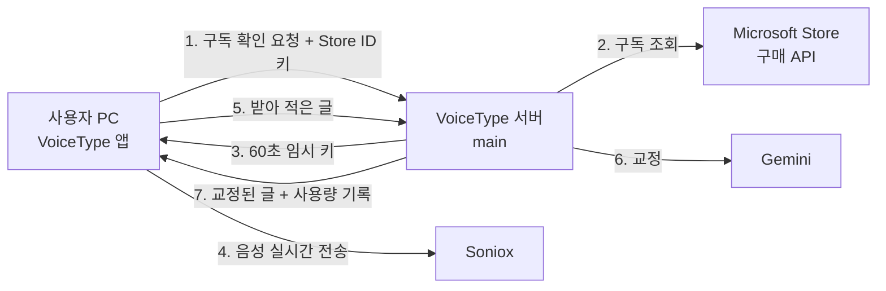

# VoiceType Microsoft Store 구독 출시 계획

- 작성일: 2026-09-26 (같은 날 개정: 사용자 키 방식 → 구독형)
- 상태: **승인 대기**
- 앞선 계획: [음성입력 마스터플랜](음성입력-마스터플랜-2026-09-26.md) (구현 완료, 이 PC에서 사용 중)

## 1. 확정한 결정 (2026-09-26 주인님)

| 항목 | 결정 |
|---|---|
| 배포 | Microsoft Store (서명 경고 없음, Store가 서명·업데이트) |
| 수익 모델 | 구독형. 사용자는 API 키 없이 쓴다 |
| 결제 | Microsoft Store 결제 (수수료 15%, 결제·환불은 Microsoft가 처리) |
| 무료 | 월 1시간 받아쓰기 |
| Pro 월간 | 9,900원 (부가세 포함), 월 30시간 |
| Pro 연간 | 99,000원 (월 8,250원), 월 30시간 |

- Store 가격은 시장별 가격 단계 중에서 고릅니다.
- 한국 가격이 정확히 9,900원 단계로 없으면 가장 가까운 단계를 씁니다.

## 2. 성공했을 때의 모습

- **설치**: 누구나 Store에서 VoiceType을 설치합니다. 경고가 없고 키 입력도 없습니다.
- **처음 켜기**
  - 음성 전송 안내에 동의합니다.
  - 곧바로 무료로 월 1시간 씁니다.
- **유료 전환**
  - 설정 창의 [Pro 구독]을 누르면 Microsoft 결제 창이 뜹니다.
  - 결제가 끝나면 바로 월 30시간이 풀립니다.
  - 해지·환불은 Microsoft 계정 화면에서 합니다.
- **사용량 확인**: 설정 창에서 이번 달 사용량과 남은 시간을 봅니다.
- **주인님이 보는 것**
  - Partner Center: 판매·수익
  - 서버: 사용자 수, 사용량, 원가

## 3. 전체 구조

- **API 키**
  - Soniox·Gemini 키는 **서버에만** 있습니다.
  - 사용자 PC에는 한 번의 연결에만 쓰는 60초짜리 임시 키만 갑니다. Soniox가 공식 지원하는 방식입니다.
- **속도**
  - 음성은 지금처럼 PC에서 Soniox로 바로 갑니다.
  - 교정만 서버를 한 번 거칩니다. 서버가 한국에 있어 약 0.05초 늘어날 것으로 봅니다.
  - 목표는 지금과 같습니다: 인식 1초 이하, 교정 포함 2초 이하.
- **사용자 구분**
  - 별도 회원가입이나 로그인이 없습니다.
  - 설치마다 무작위 사용자 ID를 만듭니다.
  - 구독 여부는 Microsoft Store가 발급하는 **Store ID 키**로 서버가 직접 Microsoft에 확인합니다.
  - 그래서 앱을 고쳐 "구독했다"고 속일 수 없습니다.
- **사용량 한도**
  - 서버가 받아쓰기마다 녹음 시간을 기록합니다.
  - 무료 1시간이나 Pro 30시간을 넘으면 새 받아쓰기를 막고, 다음 달 1일까지 안내합니다.
  - 한 번의 녹음은 최대 5분으로 제한합니다. 임시 키를 발급할 때 확인합니다.

## 4. Store 정책 대응 (Store 정책 7.20, 2026-09-14)

| 정책 | 요구 | 대응 |
|---|---|---|
| 10.5.1 | Win32 앱은 개인정보처리방침 공개 주소 필수 | 방침 페이지를 공개 주소에 게시 |
| 10.5.2 | 외부 전송 전 앱 화면에서 동의, 나중에 철회 가능 | 첫 실행 동의 화면. 설정에서 철회하면 받아쓰기 중지 |
| 10.5.4 | 개인정보 저장·전송 시 암호화 | 전송은 HTTPS·WSS. 서버에는 받아 적은 글을 **저장하지 않고** 시간·횟수만 기록. PC 기록 저장은 기본 끔, 켜면 Windows 암호화(DPAPI) |
| `runFullTrust` 제한 권한 | 제출 시 사유 기재 | "모든 입력창에서 단축키 받아쓰기·붙여넣기" |

- 심사관은 무료 1시간으로 바로 시험할 수 있습니다. 심사용 키는 필요 없어졌습니다.

## 5. 할 일

### 5-1. 서버 (main, 새 서비스)

- **기능**
  - 구독 확인: Microsoft 구매 API
  - 임시 키 발급: Soniox
  - 교정 대행: Gemini
  - 사용량 기록과 한도
- **저장**
  - main의 기존 PostgreSQL에 새 DB를 만듭니다.
  - 저장 항목: 사용자 ID, 월별 사용 시간, 구독 상태 캐시
- **비밀값**
  - Soniox·Gemini 키와 Entra ID 앱 비밀값을 main의 비밀값 파일에 둡니다.
  - Git·로그에는 넣지 않습니다.
- **배포**: main의 기존 Compose·인증서 방식을 따릅니다. 기존 제품의 주소·DB 권한은 바꾸지 않습니다.
- **주소**: HTTPS 주소가 필요합니다 (9절 결정).

### 5-2. 앱

- **키 입력칸을 빼고 서버 연동으로 바꿉니다.**
  - 이 PC의 개인용(자기 키) 방식은 Store판이 나올 때까지 그대로 둡니다.
- **Microsoft Store 기능**
  - 구매 창 열기
  - 구독 상태 확인
  - Store ID 키 받기
  - 이 기능은 파이썬에서 Windows 런타임 API를 불러야 해서 `winrt` 파이썬 패키지(새 의존성)가 필요합니다. 표준 라이브러리로는 할 수 없습니다.
- **설정 창**
  - 항목: 동의, 구독 상태, 이번 달 사용량, [Pro 구독], 교정 켜기/끄기, 단축키, 용어 사전, 기록 저장, 자동 실행
  - 로컬 서버와 Edge 앱 창으로 띄웁니다.
- **트레이 아이콘**: "설정", "종료"
- **MSIX 포장**
  - 권한: 마이크, `runFullTrust`
  - 로그인 시 자동 실행(StartupTask)
  - 아이콘
  - 이 PC에 있는 Windows SDK `makeappx`로 만듭니다.

### 5-3. Store 등록물

- **앱 아이콘**: 모든 크기를 만듭니다.
  - Store 300×300, 시작 메뉴 150×150, 작업 표시줄 44×44, 트레이 16~48
- **구독 상품(add-on) 2개**: Pro 월간, Pro 연간
- **목록**
  - 이름, 설명(한국어·영어), 스크린숏, 분류: 생산성
- **개인정보처리방침 페이지**
- **심사 안내문**: 무료로 시험하는 방법, `runFullTrust` 사유

## 6. 진행 순서

| 단계 | 내용 | 확인 |
|---|---|---|
| 0. 준비 (주인님) | 7절 목록 | 계정·이름 예약·세금 프로필 완료 |
| 1. 기술 확인 | 아래 세 가지를 작게 먼저 시험 | 세 가지 모두 동작하면 계속, 안 되면 계획 재검토 |
| 2. 서버 | 구독 확인·임시 키·교정·사용량 | main에서 실제 호출로 확인 |
| 3. 앱 | 서버 연동, 설정 창, 트레이, 동의, MSIX | 이 PC 로컬 등록판으로 전 기능 확인 |
| 4. 등록물 | 방침 페이지, 목록, 스크린숏, 구독 상품 | 공개 주소 접속 확인 |
| 5. 제출 | Store 제출 (따로 허락받음) | 심사 통과, Store판 설치 확인 |

1단계에서 먼저 시험할 세 가지는 다음과 같습니다.
- 파이썬 앱에서 Microsoft 구매 창과 Store ID 키 받기
- Soniox 임시 키로 실시간 인식
- MSIX 로컬 등록

- 알려진 위험: Microsoft Q&A에 Store ID 키 발급이 일부 사용자(약 12%)에게 실패한다는 보고가 있습니다.
- 1단계에서 이 PC 결과를 보고 대체 확인 방법을 정합니다. 대체 방법의 예: 앱 안의 구독 라이선스 확인과 사용량 한도를 함께 쓰는 방식.

## 7. 필요한 것

### 주인님이 직접 하셔야 하는 것

1. **Partner Center 개발자 계정**
   - storedeveloper.microsoft.com, 개인 계정, 무료, 본인 확인
2. **앱 이름 예약**: Partner Center에서 합니다.
3. **지급 계좌와 세금 프로필**: 돈을 받으려면 꼭 필요합니다.
   - 은행 계좌를 등록합니다.
   - 미국 세금 양식 **W-8BEN**을 냅니다. 한국 개인이면 W-8입니다.
     - 미국 고객에게 판 금액에만 원천징수가 붙습니다. 기본은 30%입니다.
     - 양식의 조약 항목(Part II)에 한미 조세조약을 적으면 세율이 낮아집니다.
     - 한국 등 미국 밖 판매분에는 원천징수가 없습니다.
   - 지급은 매월 한 번, 최소 금액 이상 쌓였을 때 합니다.
4. **Entra ID(무료 Microsoft 조직 디렉터리) 만들기와 앱 등록**
   - 서버가 구독을 확인할 때 씁니다. 글로벌 관리자 권한이 필요합니다.
   - 만드는 화면은 제가 단계별로 안내합니다.
5. **국내 세무 확인** (세무사 상담 권장)
   - 소비자 부가세
     - Microsoft는 여러 나라에서 소비자 부가세를 대신 계산·징수·납부합니다.
     - 한국이 그 목록에 들어가는지는 공식 문서에서 확인하지 못했습니다. Partner Center에서 확인이 필요합니다.
   - 사업자등록과 소득 신고
     - Microsoft에게서 받는 수익은 소득 신고 대상입니다.
     - 계속 판매하면 사업자등록이 필요할 수 있습니다.
     - Microsoft가 판매자 역할이면 통신판매업 신고가 필요 없을 수도 있습니다. 확인이 필요합니다.
   - 저는 세무 판단을 드릴 수 없습니다.

### 제가 준비하는 것

- 서버, 앱, MSIX 패키지, 아이콘 전 크기
- 설정 창
- 개인정보처리방침 초안, Store 목록 문구(한·영), 스크린숏, 심사 안내문
- 각 단계 설치·동작 확인

### 외부 공개 행위 (할 때마다 따로 허락)

- 방침 페이지 공개 게시
- main 서버에 새 서비스 배포
- Store 제출
- 구독 상품 가격 게시

## 8. 수익 추정 (가정 기반, 세전)

**가정**

- 원가: 녹음 1시간당 약 270원
  - Soniox 1시간 $0.12
  - 교정 1회 실측: 입력 401 + 출력 35토큰
  - 환율 1,400원
- 유료 사용자 평균 사용: 월 11시간 → 원가 약 3,000원
- 무료 사용자 평균 사용: 월 15분 → 원가 약 70원
- 유료 전환율 4%. 유료 중 월간 60%, 연간 40%

**유료 사용자 1명당 월 순이익**

| | 월간 (9,900원) | 연간 (월 8,250원) |
|---|---|---|
| 부가세 제외 | 9,000원 | 7,500원 |
| Microsoft 15% 제외 | 7,650원 | 6,375원 |
| 원가 제외 | **4,650원** | **3,375원** |
| 섞은 평균 | **약 4,140원/월** (연 약 5만 원) | |

**규모별 월 추정**

| 월 사용자 | 유료 (4%) | 소비자 결제액 | 무료 사용자 원가 | 월 순이익 | 연 순이익 |
|---|---|---|---|---|---|
| 1,000명 | 40명 | 약 37만 원 | 약 7만 원 | **약 10만 원** | 약 120만 원 |
| 10,000명 | 400명 | 약 370만 원 | 약 67만 원 | **약 98만 원** | 약 1,180만 원 |
| 50,000명 | 2,000명 | 약 1,850만 원 | 약 336만 원 | **약 490만 원** | 약 5,900만 원 |

- 서버는 이미 있는 main을 쓰므로 추가 고정비는 거의 없습니다.
- 대신 고객 문의 대응 시간이 듭니다.
- 무료 사용자 원가가 유료 순이익의 약 40%를 차지합니다.
  - 그래서 무료 혜택의 크기가 수익에 크게 영향을 줍니다.
  - 출시 후 실제 무료 사용량을 보고 무료 한도를 조정합니다.
- 한도(30시간) 가까이 쓰는 사용자는 1명당 약 450~1,700원 손해입니다. 한도가 이 손해를 막는 상한입니다.
- 이 표는 가정에 따른 추정이지 예측이 아닙니다. 출시 후 실제 전환율과 사용량으로 다시 계산합니다.

## 9. 정해 주실 것

1. **앱 이름**
   - 후보: 말로쓰기, CapsVoice, VoiceType KR
   - Partner Center에서 쓸 수 있는지 확인이 필요합니다.
2. **아이콘**: 검정(추천) / 보라 / 흰색
3. **서버 주소**
   - Crema 도메인 아래 `voicetype.crema-agent.site` (추가 비용 없음)
   - 새 도메인 구입
4. **개인정보처리방침 게시 위치**
   - 서버 주소 아래 `/privacy` (추천, 서버와 함께 관리)
   - GitHub Pages
5. **새 의존성 허락**
   - PyInstaller (실행 파일 묶기)
   - `winrt` 파이썬 패키지 (Store 결제·구독 확인)
6. **계획 승인**: 승인해 주시면 0단계 안내와 1단계 기술 확인부터 시작합니다.
